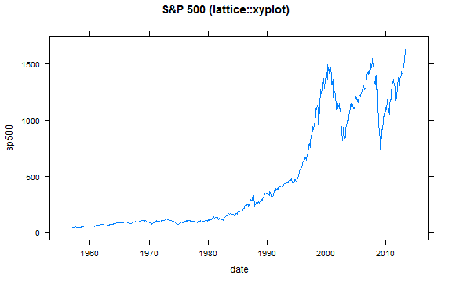
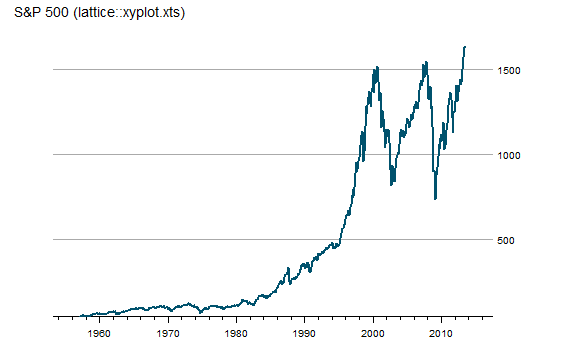
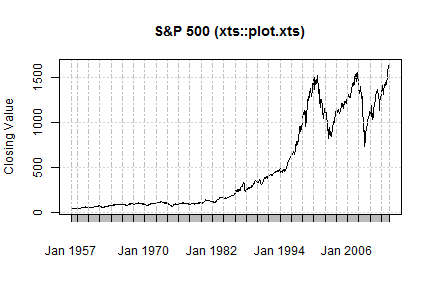
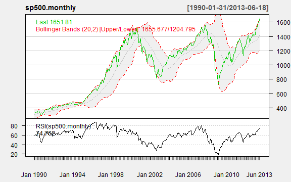
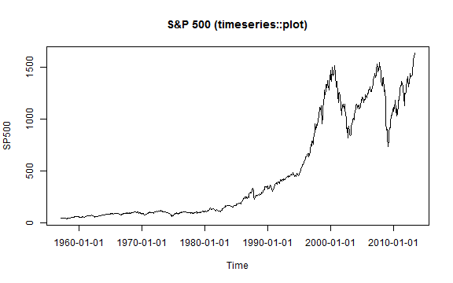
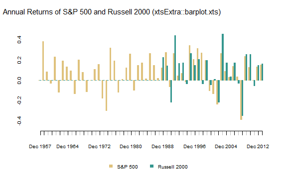

<style>
.rChart {
  height: 400px
}
</style>

# History of R Time Series Plotting

As with all of R, the ability to easily chart financial time series is the result of an iterative progression driven by the collaboration of an extremely dedicated group of open source volunteers.  With the release of [rCharts](http://ramnathv.github.io/rCharts), I thought it would be interesting to document the timeline of this progression.  For each step in the timeline, I will include a link to the source code (svn or github) of the package and a minimal example to demo the "out-of-the-box" capability.  Separating the financial time series piece from graphing in general can get murky, and some of the timeline will differ from the timeline of R graphics and the timeline of R time series analysis.

For a much more extensive discussion of time series analysis with R, please see:

- [Time Series Analysis with R](http://www.stats.uwo.ca/faculty/aim/tsar/tsar.pdf) by A. Ian McLeod, Hao Yu, and Esam Mahdi
- [CRAN Task View: Time Series Analysis](http://cran.r-project.org/web/views/TimeSeries.html) by Rob Hyndman
- [A Little Book of R for Time Series](http://a-little-book-of-r-for-time-series.readthedocs.org/en/latest/src/timeseries.html) by Avril Chohlan

Just in case you don't make it to the end,   
> Thanks to the contributors!  I wouldn't be using R if it weren't for you.


First, to build a plot, we need data. Let's see how easy it is to get a time series of financial data in R through `quantmod` [`getSymbols()`](https://r-forge.r-project.org/scm/viewvc.php/pkg/R/getSymbols.R?root=quantmod&view=log).  The [`getSymbols()`](https://r-forge.r-project.org/scm/viewvc.php/pkg/R/getSymbols.R?root=quantmod&view=log) function has been a work in progress since December 20, 2006.


```r
require(latticeExtra)
require(ggplot2)
require(reshape2)
require(quantmod)
require(PerformanceAnalytics)
require(xtsExtra)
require(rCharts)


# get S&P 500 data from FRED (St. Louis Fed)
sp500 <- na.omit( 
  getSymbols(
    "SP500",
    src = "FRED",
    from = "1949-12-31",
    auto.assign = FALSE
  )
)

# use monthly data
sp500.monthly <- sp500[endpoints(sp500, on ="months")]
```


---
## Timeline

 


- - -

---
### plot.default (As Old as Time Itself)


```r
# base plot of time series prior to xts
# get the data in data.frame format rather than xts
sp500.df <- data.frame(
  index(sp500.monthly),
  coredata(sp500.monthly),
  stringsAsFactors=FALSE
)
# name columns
colnames( sp500.df ) <- c( "date", "sp500" )
# go back in time to plot.default from the graphics library
graphics::plot.default(
  x = sp500.df$date,
  y = sp500.df$sp500,
  type = "l",
  xlab = "Date",
  ylab = "Closing Value",
  main = "S&P 500 (graphics::plot.default)"
)
```

 


- - -

---
### [ts](https://stat.ethz.ch/pipermail/r-announce/1999/000097.html) 1999-08-27
The ts package was added in R version 0.65.0 and significantly improved with release 1.5.0 in April 2002.  There is a very good discussion of the improvements in Brian Ripley's ["Time Series in R 1.5.0" from Volume 2 of R News, June 2002](http://cran.r-project.org/doc/Rnews/Rnews_2002-2.pdf).  plot.ts added some nice features, such as the ability to plot multiple/wide time series, specify panels per series, and easily calculate acf, ARIMA,and HoltWinters.


```r
stats::plot.ts(
  ts(sp500.monthly,
     start = c(
       as.numeric(format(index(sp500.monthly)[1],"%Y")),
       as.numeric(format(index(sp500.monthly)[1],"%m"))
     ),
     frequency = 12
  ), # some backwards conversion to ts from xts
  xlab = "Date",
  ylab = "Closing Value",
  main = "S&P 500 (stats::plot.ts)"
)
```

 


- - -

---
### [lattice](http://r-forge.r-project.org/scm/?group_id=638) and [grid](http://www.stat.auckland.ac.nz/~paul/grid/grid.html) released with R 1.5.0 2002-04-29
With the release of lattice and grid and also the improvements in ts mentioned above, R 1.5.0 was a very important milestone for both graphing and time series analysis.  All of these are covered in [Volume 2 of R News, June 2002](http://cran.r-project.org/doc/Rnews/Rnews_2002-2.pdf).  lattice began the era of aesthetically pleasing and production-quality graphics straight from R.

- - -

---
### [zoo](https://r-forge.r-project.org/scm/viewvc.php/pkg/zoo/R/plot.zoo.R?root=zoo&view=log) 2004-10-08


```r
# 2004-10-08 plot.zoo comes to the rescue with the zoo package
zoo::plot.zoo(
  sp500.monthly,
  main = "S&P 500 (zoo::plot.zoo)"
)
```

 


- - -

---
### [zoo](https://r-forge.r-project.org/scm/viewvc.php/pkg/zoo/R/xyplot.zoo.R?root=zoo&view=log) Meets [lattice](http://r-forge.r-project.org/scm/?group_id=638) 2006-07-06


```r
# 2006-07-06 zoo also made a handy lattice xyplot.zoo function
# so no more need to melt wide data to long data
# or convert to data.frame prior to plotting
# although slightly out of chronology
# I'll also use theEconomist from latticeExtra
asTheEconomist(
  xyplot(
    sp500.monthly,
    scales = list( y = list( rot = 0 ) ),
    main = "S&P 500 (lattice::xyplot.xts)"  
  )
)
```

 


- - -

---
### [PerformanceAnalytics chart.TimeSeries](https://r-forge.r-project.org/scm/viewvc.php/pkg/PerformanceAnalytics/R/chart.TimeSeries.R?root=returnanalytics&view=log) 2007-02-02


```r
# 2007-02-02 chart.TimeSeries in PerformanceAnalytics
charts.PerformanceSummary(
  ROC(sp500.monthly, n = 1, type = "discrete"),
  main = "S&P 500 (PerformanceAnalytice::charts.PerformanceSummary)"
)
```

```
Error: no applicable method for 'time<-' applied to an object of class
"c('xts', 'zoo')"
```

 


- - -

---
### [ggplot2](http://cran.r-project.org/src/contrib/Archive/ggplot2/) 2007-06-10
Although ggplot2 is not designed specifically for time series plotting, I include it in the timeline for both its significant impact on R graphics and its ability to handle dates/times on the x-axis.  To use xts with ggplot2, a simple conversion to a wide or long format data.frame is necessary.


```r
#ggplot2 requires conversion of xts to data.frame
#we will use the data.frame from the plot.default example
ggplot( sp500.df, aes(date) ) + 
  geom_line( aes( y = sp500 ) ) +
  labs( title = "S&P 500 (ggplot2::ggplot)")
```

 


- - -

---
### [quantmod/TTR chartSeries](https://r-forge.r-project.org/scm/viewvc.php/pkg/R/chartSeries.R?root=quantmod&view=log) 2007-10-07


```r
# 2007-10-17 then quantmod/TTR built on zoo
# to offer much better handling of financial time series
# notice the ease of adding pertinent financial information
chartSeries(
  sp500.monthly,
#  log = TRUE,
  theme = chartTheme("white"),
  TA = c(addBBands(),addTA(RSI(sp500.monthly)))
)
```

 


Just look how easy it is to zoom.


```r
# also easy zooming
zoomChart("1990::")
```

 


- - -

---
### [xts plot.xts](https://r-forge.r-project.org/scm/viewvc.php/pkg/xts/R/plot.R?root=xts&view=log) 2008-02-17


```r
# 2008-02-17 xts improved zoo and other time series libraries
# http://cran.r-project.org/web/packages/xts/vignettes/xts.pdf
# plot.zoo got ported to plot.xts and little graphing improvement
xts::plot.xts(
  sp500.monthly,
  ylab = "Closing Value",
  main = "S&P 500 (xts::plot.xts)"  
)
```

 


- - -

---
### [timeSeries plot](https://r-forge.r-project.org/scm/viewvc.php/pkg/timeSeries/R/methods-plot.R?root=rmetrics&view=log) 2009-05-17
The timeSeries plot method is basically a port of R's plot.ts().  It does not significantly add any plotting functionality, but I include it for completeness and since the [Rmetrics team](https://www.rmetrics.org) offers robust financial analysis through its many R packages that depend on the timeSeries object.


```r
require(timeSeries)
timeSeries::plot(
  timeSeries(sp500.monthly),
  main = "S&P 500 (timeseries::plot)"
)
```

 


- - -

---
### [xtsExtra plot.xts and barplot.xts](https://r-forge.r-project.org/scm/viewvc.php/pkg/xtsExtra/R/plot.R?root=xts&view=log) 2012-05-30


```r
# Summer 2012 Google Summer of Code
# xtsExtra significantly improves xts
# lots of examples in this post
# http://timelyportfolio.blogspot.com/search/label/plot.xts

#require(devtools)
#setwd("C:/Program Files/R/R-2.15.1/sandbox/svnsource/xts/pkg/xtsExtra")
#build()
#load_all()


#explore barplot.xts to do a chart of annual returns for both indexes
#merge prices
russell2000 <- getSymbols("^RUT", from = "1900-01-01", auto.assign = F)  
prices <- merge(sp500,russell2000[,4])
#use endpoints to get annual returns
returns.annual <- as.xts(
  apply(
    ROC(prices[endpoints(prices,"years")],type="discrete",n=1),
    MARGIN = 2,
    FUN = na.fill, fill = 0
  ),
  order.by = index(prices[endpoints(prices,"years")])
)
#name columns something a little more clear
colnames(returns.annual) <- c("S&P 500","Russell 2000")

barplot.xts(
  returns.annual,
  stacked=FALSE,
  box="transparent",  #get rid of box surrounding the plot
  ylim=c(-0.5,0.5),
  ylab=NA,
  border=c(brewer.pal(n=11,"BrBG")[c(4,9)]),
  col=c(brewer.pal(n=11,"BrBG")[c(4,9)])
)

title(
  main="Annual Returns of S&P 500 and Russell 2000 (xtsExtra::barplot.xts)", 
  outer = TRUE,
  adj=0.05,
  font.main = 1,
  cex.main = 1.25,
  line = -2
)
```

 


- - -

---
### [rCharts](http://rcharts.github.io/site) 2013
rCharts allows us to create interactive charts straight from R with built-in functionality from frameworks built on top of [d3.js](http://d3js.org), [raphael](http://raphaeljs.com), and other leading javascript libraries.  This interactivity offers a whole new level of discovery and exploration previously not available with static graphics.  See the examples below.  The examples below are minimal examples to demonstrate how much can be done in only a few lines of code.  For more thorough demos, check out the [gallery](http://rcharts.github.io/site/gallery.html).


```r
# 2013 the world changes with rCharts

# define a function to convert xts wide to long data.frame
xtsMelt <- function(xtsData,metric){
  df <- data.frame(index(xtsData),coredata(xtsData),stringsAsFactors=FALSE)
  df.melt <- melt(df,id.vars=1)
  df.melt <- data.frame(df.melt,rep(metric,NROW(df.melt)))
  #little unnecessary housekeeping
  df.melt <- df.melt[,c(1,2,4,3)]
  colnames(df.melt) <- c("date","indexname","metric","value")
  df.melt$date <- as.Date(df.melt$date)
  #javascript works better when there are no .
  #remove troublesome . using modified method from Stack Overflow
  i <- sapply(df.melt, is.factor)
  df.melt[i] <- lapply(df.melt[i], gsub, pattern="\\.", replacement="")
  
  return(df.melt)
}

sp500.melt <- xtsMelt(
  sp500.monthly,
  metric = "price"
)

n1 <- nPlot(
  value~date,
  data = sp500.melt,
  group = "indexname",  # even though only one series need to specify group
  type = "lineWithFocusChart"
)

n1$xAxis(
  tickFormat=
    "#!function(d) {return d3.time.format('%b %Y')(new Date( d * 86400000 ));}!#"
)

n1$x2Axis(
  tickFormat=
    "#!function(d) {return d3.time.format('%Y')(new Date( d * 86400000 ));}!#"
)
n1$print("chart1")
```


<div id='chart1' class='rChart nvd3'></div>
<script type='text/javascript'>
 $(document).ready(function(){
      drawchart1()
    });
    function drawchart1(){  
      var opts = {
 "dom": "chart1",
"width":    600,
"height":    400,
"x": "date",
"y": "value",
"group": "indexname",
"type": "lineWithFocusChart",
"id": "chart1" 
},
        data = [
 {
 "date":  -4718,
"indexname": "SP500",
"metric": "price",
"value":  44.72 
},
{
 "date":  -4690,
"indexname": "SP500",
"metric": "price",
"value":  43.26 
},
{
 "date":  -4661,
"indexname": "SP500",
"metric": "price",
"value":  44.11 
},
{
 "date":  -4629,
"indexname": "SP500",
"metric": "price",
"value":  45.74 
},
{
 "date":  -4598,
"indexname": "SP500",
"metric": "price",
"value":  47.43 
},
{
 "date":  -4570,
"indexname": "SP500",
"metric": "price",
"value":  47.37 
},
{
 "date":  -4537,
"indexname": "SP500",
"metric": "price",
"value":  47.91 
},
{
 "date":  -4507,
"indexname": "SP500",
"metric": "price",
"value":  45.22 
},
{
 "date":  -4476,
"indexname": "SP500",
"metric": "price",
"value":  42.42 
},
{
 "date":  -4445,
"indexname": "SP500",
"metric": "price",
"value":  41.06 
},
{
 "date":  -4416,
"indexname": "SP500",
"metric": "price",
"value":  41.72 
},
{
 "date":  -4384,
"indexname": "SP500",
"metric": "price",
"value":  39.99 
},
{
 "date":  -4353,
"indexname": "SP500",
"metric": "price",
"value":   41.7 
},
{
 "date":  -4325,
"indexname": "SP500",
"metric": "price",
"value":  40.84 
},
{
 "date":  -4294,
"indexname": "SP500",
"metric": "price",
"value":   42.1 
},
{
 "date":  -4264,
"indexname": "SP500",
"metric": "price",
"value":  43.44 
},
{
 "date":  -4235,
"indexname": "SP500",
"metric": "price",
"value":  44.09 
},
{
 "date":  -4203,
"indexname": "SP500",
"metric": "price",
"value":  45.24 
},
{
 "date":  -4172,
"indexname": "SP500",
"metric": "price",
"value":  47.19 
},
{
 "date":  -4143,
"indexname": "SP500",
"metric": "price",
"value":  47.75 
},
{
 "date":  -4111,
"indexname": "SP500",
"metric": "price",
"value":  50.06 
},
{
 "date":  -4080,
"indexname": "SP500",
"metric": "price",
"value":  51.33 
},
{
 "date":  -4052,
"indexname": "SP500",
"metric": "price",
"value":  52.48 
},
{
 "date":  -4019,
"indexname": "SP500",
"metric": "price",
"value":  55.21 
},
{
 "date":  -3989,
"indexname": "SP500",
"metric": "price",
"value":  55.42 
},
{
 "date":  -3961,
"indexname": "SP500",
"metric": "price",
"value":  55.41 
},
{
 "date":  -3929,
"indexname": "SP500",
"metric": "price",
"value":  55.44 
},
{
 "date":  -3899,
"indexname": "SP500",
"metric": "price",
"value":  57.59 
},
{
 "date":  -3870,
"indexname": "SP500",
"metric": "price",
"value":  58.68 
},
{
 "date":  -3838,
"indexname": "SP500",
"metric": "price",
"value":  58.47 
},
{
 "date":  -3807,
"indexname": "SP500",
"metric": "price",
"value":  60.51 
},
{
 "date":  -3776,
"indexname": "SP500",
"metric": "price",
"value":   59.6 
},
{
 "date":  -3746,
"indexname": "SP500",
"metric": "price",
"value":  56.88 
},
{
 "date":  -3716,
"indexname": "SP500",
"metric": "price",
"value":  57.52 
},
{
 "date":  -3685,
"indexname": "SP500",
"metric": "price",
"value":  58.28 
},
{
 "date":  -3654,
"indexname": "SP500",
"metric": "price",
"value":  59.89 
},
{
 "date":  -3625,
"indexname": "SP500",
"metric": "price",
"value":  55.61 
},
{
 "date":  -3594,
"indexname": "SP500",
"metric": "price",
"value":  56.12 
},
{
 "date":  -3563,
"indexname": "SP500",
"metric": "price",
"value":  55.34 
},
{
 "date":  -3534,
"indexname": "SP500",
"metric": "price",
"value":  54.37 
},
{
 "date":  -3502,
"indexname": "SP500",
"metric": "price",
"value":  55.83 
},
{
 "date":  -3472,
"indexname": "SP500",
"metric": "price",
"value":  56.92 
},
{
 "date":  -3443,
"indexname": "SP500",
"metric": "price",
"value":  55.51 
},
{
 "date":  -3410,
"indexname": "SP500",
"metric": "price",
"value":  56.96 
},
{
 "date":  -3380,
"indexname": "SP500",
"metric": "price",
"value":  53.52 
},
{
 "date":  -3349,
"indexname": "SP500",
"metric": "price",
"value":  53.39 
},
{
 "date":  -3319,
"indexname": "SP500",
"metric": "price",
"value":  55.54 
},
{
 "date":  -3289,
"indexname": "SP500",
"metric": "price",
"value":  58.11 
},
{
 "date":  -3257,
"indexname": "SP500",
"metric": "price",
"value":  61.78 
},
{
 "date":  -3229,
"indexname": "SP500",
"metric": "price",
"value":  63.44 
},
{
 "date":  -3199,
"indexname": "SP500",
"metric": "price",
"value":  65.06 
},
{
 "date":  -3170,
"indexname": "SP500",
"metric": "price",
"value":  65.31 
},
{
 "date":  -3137,
"indexname": "SP500",
"metric": "price",
"value":  66.56 
},
{
 "date":  -3107,
"indexname": "SP500",
"metric": "price",
"value":  64.64 
},
{
 "date":  -3076,
"indexname": "SP500",
"metric": "price",
"value":  66.76 
},
{
 "date":  -3045,
"indexname": "SP500",
"metric": "price",
"value":  68.07 
},
{
 "date":  -3016,
"indexname": "SP500",
"metric": "price",
"value":  66.73 
},
{
 "date":  -2984,
"indexname": "SP500",
"metric": "price",
"value":  68.62 
},
{
 "date":  -2954,
"indexname": "SP500",
"metric": "price",
"value":  71.32 
},
{
 "date":  -2925,
"indexname": "SP500",
"metric": "price",
"value":  71.55 
},
{
 "date":  -2892,
"indexname": "SP500",
"metric": "price",
"value":  68.84 
},
{
 "date":  -2864,
"indexname": "SP500",
"metric": "price",
"value":  69.96 
},
{
 "date":  -2834,
"indexname": "SP500",
"metric": "price",
"value":  69.55 
},
{
 "date":  -2803,
"indexname": "SP500",
"metric": "price",
"value":  65.24 
},
{
 "date":  -2772,
"indexname": "SP500",
"metric": "price",
"value":  59.63 
},
{
 "date":  -2743,
"indexname": "SP500",
"metric": "price",
"value":  54.75 
},
{
 "date":  -2711,
"indexname": "SP500",
"metric": "price",
"value":  58.23 
},
{
 "date":  -2680,
"indexname": "SP500",
"metric": "price",
"value":  59.12 
},
{
 "date":  -2652,
"indexname": "SP500",
"metric": "price",
"value":  56.27 
},
{
 "date":  -2619,
"indexname": "SP500",
"metric": "price",
"value":  56.52 
},
{
 "date":  -2589,
"indexname": "SP500",
"metric": "price",
"value":  62.26 
},
{
 "date":  -2558,
"indexname": "SP500",
"metric": "price",
"value":   63.1 
},
{
 "date":  -2527,
"indexname": "SP500",
"metric": "price",
"value":   66.2 
},
{
 "date":  -2499,
"indexname": "SP500",
"metric": "price",
"value":  64.29 
},
{
 "date":  -2470,
"indexname": "SP500",
"metric": "price",
"value":  66.57 
},
{
 "date":  -2438,
"indexname": "SP500",
"metric": "price",
"value":   69.8 
},
{
 "date":  -2407,
"indexname": "SP500",
"metric": "price",
"value":   70.8 
},
{
 "date":  -2379,
"indexname": "SP500",
"metric": "price",
"value":  69.37 
},
{
 "date":  -2346,
"indexname": "SP500",
"metric": "price",
"value":  69.13 
},
{
 "date":  -2316,
"indexname": "SP500",
"metric": "price",
"value":   72.5 
},
{
 "date":  -2285,
"indexname": "SP500",
"metric": "price",
"value":   71.7 
},
{
 "date":  -2254,
"indexname": "SP500",
"metric": "price",
"value":  74.01 
},
{
 "date":  -2225,
"indexname": "SP500",
"metric": "price",
"value":  73.23 
},
{
 "date":  -2193,
"indexname": "SP500",
"metric": "price",
"value":  75.02 
},
{
 "date":  -2162,
"indexname": "SP500",
"metric": "price",
"value":  77.04 
},
{
 "date":  -2134,
"indexname": "SP500",
"metric": "price",
"value":   77.8 
},
{
 "date":  -2102,
"indexname": "SP500",
"metric": "price",
"value":  78.98 
},
{
 "date":  -2072,
"indexname": "SP500",
"metric": "price",
"value":  79.46 
},
{
 "date":  -2044,
"indexname": "SP500",
"metric": "price",
"value":  80.37 
},
{
 "date":  -2011,
"indexname": "SP500",
"metric": "price",
"value":  81.69 
},
{
 "date":  -1980,
"indexname": "SP500",
"metric": "price",
"value":  83.18 
},
{
 "date":  -1949,
"indexname": "SP500",
"metric": "price",
"value":  81.83 
},
{
 "date":  -1919,
"indexname": "SP500",
"metric": "price",
"value":  84.18 
},
{
 "date":  -1889,
"indexname": "SP500",
"metric": "price",
"value":  84.86 
},
{
 "date":  -1858,
"indexname": "SP500",
"metric": "price",
"value":  84.42 
},
{
 "date":  -1827,
"indexname": "SP500",
"metric": "price",
"value":  84.75 
},
{
 "date":  -1798,
"indexname": "SP500",
"metric": "price",
"value":  87.56 
},
{
 "date":  -1770,
"indexname": "SP500",
"metric": "price",
"value":  87.43 
},
{
 "date":  -1737,
"indexname": "SP500",
"metric": "price",
"value":  86.16 
},
{
 "date":  -1707,
"indexname": "SP500",
"metric": "price",
"value":  89.11 
},
{
 "date":  -1679,
"indexname": "SP500",
"metric": "price",
"value":  88.42 
},
{
 "date":  -1646,
"indexname": "SP500",
"metric": "price",
"value":  84.12 
},
{
 "date":  -1616,
"indexname": "SP500",
"metric": "price",
"value":  85.25 
},
{
 "date":  -1584,
"indexname": "SP500",
"metric": "price",
"value":  87.17 
},
{
 "date":  -1554,
"indexname": "SP500",
"metric": "price",
"value":  89.96 
},
{
 "date":  -1525,
"indexname": "SP500",
"metric": "price",
"value":  92.42 
},
{
 "date":  -1493,
"indexname": "SP500",
"metric": "price",
"value":  91.61 
},
{
 "date":  -1462,
"indexname": "SP500",
"metric": "price",
"value":  92.43 
},
{
 "date":  -1431,
"indexname": "SP500",
"metric": "price",
"value":  92.88 
},
{
 "date":  -1403,
"indexname": "SP500",
"metric": "price",
"value":  91.22 
},
{
 "date":  -1372,
"indexname": "SP500",
"metric": "price",
"value":  89.23 
},
{
 "date":  -1343,
"indexname": "SP500",
"metric": "price",
"value":  91.06 
},
{
 "date":  -1311,
"indexname": "SP500",
"metric": "price",
"value":  86.13 
},
{
 "date":  -1281,
"indexname": "SP500",
"metric": "price",
"value":  84.74 
},
{
 "date":  -1252,
"indexname": "SP500",
"metric": "price",
"value":   83.6 
},
{
 "date":  -1219,
"indexname": "SP500",
"metric": "price",
"value":   77.1 
},
{
 "date":  -1189,
"indexname": "SP500",
"metric": "price",
"value":  76.56 
},
{
 "date":  -1158,
"indexname": "SP500",
"metric": "price",
"value":   80.2 
},
{
 "date":  -1128,
"indexname": "SP500",
"metric": "price",
"value":  80.45 
},
{
 "date":  -1098,
"indexname": "SP500",
"metric": "price",
"value":  80.33 
},
{
 "date":  -1066,
"indexname": "SP500",
"metric": "price",
"value":  86.61 
},
{
 "date":  -1038,
"indexname": "SP500",
"metric": "price",
"value":  86.78 
},
{
 "date":  -1007,
"indexname": "SP500",
"metric": "price",
"value":   90.2 
},
{
 "date":   -979,
"indexname": "SP500",
"metric": "price",
"value":  94.01 
},
{
 "date":   -946,
"indexname": "SP500",
"metric": "price",
"value":  89.08 
},
{
 "date":   -916,
"indexname": "SP500",
"metric": "price",
"value":  90.64 
},
{
 "date":   -885,
"indexname": "SP500",
"metric": "price",
"value":  94.75 
},
{
 "date":   -854,
"indexname": "SP500",
"metric": "price",
"value":  93.64 
},
{
 "date":   -825,
"indexname": "SP500",
"metric": "price",
"value":  96.71 
},
{
 "date":   -793,
"indexname": "SP500",
"metric": "price",
"value":   93.9 
},
{
 "date":   -763,
"indexname": "SP500",
"metric": "price",
"value":     94 
},
{
 "date":   -734,
"indexname": "SP500",
"metric": "price",
"value":  96.47 
},
{
 "date":   -701,
"indexname": "SP500",
"metric": "price",
"value":  92.24 
},
{
 "date":   -672,
"indexname": "SP500",
"metric": "price",
"value":  89.36 
},
{
 "date":   -643,
"indexname": "SP500",
"metric": "price",
"value":   90.2 
},
{
 "date":   -611,
"indexname": "SP500",
"metric": "price",
"value":  97.59 
},
{
 "date":   -580,
"indexname": "SP500",
"metric": "price",
"value":  98.68 
},
{
 "date":   -552,
"indexname": "SP500",
"metric": "price",
"value":  99.58 
},
{
 "date":   -520,
"indexname": "SP500",
"metric": "price",
"value":  97.74 
},
{
 "date":   -489,
"indexname": "SP500",
"metric": "price",
"value":  98.86 
},
{
 "date":   -458,
"indexname": "SP500",
"metric": "price",
"value": 102.67 
},
{
 "date":   -427,
"indexname": "SP500",
"metric": "price",
"value": 103.41 
},
{
 "date":   -398,
"indexname": "SP500",
"metric": "price",
"value": 108.37 
},
{
 "date":   -366,
"indexname": "SP500",
"metric": "price",
"value": 103.86 
},
{
 "date":   -335,
"indexname": "SP500",
"metric": "price",
"value": 103.01 
},
{
 "date":   -307,
"indexname": "SP500",
"metric": "price",
"value":  98.13 
},
{
 "date":   -279,
"indexname": "SP500",
"metric": "price",
"value": 101.51 
},
{
 "date":   -246,
"indexname": "SP500",
"metric": "price",
"value": 103.69 
},
{
 "date":   -217,
"indexname": "SP500",
"metric": "price",
"value": 103.46 
},
{
 "date":   -185,
"indexname": "SP500",
"metric": "price",
"value":  97.71 
},
{
 "date":   -154,
"indexname": "SP500",
"metric": "price",
"value":  91.83 
},
{
 "date":   -125,
"indexname": "SP500",
"metric": "price",
"value":  95.51 
},
{
 "date":    -93,
"indexname": "SP500",
"metric": "price",
"value":  93.12 
},
{
 "date":    -62,
"indexname": "SP500",
"metric": "price",
"value":  97.24 
},
{
 "date":    -34,
"indexname": "SP500",
"metric": "price",
"value":  93.81 
},
{
 "date":     -1,
"indexname": "SP500",
"metric": "price",
"value":  92.06 
},
{
 "date":     29,
"indexname": "SP500",
"metric": "price",
"value":  85.02 
},
{
 "date":     57,
"indexname": "SP500",
"metric": "price",
"value":   89.5 
},
{
 "date":     89,
"indexname": "SP500",
"metric": "price",
"value":  89.63 
},
{
 "date":    119,
"indexname": "SP500",
"metric": "price",
"value":  81.52 
},
{
 "date":    148,
"indexname": "SP500",
"metric": "price",
"value":  76.55 
},
{
 "date":    180,
"indexname": "SP500",
"metric": "price",
"value":  72.72 
},
{
 "date":    211,
"indexname": "SP500",
"metric": "price",
"value":  78.05 
},
{
 "date":    242,
"indexname": "SP500",
"metric": "price",
"value":  81.52 
},
{
 "date":    272,
"indexname": "SP500",
"metric": "price",
"value":  84.21 
},
{
 "date":    302,
"indexname": "SP500",
"metric": "price",
"value":  83.25 
},
{
 "date":    333,
"indexname": "SP500",
"metric": "price",
"value":   87.2 
},
{
 "date":    364,
"indexname": "SP500",
"metric": "price",
"value":  92.15 
},
{
 "date":    393,
"indexname": "SP500",
"metric": "price",
"value":  95.88 
},
{
 "date":    421,
"indexname": "SP500",
"metric": "price",
"value":  96.75 
},
{
 "date":    454,
"indexname": "SP500",
"metric": "price",
"value": 100.31 
},
{
 "date":    484,
"indexname": "SP500",
"metric": "price",
"value": 103.95 
},
{
 "date":    512,
"indexname": "SP500",
"metric": "price",
"value":  99.63 
},
{
 "date":    545,
"indexname": "SP500",
"metric": "price",
"value":   99.7 
},
{
 "date":    575,
"indexname": "SP500",
"metric": "price",
"value":  95.58 
},
{
 "date":    607,
"indexname": "SP500",
"metric": "price",
"value":  99.03 
},
{
 "date":    637,
"indexname": "SP500",
"metric": "price",
"value":  98.34 
},
{
 "date":    666,
"indexname": "SP500",
"metric": "price",
"value":  94.23 
},
{
 "date":    698,
"indexname": "SP500",
"metric": "price",
"value":  93.99 
},
{
 "date":    729,
"indexname": "SP500",
"metric": "price",
"value": 102.09 
},
{
 "date":    760,
"indexname": "SP500",
"metric": "price",
"value": 103.94 
},
{
 "date":    789,
"indexname": "SP500",
"metric": "price",
"value": 106.57 
},
{
 "date":    819,
"indexname": "SP500",
"metric": "price",
"value":  107.2 
},
{
 "date":    848,
"indexname": "SP500",
"metric": "price",
"value": 107.67 
},
{
 "date":    881,
"indexname": "SP500",
"metric": "price",
"value": 109.53 
},
{
 "date":    911,
"indexname": "SP500",
"metric": "price",
"value": 107.14 
},
{
 "date":    942,
"indexname": "SP500",
"metric": "price",
"value": 107.39 
},
{
 "date":    973,
"indexname": "SP500",
"metric": "price",
"value": 111.09 
},
{
 "date":   1002,
"indexname": "SP500",
"metric": "price",
"value": 110.55 
},
{
 "date":   1034,
"indexname": "SP500",
"metric": "price",
"value": 111.58 
},
{
 "date":   1064,
"indexname": "SP500",
"metric": "price",
"value": 116.67 
},
{
 "date":   1093,
"indexname": "SP500",
"metric": "price",
"value": 118.05 
},
{
 "date":   1126,
"indexname": "SP500",
"metric": "price",
"value": 116.03 
},
{
 "date":   1154,
"indexname": "SP500",
"metric": "price",
"value": 111.68 
},
{
 "date":   1184,
"indexname": "SP500",
"metric": "price",
"value": 111.52 
},
{
 "date":   1215,
"indexname": "SP500",
"metric": "price",
"value": 106.97 
},
{
 "date":   1246,
"indexname": "SP500",
"metric": "price",
"value": 104.95 
},
{
 "date":   1275,
"indexname": "SP500",
"metric": "price",
"value": 104.26 
},
{
 "date":   1307,
"indexname": "SP500",
"metric": "price",
"value": 108.22 
},
{
 "date":   1338,
"indexname": "SP500",
"metric": "price",
"value": 104.25 
},
{
 "date":   1366,
"indexname": "SP500",
"metric": "price",
"value": 108.43 
},
{
 "date":   1399,
"indexname": "SP500",
"metric": "price",
"value": 108.29 
},
{
 "date":   1429,
"indexname": "SP500",
"metric": "price",
"value":  95.96 
},
{
 "date":   1460,
"indexname": "SP500",
"metric": "price",
"value":  97.55 
},
{
 "date":   1491,
"indexname": "SP500",
"metric": "price",
"value":  96.57 
},
{
 "date":   1519,
"indexname": "SP500",
"metric": "price",
"value":  96.22 
},
{
 "date":   1548,
"indexname": "SP500",
"metric": "price",
"value":  93.98 
},
{
 "date":   1580,
"indexname": "SP500",
"metric": "price",
"value":  90.31 
},
{
 "date":   1611,
"indexname": "SP500",
"metric": "price",
"value":  87.28 
},
{
 "date":   1639,
"indexname": "SP500",
"metric": "price",
"value":     86 
},
{
 "date":   1672,
"indexname": "SP500",
"metric": "price",
"value":  79.31 
},
{
 "date":   1702,
"indexname": "SP500",
"metric": "price",
"value":  72.15 
},
{
 "date":   1733,
"indexname": "SP500",
"metric": "price",
"value":  63.54 
},
{
 "date":   1764,
"indexname": "SP500",
"metric": "price",
"value":   73.9 
},
{
 "date":   1793,
"indexname": "SP500",
"metric": "price",
"value":  69.97 
},
{
 "date":   1825,
"indexname": "SP500",
"metric": "price",
"value":  68.56 
},
{
 "date":   1856,
"indexname": "SP500",
"metric": "price",
"value":  76.98 
},
{
 "date":   1884,
"indexname": "SP500",
"metric": "price",
"value":  81.59 
},
{
 "date":   1915,
"indexname": "SP500",
"metric": "price",
"value":  83.36 
},
{
 "date":   1945,
"indexname": "SP500",
"metric": "price",
"value":   87.3 
},
{
 "date":   1975,
"indexname": "SP500",
"metric": "price",
"value":  91.15 
},
{
 "date":   2006,
"indexname": "SP500",
"metric": "price",
"value":  95.19 
},
{
 "date":   2037,
"indexname": "SP500",
"metric": "price",
"value":  88.75 
},
{
 "date":   2066,
"indexname": "SP500",
"metric": "price",
"value":  86.88 
},
{
 "date":   2098,
"indexname": "SP500",
"metric": "price",
"value":  83.87 
},
{
 "date":   2129,
"indexname": "SP500",
"metric": "price",
"value":  89.04 
},
{
 "date":   2157,
"indexname": "SP500",
"metric": "price",
"value":  91.24 
},
{
 "date":   2190,
"indexname": "SP500",
"metric": "price",
"value":  90.19 
},
{
 "date":   2220,
"indexname": "SP500",
"metric": "price",
"value": 100.86 
},
{
 "date":   2248,
"indexname": "SP500",
"metric": "price",
"value":  99.71 
},
{
 "date":   2281,
"indexname": "SP500",
"metric": "price",
"value": 102.77 
},
{
 "date":   2311,
"indexname": "SP500",
"metric": "price",
"value": 101.64 
},
{
 "date":   2339,
"indexname": "SP500",
"metric": "price",
"value": 100.18 
},
{
 "date":   2372,
"indexname": "SP500",
"metric": "price",
"value": 104.28 
},
{
 "date":   2402,
"indexname": "SP500",
"metric": "price",
"value": 103.44 
},
{
 "date":   2434,
"indexname": "SP500",
"metric": "price",
"value": 102.91 
},
{
 "date":   2464,
"indexname": "SP500",
"metric": "price",
"value": 105.24 
},
{
 "date":   2493,
"indexname": "SP500",
"metric": "price",
"value":  102.9 
},
{
 "date":   2525,
"indexname": "SP500",
"metric": "price",
"value":  102.1 
},
{
 "date":   2556,
"indexname": "SP500",
"metric": "price",
"value": 107.46 
},
{
 "date":   2587,
"indexname": "SP500",
"metric": "price",
"value": 102.03 
},
{
 "date":   2615,
"indexname": "SP500",
"metric": "price",
"value":  99.82 
},
{
 "date":   2646,
"indexname": "SP500",
"metric": "price",
"value":  98.42 
},
{
 "date":   2675,
"indexname": "SP500",
"metric": "price",
"value":  98.44 
},
{
 "date":   2707,
"indexname": "SP500",
"metric": "price",
"value":  96.12 
},
{
 "date":   2737,
"indexname": "SP500",
"metric": "price",
"value": 100.48 
},
{
 "date":   2766,
"indexname": "SP500",
"metric": "price",
"value":  98.85 
},
{
 "date":   2799,
"indexname": "SP500",
"metric": "price",
"value":  96.77 
},
{
 "date":   2829,
"indexname": "SP500",
"metric": "price",
"value":  96.53 
},
{
 "date":   2860,
"indexname": "SP500",
"metric": "price",
"value":  92.34 
},
{
 "date":   2890,
"indexname": "SP500",
"metric": "price",
"value":  94.83 
},
{
 "date":   2920,
"indexname": "SP500",
"metric": "price",
"value":   95.1 
},
{
 "date":   2952,
"indexname": "SP500",
"metric": "price",
"value":  89.25 
},
{
 "date":   2980,
"indexname": "SP500",
"metric": "price",
"value":  87.04 
},
{
 "date":   3011,
"indexname": "SP500",
"metric": "price",
"value":  89.21 
},
{
 "date":   3039,
"indexname": "SP500",
"metric": "price",
"value":  96.83 
},
{
 "date":   3072,
"indexname": "SP500",
"metric": "price",
"value":  97.29 
},
{
 "date":   3102,
"indexname": "SP500",
"metric": "price",
"value":  95.53 
},
{
 "date":   3133,
"indexname": "SP500",
"metric": "price",
"value": 100.68 
},
{
 "date":   3164,
"indexname": "SP500",
"metric": "price",
"value": 103.29 
},
{
 "date":   3193,
"indexname": "SP500",
"metric": "price",
"value": 102.54 
},
{
 "date":   3225,
"indexname": "SP500",
"metric": "price",
"value":  93.15 
},
{
 "date":   3255,
"indexname": "SP500",
"metric": "price",
"value":   94.7 
},
{
 "date":   3284,
"indexname": "SP500",
"metric": "price",
"value":  96.11 
},
{
 "date":   3317,
"indexname": "SP500",
"metric": "price",
"value":  99.93 
},
{
 "date":   3345,
"indexname": "SP500",
"metric": "price",
"value":  96.28 
},
{
 "date":   3375,
"indexname": "SP500",
"metric": "price",
"value": 101.59 
},
{
 "date":   3406,
"indexname": "SP500",
"metric": "price",
"value": 101.76 
},
{
 "date":   3437,
"indexname": "SP500",
"metric": "price",
"value":  99.08 
},
{
 "date":   3466,
"indexname": "SP500",
"metric": "price",
"value": 102.91 
},
{
 "date":   3498,
"indexname": "SP500",
"metric": "price",
"value": 103.81 
},
{
 "date":   3529,
"indexname": "SP500",
"metric": "price",
"value": 109.32 
},
{
 "date":   3557,
"indexname": "SP500",
"metric": "price",
"value": 109.32 
},
{
 "date":   3590,
"indexname": "SP500",
"metric": "price",
"value": 101.82 
},
{
 "date":   3620,
"indexname": "SP500",
"metric": "price",
"value": 106.16 
},
{
 "date":   3651,
"indexname": "SP500",
"metric": "price",
"value": 107.94 
},
{
 "date":   3682,
"indexname": "SP500",
"metric": "price",
"value": 114.16 
},
{
 "date":   3711,
"indexname": "SP500",
"metric": "price",
"value": 113.66 
},
{
 "date":   3742,
"indexname": "SP500",
"metric": "price",
"value": 102.09 
},
{
 "date":   3772,
"indexname": "SP500",
"metric": "price",
"value": 106.29 
},
{
 "date":   3802,
"indexname": "SP500",
"metric": "price",
"value": 111.24 
},
{
 "date":   3833,
"indexname": "SP500",
"metric": "price",
"value": 114.24 
},
{
 "date":   3864,
"indexname": "SP500",
"metric": "price",
"value": 121.67 
},
{
 "date":   3893,
"indexname": "SP500",
"metric": "price",
"value": 122.38 
},
{
 "date":   3925,
"indexname": "SP500",
"metric": "price",
"value": 125.46 
},
{
 "date":   3956,
"indexname": "SP500",
"metric": "price",
"value": 127.47 
},
{
 "date":   3984,
"indexname": "SP500",
"metric": "price",
"value": 140.52 
},
{
 "date":   4017,
"indexname": "SP500",
"metric": "price",
"value": 135.76 
},
{
 "date":   4047,
"indexname": "SP500",
"metric": "price",
"value": 129.55 
},
{
 "date":   4075,
"indexname": "SP500",
"metric": "price",
"value": 131.27 
},
{
 "date":   4107,
"indexname": "SP500",
"metric": "price",
"value":    136 
},
{
 "date":   4137,
"indexname": "SP500",
"metric": "price",
"value": 132.81 
},
{
 "date":   4166,
"indexname": "SP500",
"metric": "price",
"value": 132.59 
},
{
 "date":   4198,
"indexname": "SP500",
"metric": "price",
"value": 131.21 
},
{
 "date":   4229,
"indexname": "SP500",
"metric": "price",
"value": 130.92 
},
{
 "date":   4260,
"indexname": "SP500",
"metric": "price",
"value": 122.79 
},
{
 "date":   4290,
"indexname": "SP500",
"metric": "price",
"value": 116.18 
},
{
 "date":   4320,
"indexname": "SP500",
"metric": "price",
"value": 121.89 
},
{
 "date":   4351,
"indexname": "SP500",
"metric": "price",
"value": 126.35 
},
{
 "date":   4382,
"indexname": "SP500",
"metric": "price",
"value": 122.55 
},
{
 "date":   4411,
"indexname": "SP500",
"metric": "price",
"value":  120.4 
},
{
 "date":   4439,
"indexname": "SP500",
"metric": "price",
"value": 113.11 
},
{
 "date":   4472,
"indexname": "SP500",
"metric": "price",
"value": 111.96 
},
{
 "date":   4502,
"indexname": "SP500",
"metric": "price",
"value": 116.44 
},
{
 "date":   4530,
"indexname": "SP500",
"metric": "price",
"value": 111.88 
},
{
 "date":   4563,
"indexname": "SP500",
"metric": "price",
"value": 109.61 
},
{
 "date":   4593,
"indexname": "SP500",
"metric": "price",
"value": 107.09 
},
{
 "date":   4625,
"indexname": "SP500",
"metric": "price",
"value": 119.51 
},
{
 "date":   4655,
"indexname": "SP500",
"metric": "price",
"value": 120.42 
},
{
 "date":   4684,
"indexname": "SP500",
"metric": "price",
"value": 133.71 
},
{
 "date":   4716,
"indexname": "SP500",
"metric": "price",
"value": 138.54 
},
{
 "date":   4747,
"indexname": "SP500",
"metric": "price",
"value": 140.64 
},
{
 "date":   4778,
"indexname": "SP500",
"metric": "price",
"value":  145.3 
},
{
 "date":   4806,
"indexname": "SP500",
"metric": "price",
"value": 148.06 
},
{
 "date":   4837,
"indexname": "SP500",
"metric": "price",
"value": 152.96 
},
{
 "date":   4866,
"indexname": "SP500",
"metric": "price",
"value": 164.42 
},
{
 "date":   4898,
"indexname": "SP500",
"metric": "price",
"value": 162.39 
},
{
 "date":   4928,
"indexname": "SP500",
"metric": "price",
"value": 168.11 
},
{
 "date":   4957,
"indexname": "SP500",
"metric": "price",
"value": 162.56 
},
{
 "date":   4990,
"indexname": "SP500",
"metric": "price",
"value":  164.4 
},
{
 "date":   5020,
"indexname": "SP500",
"metric": "price",
"value": 166.07 
},
{
 "date":   5051,
"indexname": "SP500",
"metric": "price",
"value": 163.55 
},
{
 "date":   5081,
"indexname": "SP500",
"metric": "price",
"value":  166.4 
},
{
 "date":   5111,
"indexname": "SP500",
"metric": "price",
"value": 164.93 
},
{
 "date":   5143,
"indexname": "SP500",
"metric": "price",
"value": 163.41 
},
{
 "date":   5172,
"indexname": "SP500",
"metric": "price",
"value": 157.06 
},
{
 "date":   5202,
"indexname": "SP500",
"metric": "price",
"value": 159.18 
},
{
 "date":   5233,
"indexname": "SP500",
"metric": "price",
"value": 160.05 
},
{
 "date":   5264,
"indexname": "SP500",
"metric": "price",
"value": 150.55 
},
{
 "date":   5293,
"indexname": "SP500",
"metric": "price",
"value": 153.18 
},
{
 "date":   5325,
"indexname": "SP500",
"metric": "price",
"value": 150.66 
},
{
 "date":   5356,
"indexname": "SP500",
"metric": "price",
"value": 166.68 
},
{
 "date":   5384,
"indexname": "SP500",
"metric": "price",
"value":  166.1 
},
{
 "date":   5417,
"indexname": "SP500",
"metric": "price",
"value": 166.09 
},
{
 "date":   5447,
"indexname": "SP500",
"metric": "price",
"value": 163.58 
},
{
 "date":   5478,
"indexname": "SP500",
"metric": "price",
"value": 167.24 
},
{
 "date":   5509,
"indexname": "SP500",
"metric": "price",
"value": 179.63 
},
{
 "date":   5537,
"indexname": "SP500",
"metric": "price",
"value": 181.18 
},
{
 "date":   5566,
"indexname": "SP500",
"metric": "price",
"value": 180.66 
},
{
 "date":   5598,
"indexname": "SP500",
"metric": "price",
"value": 179.83 
},
{
 "date":   5629,
"indexname": "SP500",
"metric": "price",
"value": 189.55 
},
{
 "date":   5657,
"indexname": "SP500",
"metric": "price",
"value": 191.85 
},
{
 "date":   5690,
"indexname": "SP500",
"metric": "price",
"value": 190.92 
},
{
 "date":   5720,
"indexname": "SP500",
"metric": "price",
"value": 188.63 
},
{
 "date":   5751,
"indexname": "SP500",
"metric": "price",
"value": 182.08 
},
{
 "date":   5782,
"indexname": "SP500",
"metric": "price",
"value": 189.82 
},
{
 "date":   5811,
"indexname": "SP500",
"metric": "price",
"value": 202.17 
},
{
 "date":   5843,
"indexname": "SP500",
"metric": "price",
"value": 211.28 
},
{
 "date":   5874,
"indexname": "SP500",
"metric": "price",
"value": 211.78 
},
{
 "date":   5902,
"indexname": "SP500",
"metric": "price",
"value": 226.92 
},
{
 "date":   5933,
"indexname": "SP500",
"metric": "price",
"value":  238.9 
},
{
 "date":   5963,
"indexname": "SP500",
"metric": "price",
"value": 235.52 
},
{
 "date":   5993,
"indexname": "SP500",
"metric": "price",
"value": 247.35 
},
{
 "date":   6024,
"indexname": "SP500",
"metric": "price",
"value": 250.84 
},
{
 "date":   6055,
"indexname": "SP500",
"metric": "price",
"value": 236.12 
},
{
 "date":   6084,
"indexname": "SP500",
"metric": "price",
"value": 252.93 
},
{
 "date":   6116,
"indexname": "SP500",
"metric": "price",
"value": 231.32 
},
{
 "date":   6147,
"indexname": "SP500",
"metric": "price",
"value": 243.98 
},
{
 "date":   6175,
"indexname": "SP500",
"metric": "price",
"value": 249.22 
},
{
 "date":   6208,
"indexname": "SP500",
"metric": "price",
"value": 242.17 
},
{
 "date":   6238,
"indexname": "SP500",
"metric": "price",
"value": 274.08 
},
{
 "date":   6266,
"indexname": "SP500",
"metric": "price",
"value":  284.2 
},
{
 "date":   6298,
"indexname": "SP500",
"metric": "price",
"value":  291.7 
},
{
 "date":   6328,
"indexname": "SP500",
"metric": "price",
"value": 288.36 
},
{
 "date":   6357,
"indexname": "SP500",
"metric": "price",
"value":  290.1 
},
{
 "date":   6389,
"indexname": "SP500",
"metric": "price",
"value":    304 
},
{
 "date":   6420,
"indexname": "SP500",
"metric": "price",
"value": 318.66 
},
{
 "date":   6451,
"indexname": "SP500",
"metric": "price",
"value":  329.8 
},
{
 "date":   6481,
"indexname": "SP500",
"metric": "price",
"value": 321.83 
},
{
 "date":   6511,
"indexname": "SP500",
"metric": "price",
"value": 251.79 
},
{
 "date":   6542,
"indexname": "SP500",
"metric": "price",
"value":  230.3 
},
{
 "date":   6573,
"indexname": "SP500",
"metric": "price",
"value": 247.08 
},
{
 "date":   6602,
"indexname": "SP500",
"metric": "price",
"value": 257.07 
},
{
 "date":   6633,
"indexname": "SP500",
"metric": "price",
"value": 267.82 
},
{
 "date":   6664,
"indexname": "SP500",
"metric": "price",
"value": 258.89 
},
{
 "date":   6693,
"indexname": "SP500",
"metric": "price",
"value": 261.33 
},
{
 "date":   6725,
"indexname": "SP500",
"metric": "price",
"value": 262.16 
},
{
 "date":   6755,
"indexname": "SP500",
"metric": "price",
"value":  273.5 
},
{
 "date":   6784,
"indexname": "SP500",
"metric": "price",
"value": 272.02 
},
{
 "date":   6817,
"indexname": "SP500",
"metric": "price",
"value": 261.52 
},
{
 "date":   6847,
"indexname": "SP500",
"metric": "price",
"value": 271.91 
},
{
 "date":   6878,
"indexname": "SP500",
"metric": "price",
"value": 278.97 
},
{
 "date":   6908,
"indexname": "SP500",
"metric": "price",
"value":  273.7 
},
{
 "date":   6938,
"indexname": "SP500",
"metric": "price",
"value": 277.72 
},
{
 "date":   6970,
"indexname": "SP500",
"metric": "price",
"value": 297.47 
},
{
 "date":   6998,
"indexname": "SP500",
"metric": "price",
"value": 288.86 
},
{
 "date":   7029,
"indexname": "SP500",
"metric": "price",
"value": 294.87 
},
{
 "date":   7057,
"indexname": "SP500",
"metric": "price",
"value": 309.64 
},
{
 "date":   7090,
"indexname": "SP500",
"metric": "price",
"value": 320.52 
},
{
 "date":   7120,
"indexname": "SP500",
"metric": "price",
"value": 317.98 
},
{
 "date":   7151,
"indexname": "SP500",
"metric": "price",
"value": 346.08 
},
{
 "date":   7182,
"indexname": "SP500",
"metric": "price",
"value": 351.45 
},
{
 "date":   7211,
"indexname": "SP500",
"metric": "price",
"value": 349.15 
},
{
 "date":   7243,
"indexname": "SP500",
"metric": "price",
"value": 340.36 
},
{
 "date":   7273,
"indexname": "SP500",
"metric": "price",
"value": 345.99 
},
{
 "date":   7302,
"indexname": "SP500",
"metric": "price",
"value":  353.4 
},
{
 "date":   7335,
"indexname": "SP500",
"metric": "price",
"value": 329.08 
},
{
 "date":   7363,
"indexname": "SP500",
"metric": "price",
"value": 331.89 
},
{
 "date":   7393,
"indexname": "SP500",
"metric": "price",
"value": 339.94 
},
{
 "date":   7424,
"indexname": "SP500",
"metric": "price",
"value":  330.8 
},
{
 "date":   7455,
"indexname": "SP500",
"metric": "price",
"value": 361.23 
},
{
 "date":   7484,
"indexname": "SP500",
"metric": "price",
"value": 358.02 
},
{
 "date":   7516,
"indexname": "SP500",
"metric": "price",
"value": 356.15 
},
{
 "date":   7547,
"indexname": "SP500",
"metric": "price",
"value": 322.56 
},
{
 "date":   7575,
"indexname": "SP500",
"metric": "price",
"value": 306.05 
},
{
 "date":   7608,
"indexname": "SP500",
"metric": "price",
"value":    304 
},
{
 "date":   7638,
"indexname": "SP500",
"metric": "price",
"value": 322.22 
},
{
 "date":   7669,
"indexname": "SP500",
"metric": "price",
"value": 330.22 
},
{
 "date":   7700,
"indexname": "SP500",
"metric": "price",
"value": 343.93 
},
{
 "date":   7728,
"indexname": "SP500",
"metric": "price",
"value": 367.07 
},
{
 "date":   7756,
"indexname": "SP500",
"metric": "price",
"value": 375.22 
},
{
 "date":   7789,
"indexname": "SP500",
"metric": "price",
"value": 375.35 
},
{
 "date":   7820,
"indexname": "SP500",
"metric": "price",
"value": 389.83 
},
{
 "date":   7848,
"indexname": "SP500",
"metric": "price",
"value": 371.16 
},
{
 "date":   7881,
"indexname": "SP500",
"metric": "price",
"value": 387.81 
},
{
 "date":   7911,
"indexname": "SP500",
"metric": "price",
"value": 395.43 
},
{
 "date":   7942,
"indexname": "SP500",
"metric": "price",
"value": 387.86 
},
{
 "date":   7973,
"indexname": "SP500",
"metric": "price",
"value": 392.46 
},
{
 "date":   8002,
"indexname": "SP500",
"metric": "price",
"value": 375.22 
},
{
 "date":   8034,
"indexname": "SP500",
"metric": "price",
"value": 417.09 
},
{
 "date":   8065,
"indexname": "SP500",
"metric": "price",
"value": 408.79 
},
{
 "date":   8093,
"indexname": "SP500",
"metric": "price",
"value":  412.7 
},
{
 "date":   8125,
"indexname": "SP500",
"metric": "price",
"value": 403.69 
},
{
 "date":   8155,
"indexname": "SP500",
"metric": "price",
"value": 414.95 
},
{
 "date":   8184,
"indexname": "SP500",
"metric": "price",
"value": 415.35 
},
{
 "date":   8216,
"indexname": "SP500",
"metric": "price",
"value": 408.14 
},
{
 "date":   8247,
"indexname": "SP500",
"metric": "price",
"value": 424.21 
},
{
 "date":   8278,
"indexname": "SP500",
"metric": "price",
"value": 414.03 
},
{
 "date":   8308,
"indexname": "SP500",
"metric": "price",
"value":  417.8 
},
{
 "date":   8338,
"indexname": "SP500",
"metric": "price",
"value": 418.68 
},
{
 "date":   8369,
"indexname": "SP500",
"metric": "price",
"value": 431.35 
},
{
 "date":   8400,
"indexname": "SP500",
"metric": "price",
"value": 435.71 
},
{
 "date":   8429,
"indexname": "SP500",
"metric": "price",
"value": 438.78 
},
{
 "date":   8457,
"indexname": "SP500",
"metric": "price",
"value": 443.38 
},
{
 "date":   8490,
"indexname": "SP500",
"metric": "price",
"value": 451.67 
},
{
 "date":   8520,
"indexname": "SP500",
"metric": "price",
"value": 440.19 
},
{
 "date":   8548,
"indexname": "SP500",
"metric": "price",
"value": 450.19 
},
{
 "date":   8581,
"indexname": "SP500",
"metric": "price",
"value": 450.53 
},
{
 "date":   8611,
"indexname": "SP500",
"metric": "price",
"value": 448.13 
},
{
 "date":   8643,
"indexname": "SP500",
"metric": "price",
"value": 463.56 
},
{
 "date":   8673,
"indexname": "SP500",
"metric": "price",
"value": 458.93 
},
{
 "date":   8702,
"indexname": "SP500",
"metric": "price",
"value": 467.83 
},
{
 "date":   8734,
"indexname": "SP500",
"metric": "price",
"value": 461.79 
},
{
 "date":   8765,
"indexname": "SP500",
"metric": "price",
"value": 466.45 
},
{
 "date":   8796,
"indexname": "SP500",
"metric": "price",
"value": 481.61 
},
{
 "date":   8824,
"indexname": "SP500",
"metric": "price",
"value": 467.14 
},
{
 "date":   8855,
"indexname": "SP500",
"metric": "price",
"value": 445.77 
},
{
 "date":   8884,
"indexname": "SP500",
"metric": "price",
"value": 450.91 
},
{
 "date":   8916,
"indexname": "SP500",
"metric": "price",
"value":  456.5 
},
{
 "date":   8946,
"indexname": "SP500",
"metric": "price",
"value": 444.27 
},
{
 "date":   8975,
"indexname": "SP500",
"metric": "price",
"value": 458.26 
},
{
 "date":   9008,
"indexname": "SP500",
"metric": "price",
"value": 475.49 
},
{
 "date":   9038,
"indexname": "SP500",
"metric": "price",
"value": 462.69 
},
{
 "date":   9069,
"indexname": "SP500",
"metric": "price",
"value": 472.35 
},
{
 "date":   9099,
"indexname": "SP500",
"metric": "price",
"value": 453.69 
},
{
 "date":   9129,
"indexname": "SP500",
"metric": "price",
"value": 459.27 
},
{
 "date":   9161,
"indexname": "SP500",
"metric": "price",
"value": 470.42 
},
{
 "date":   9189,
"indexname": "SP500",
"metric": "price",
"value": 487.39 
},
{
 "date":   9220,
"indexname": "SP500",
"metric": "price",
"value": 500.71 
},
{
 "date":   9248,
"indexname": "SP500",
"metric": "price",
"value": 514.71 
},
{
 "date":   9281,
"indexname": "SP500",
"metric": "price",
"value":  533.4 
},
{
 "date":   9311,
"indexname": "SP500",
"metric": "price",
"value": 544.75 
},
{
 "date":   9342,
"indexname": "SP500",
"metric": "price",
"value": 562.06 
},
{
 "date":   9373,
"indexname": "SP500",
"metric": "price",
"value": 561.88 
},
{
 "date":   9402,
"indexname": "SP500",
"metric": "price",
"value": 584.41 
},
{
 "date":   9434,
"indexname": "SP500",
"metric": "price",
"value":  581.5 
},
{
 "date":   9464,
"indexname": "SP500",
"metric": "price",
"value": 605.37 
},
{
 "date":   9493,
"indexname": "SP500",
"metric": "price",
"value": 615.93 
},
{
 "date":   9526,
"indexname": "SP500",
"metric": "price",
"value": 636.02 
},
{
 "date":   9555,
"indexname": "SP500",
"metric": "price",
"value": 640.43 
},
{
 "date":   9584,
"indexname": "SP500",
"metric": "price",
"value":  645.5 
},
{
 "date":   9616,
"indexname": "SP500",
"metric": "price",
"value": 654.17 
},
{
 "date":   9647,
"indexname": "SP500",
"metric": "price",
"value": 669.12 
},
{
 "date":   9675,
"indexname": "SP500",
"metric": "price",
"value": 670.63 
},
{
 "date":   9708,
"indexname": "SP500",
"metric": "price",
"value": 639.95 
},
{
 "date":   9738,
"indexname": "SP500",
"metric": "price",
"value": 651.99 
},
{
 "date":   9769,
"indexname": "SP500",
"metric": "price",
"value": 687.31 
},
{
 "date":   9800,
"indexname": "SP500",
"metric": "price",
"value": 705.27 
},
{
 "date":   9829,
"indexname": "SP500",
"metric": "price",
"value": 757.02 
},
{
 "date":   9861,
"indexname": "SP500",
"metric": "price",
"value": 740.74 
},
{
 "date":   9892,
"indexname": "SP500",
"metric": "price",
"value": 786.16 
},
{
 "date":   9920,
"indexname": "SP500",
"metric": "price",
"value": 790.82 
},
{
 "date":   9951,
"indexname": "SP500",
"metric": "price",
"value": 757.12 
},
{
 "date":   9981,
"indexname": "SP500",
"metric": "price",
"value": 801.34 
},
{
 "date":  10011,
"indexname": "SP500",
"metric": "price",
"value": 848.28 
},
{
 "date":  10042,
"indexname": "SP500",
"metric": "price",
"value": 885.14 
},
{
 "date":  10073,
"indexname": "SP500",
"metric": "price",
"value": 954.29 
},
{
 "date":  10102,
"indexname": "SP500",
"metric": "price",
"value": 899.47 
},
{
 "date":  10134,
"indexname": "SP500",
"metric": "price",
"value": 947.28 
},
{
 "date":  10165,
"indexname": "SP500",
"metric": "price",
"value": 914.62 
},
{
 "date":  10193,
"indexname": "SP500",
"metric": "price",
"value":  955.4 
},
{
 "date":  10226,
"indexname": "SP500",
"metric": "price",
"value": 970.43 
},
{
 "date":  10256,
"indexname": "SP500",
"metric": "price",
"value": 980.28 
},
{
 "date":  10284,
"indexname": "SP500",
"metric": "price",
"value": 1049.3 
},
{
 "date":  10316,
"indexname": "SP500",
"metric": "price",
"value": 1101.8 
},
{
 "date":  10346,
"indexname": "SP500",
"metric": "price",
"value": 1111.8 
},
{
 "date":  10375,
"indexname": "SP500",
"metric": "price",
"value": 1090.8 
},
{
 "date":  10407,
"indexname": "SP500",
"metric": "price",
"value": 1133.8 
},
{
 "date":  10438,
"indexname": "SP500",
"metric": "price",
"value": 1120.7 
},
{
 "date":  10469,
"indexname": "SP500",
"metric": "price",
"value": 957.28 
},
{
 "date":  10499,
"indexname": "SP500",
"metric": "price",
"value":   1017 
},
{
 "date":  10529,
"indexname": "SP500",
"metric": "price",
"value": 1098.7 
},
{
 "date":  10560,
"indexname": "SP500",
"metric": "price",
"value": 1163.6 
},
{
 "date":  10591,
"indexname": "SP500",
"metric": "price",
"value": 1229.2 
},
{
 "date":  10620,
"indexname": "SP500",
"metric": "price",
"value": 1279.6 
},
{
 "date":  10648,
"indexname": "SP500",
"metric": "price",
"value": 1238.3 
},
{
 "date":  10681,
"indexname": "SP500",
"metric": "price",
"value": 1286.4 
},
{
 "date":  10711,
"indexname": "SP500",
"metric": "price",
"value": 1335.2 
},
{
 "date":  10739,
"indexname": "SP500",
"metric": "price",
"value": 1301.8 
},
{
 "date":  10772,
"indexname": "SP500",
"metric": "price",
"value": 1372.7 
},
{
 "date":  10802,
"indexname": "SP500",
"metric": "price",
"value": 1328.7 
},
{
 "date":  10834,
"indexname": "SP500",
"metric": "price",
"value": 1320.4 
},
{
 "date":  10864,
"indexname": "SP500",
"metric": "price",
"value": 1282.7 
},
{
 "date":  10893,
"indexname": "SP500",
"metric": "price",
"value": 1362.9 
},
{
 "date":  10925,
"indexname": "SP500",
"metric": "price",
"value": 1388.9 
},
{
 "date":  10956,
"indexname": "SP500",
"metric": "price",
"value": 1469.2 
},
{
 "date":  10987,
"indexname": "SP500",
"metric": "price",
"value": 1394.5 
},
{
 "date":  11016,
"indexname": "SP500",
"metric": "price",
"value": 1366.4 
},
{
 "date":  11047,
"indexname": "SP500",
"metric": "price",
"value": 1498.6 
},
{
 "date":  11075,
"indexname": "SP500",
"metric": "price",
"value": 1452.4 
},
{
 "date":  11108,
"indexname": "SP500",
"metric": "price",
"value": 1420.6 
},
{
 "date":  11138,
"indexname": "SP500",
"metric": "price",
"value": 1454.6 
},
{
 "date":  11169,
"indexname": "SP500",
"metric": "price",
"value": 1430.8 
},
{
 "date":  11200,
"indexname": "SP500",
"metric": "price",
"value": 1517.7 
},
{
 "date":  11229,
"indexname": "SP500",
"metric": "price",
"value": 1436.5 
},
{
 "date":  11261,
"indexname": "SP500",
"metric": "price",
"value": 1429.4 
},
{
 "date":  11291,
"indexname": "SP500",
"metric": "price",
"value":   1315 
},
{
 "date":  11320,
"indexname": "SP500",
"metric": "price",
"value": 1320.3 
},
{
 "date":  11353,
"indexname": "SP500",
"metric": "price",
"value":   1366 
},
{
 "date":  11381,
"indexname": "SP500",
"metric": "price",
"value": 1239.9 
},
{
 "date":  11411,
"indexname": "SP500",
"metric": "price",
"value": 1160.3 
},
{
 "date":  11442,
"indexname": "SP500",
"metric": "price",
"value": 1249.5 
},
{
 "date":  11473,
"indexname": "SP500",
"metric": "price",
"value": 1255.8 
},
{
 "date":  11502,
"indexname": "SP500",
"metric": "price",
"value": 1224.4 
},
{
 "date":  11534,
"indexname": "SP500",
"metric": "price",
"value": 1211.2 
},
{
 "date":  11565,
"indexname": "SP500",
"metric": "price",
"value": 1133.6 
},
{
 "date":  11593,
"indexname": "SP500",
"metric": "price",
"value": 1040.9 
},
{
 "date":  11626,
"indexname": "SP500",
"metric": "price",
"value": 1059.8 
},
{
 "date":  11656,
"indexname": "SP500",
"metric": "price",
"value": 1139.5 
},
{
 "date":  11687,
"indexname": "SP500",
"metric": "price",
"value": 1148.1 
},
{
 "date":  11718,
"indexname": "SP500",
"metric": "price",
"value": 1130.2 
},
{
 "date":  11746,
"indexname": "SP500",
"metric": "price",
"value": 1106.7 
},
{
 "date":  11774,
"indexname": "SP500",
"metric": "price",
"value": 1147.4 
},
{
 "date":  11807,
"indexname": "SP500",
"metric": "price",
"value": 1076.9 
},
{
 "date":  11838,
"indexname": "SP500",
"metric": "price",
"value": 1067.1 
},
{
 "date":  11866,
"indexname": "SP500",
"metric": "price",
"value": 989.81 
},
{
 "date":  11899,
"indexname": "SP500",
"metric": "price",
"value": 911.62 
},
{
 "date":  11929,
"indexname": "SP500",
"metric": "price",
"value": 916.07 
},
{
 "date":  11960,
"indexname": "SP500",
"metric": "price",
"value": 815.28 
},
{
 "date":  11991,
"indexname": "SP500",
"metric": "price",
"value": 885.76 
},
{
 "date":  12020,
"indexname": "SP500",
"metric": "price",
"value": 936.31 
},
{
 "date":  12052,
"indexname": "SP500",
"metric": "price",
"value": 879.82 
},
{
 "date":  12083,
"indexname": "SP500",
"metric": "price",
"value":  855.7 
},
{
 "date":  12111,
"indexname": "SP500",
"metric": "price",
"value": 841.15 
},
{
 "date":  12142,
"indexname": "SP500",
"metric": "price",
"value": 848.18 
},
{
 "date":  12172,
"indexname": "SP500",
"metric": "price",
"value": 916.92 
},
{
 "date":  12202,
"indexname": "SP500",
"metric": "price",
"value": 963.59 
},
{
 "date":  12233,
"indexname": "SP500",
"metric": "price",
"value":  974.5 
},
{
 "date":  12264,
"indexname": "SP500",
"metric": "price",
"value": 990.31 
},
{
 "date":  12293,
"indexname": "SP500",
"metric": "price",
"value":   1008 
},
{
 "date":  12325,
"indexname": "SP500",
"metric": "price",
"value": 995.97 
},
{
 "date":  12356,
"indexname": "SP500",
"metric": "price",
"value": 1050.7 
},
{
 "date":  12384,
"indexname": "SP500",
"metric": "price",
"value": 1058.2 
},
{
 "date":  12417,
"indexname": "SP500",
"metric": "price",
"value": 1111.9 
},
{
 "date":  12447,
"indexname": "SP500",
"metric": "price",
"value": 1131.1 
},
{
 "date":  12475,
"indexname": "SP500",
"metric": "price",
"value": 1144.9 
},
{
 "date":  12508,
"indexname": "SP500",
"metric": "price",
"value": 1126.2 
},
{
 "date":  12538,
"indexname": "SP500",
"metric": "price",
"value": 1107.3 
},
{
 "date":  12566,
"indexname": "SP500",
"metric": "price",
"value": 1120.7 
},
{
 "date":  12599,
"indexname": "SP500",
"metric": "price",
"value": 1140.8 
},
{
 "date":  12629,
"indexname": "SP500",
"metric": "price",
"value": 1101.7 
},
{
 "date":  12661,
"indexname": "SP500",
"metric": "price",
"value": 1104.2 
},
{
 "date":  12691,
"indexname": "SP500",
"metric": "price",
"value": 1114.6 
},
{
 "date":  12720,
"indexname": "SP500",
"metric": "price",
"value": 1130.2 
},
{
 "date":  12752,
"indexname": "SP500",
"metric": "price",
"value": 1173.8 
},
{
 "date":  12783,
"indexname": "SP500",
"metric": "price",
"value": 1211.9 
},
{
 "date":  12814,
"indexname": "SP500",
"metric": "price",
"value": 1181.3 
},
{
 "date":  12842,
"indexname": "SP500",
"metric": "price",
"value": 1203.6 
},
{
 "date":  12873,
"indexname": "SP500",
"metric": "price",
"value": 1180.6 
},
{
 "date":  12902,
"indexname": "SP500",
"metric": "price",
"value": 1156.8 
},
{
 "date":  12934,
"indexname": "SP500",
"metric": "price",
"value": 1191.5 
},
{
 "date":  12964,
"indexname": "SP500",
"metric": "price",
"value": 1191.3 
},
{
 "date":  12993,
"indexname": "SP500",
"metric": "price",
"value": 1234.2 
},
{
 "date":  13026,
"indexname": "SP500",
"metric": "price",
"value": 1220.3 
},
{
 "date":  13056,
"indexname": "SP500",
"metric": "price",
"value": 1228.8 
},
{
 "date":  13087,
"indexname": "SP500",
"metric": "price",
"value":   1207 
},
{
 "date":  13117,
"indexname": "SP500",
"metric": "price",
"value": 1249.5 
},
{
 "date":  13147,
"indexname": "SP500",
"metric": "price",
"value": 1248.3 
},
{
 "date":  13179,
"indexname": "SP500",
"metric": "price",
"value": 1280.1 
},
{
 "date":  13207,
"indexname": "SP500",
"metric": "price",
"value": 1280.7 
},
{
 "date":  13238,
"indexname": "SP500",
"metric": "price",
"value": 1294.8 
},
{
 "date":  13266,
"indexname": "SP500",
"metric": "price",
"value": 1310.6 
},
{
 "date":  13299,
"indexname": "SP500",
"metric": "price",
"value": 1270.1 
},
{
 "date":  13329,
"indexname": "SP500",
"metric": "price",
"value": 1270.2 
},
{
 "date":  13360,
"indexname": "SP500",
"metric": "price",
"value": 1276.7 
},
{
 "date":  13391,
"indexname": "SP500",
"metric": "price",
"value": 1303.8 
},
{
 "date":  13420,
"indexname": "SP500",
"metric": "price",
"value": 1335.8 
},
{
 "date":  13452,
"indexname": "SP500",
"metric": "price",
"value": 1377.9 
},
{
 "date":  13482,
"indexname": "SP500",
"metric": "price",
"value": 1400.6 
},
{
 "date":  13511,
"indexname": "SP500",
"metric": "price",
"value": 1418.3 
},
{
 "date":  13544,
"indexname": "SP500",
"metric": "price",
"value": 1438.2 
},
{
 "date":  13572,
"indexname": "SP500",
"metric": "price",
"value": 1406.8 
},
{
 "date":  13602,
"indexname": "SP500",
"metric": "price",
"value": 1420.9 
},
{
 "date":  13633,
"indexname": "SP500",
"metric": "price",
"value": 1482.4 
},
{
 "date":  13664,
"indexname": "SP500",
"metric": "price",
"value": 1530.6 
},
{
 "date":  13693,
"indexname": "SP500",
"metric": "price",
"value": 1503.3 
},
{
 "date":  13725,
"indexname": "SP500",
"metric": "price",
"value": 1455.3 
},
{
 "date":  13756,
"indexname": "SP500",
"metric": "price",
"value":   1474 
},
{
 "date":  13784,
"indexname": "SP500",
"metric": "price",
"value": 1526.8 
},
{
 "date":  13817,
"indexname": "SP500",
"metric": "price",
"value": 1549.4 
},
{
 "date":  13847,
"indexname": "SP500",
"metric": "price",
"value": 1481.1 
},
{
 "date":  13878,
"indexname": "SP500",
"metric": "price",
"value": 1468.4 
},
{
 "date":  13909,
"indexname": "SP500",
"metric": "price",
"value": 1378.5 
},
{
 "date":  13938,
"indexname": "SP500",
"metric": "price",
"value": 1330.6 
},
{
 "date":  13969,
"indexname": "SP500",
"metric": "price",
"value": 1322.7 
},
{
 "date":  13999,
"indexname": "SP500",
"metric": "price",
"value": 1385.6 
},
{
 "date":  14029,
"indexname": "SP500",
"metric": "price",
"value": 1400.4 
},
{
 "date":  14060,
"indexname": "SP500",
"metric": "price",
"value":   1280 
},
{
 "date":  14091,
"indexname": "SP500",
"metric": "price",
"value": 1267.4 
},
{
 "date":  14120,
"indexname": "SP500",
"metric": "price",
"value": 1282.8 
},
{
 "date":  14152,
"indexname": "SP500",
"metric": "price",
"value": 1166.4 
},
{
 "date":  14183,
"indexname": "SP500",
"metric": "price",
"value": 968.75 
},
{
 "date":  14211,
"indexname": "SP500",
"metric": "price",
"value": 896.24 
},
{
 "date":  14244,
"indexname": "SP500",
"metric": "price",
"value": 903.25 
},
{
 "date":  14274,
"indexname": "SP500",
"metric": "price",
"value": 825.88 
},
{
 "date":  14302,
"indexname": "SP500",
"metric": "price",
"value": 735.09 
},
{
 "date":  14334,
"indexname": "SP500",
"metric": "price",
"value": 797.87 
},
{
 "date":  14364,
"indexname": "SP500",
"metric": "price",
"value": 872.81 
},
{
 "date":  14393,
"indexname": "SP500",
"metric": "price",
"value": 919.14 
},
{
 "date":  14425,
"indexname": "SP500",
"metric": "price",
"value": 919.32 
},
{
 "date":  14456,
"indexname": "SP500",
"metric": "price",
"value": 987.48 
},
{
 "date":  14487,
"indexname": "SP500",
"metric": "price",
"value": 1020.6 
},
{
 "date":  14517,
"indexname": "SP500",
"metric": "price",
"value": 1057.1 
},
{
 "date":  14547,
"indexname": "SP500",
"metric": "price",
"value": 1036.2 
},
{
 "date":  14578,
"indexname": "SP500",
"metric": "price",
"value": 1095.6 
},
{
 "date":  14609,
"indexname": "SP500",
"metric": "price",
"value": 1115.1 
},
{
 "date":  14638,
"indexname": "SP500",
"metric": "price",
"value": 1073.9 
},
{
 "date":  14666,
"indexname": "SP500",
"metric": "price",
"value": 1104.5 
},
{
 "date":  14699,
"indexname": "SP500",
"metric": "price",
"value": 1169.4 
},
{
 "date":  14729,
"indexname": "SP500",
"metric": "price",
"value": 1186.7 
},
{
 "date":  14757,
"indexname": "SP500",
"metric": "price",
"value": 1089.4 
},
{
 "date":  14790,
"indexname": "SP500",
"metric": "price",
"value": 1030.7 
},
{
 "date":  14820,
"indexname": "SP500",
"metric": "price",
"value": 1101.6 
},
{
 "date":  14852,
"indexname": "SP500",
"metric": "price",
"value": 1049.3 
},
{
 "date":  14882,
"indexname": "SP500",
"metric": "price",
"value": 1141.2 
},
{
 "date":  14911,
"indexname": "SP500",
"metric": "price",
"value": 1183.3 
},
{
 "date":  14943,
"indexname": "SP500",
"metric": "price",
"value": 1180.5 
},
{
 "date":  14974,
"indexname": "SP500",
"metric": "price",
"value": 1257.6 
},
{
 "date":  15005,
"indexname": "SP500",
"metric": "price",
"value": 1286.1 
},
{
 "date":  15033,
"indexname": "SP500",
"metric": "price",
"value": 1327.2 
},
{
 "date":  15064,
"indexname": "SP500",
"metric": "price",
"value": 1325.8 
},
{
 "date":  15093,
"indexname": "SP500",
"metric": "price",
"value": 1363.6 
},
{
 "date":  15125,
"indexname": "SP500",
"metric": "price",
"value": 1345.2 
},
{
 "date":  15155,
"indexname": "SP500",
"metric": "price",
"value": 1320.6 
},
{
 "date":  15184,
"indexname": "SP500",
"metric": "price",
"value": 1292.3 
},
{
 "date":  15217,
"indexname": "SP500",
"metric": "price",
"value": 1218.9 
},
{
 "date":  15247,
"indexname": "SP500",
"metric": "price",
"value": 1131.4 
},
{
 "date":  15278,
"indexname": "SP500",
"metric": "price",
"value": 1253.3 
},
{
 "date":  15308,
"indexname": "SP500",
"metric": "price",
"value":   1247 
},
{
 "date":  15338,
"indexname": "SP500",
"metric": "price",
"value": 1257.6 
},
{
 "date":  15370,
"indexname": "SP500",
"metric": "price",
"value": 1312.4 
},
{
 "date":  15399,
"indexname": "SP500",
"metric": "price",
"value": 1365.7 
},
{
 "date":  15429,
"indexname": "SP500",
"metric": "price",
"value": 1408.5 
},
{
 "date":  15460,
"indexname": "SP500",
"metric": "price",
"value": 1397.9 
},
{
 "date":  15491,
"indexname": "SP500",
"metric": "price",
"value": 1310.3 
},
{
 "date":  15520,
"indexname": "SP500",
"metric": "price",
"value": 1362.2 
},
{
 "date":  15552,
"indexname": "SP500",
"metric": "price",
"value": 1379.3 
},
{
 "date":  15583,
"indexname": "SP500",
"metric": "price",
"value": 1406.6 
},
{
 "date":  15611,
"indexname": "SP500",
"metric": "price",
"value": 1440.7 
},
{
 "date":  15644,
"indexname": "SP500",
"metric": "price",
"value": 1412.2 
},
{
 "date":  15674,
"indexname": "SP500",
"metric": "price",
"value": 1416.2 
},
{
 "date":  15705,
"indexname": "SP500",
"metric": "price",
"value": 1426.2 
},
{
 "date":  15736,
"indexname": "SP500",
"metric": "price",
"value": 1498.1 
},
{
 "date":  15764,
"indexname": "SP500",
"metric": "price",
"value": 1514.7 
},
{
 "date":  15792,
"indexname": "SP500",
"metric": "price",
"value": 1569.2 
},
{
 "date":  15825,
"indexname": "SP500",
"metric": "price",
"value": 1597.6 
},
{
 "date":  15856,
"indexname": "SP500",
"metric": "price",
"value": 1630.7 
},
{
 "date":  15873,
"indexname": "SP500",
"metric": "price",
"value":   1639 
} 
]
  
      var data = d3.nest()
        .key(function(d){
          return opts.group === undefined ? 'main' : d[opts.group]
        })
        .entries(data)
      
      nv.addGraph(function() {
        var chart = nv.models[opts.type]()
          .x(function(d) { return d[opts.x] })
          .y(function(d) { return d[opts.y] })
          .width(opts.width)
          .height(opts.height)
         
        
          
        chart.xAxis
  .tickFormat(function(d) {return d3.time.format('%b %Y')(new Date( d * 86400000 ));})

        chart.x2Axis
  .tickFormat(function(d) {return d3.time.format('%Y')(new Date( d * 86400000 ));})
        
        
      
       d3.select("#" + opts.id)
        .append('svg')
        .datum(data)
        .transition().duration(500)
        .call(chart);

       nv.utils.windowResize(chart.update);
       return chart;
      });
    };
</script>

<br/><h4>morris.js example</h4>

```r
sp500.df$date <- format(sp500.df$date, "%Y-%m-%d")
m1 <- mPlot(
  sp500 ~ date,
  data = sp500.df,
  type = "Line"
)
m1$set( pointSize = 0 )
m1$set( hideHover = "auto" )
m1$print("chart2")
```


<div id='chart2' class='rChart morris'></div>
<script type='text/javascript'>
    var chartParams = {
 "element": "chart2",
"width":            600,
"height":            400,
"xkey": "date",
"ykeys": [
 "sp500" 
],
"data": [
 {
 "date": "1957-01-31",
"sp500":          44.72 
},
{
 "date": "1957-02-28",
"sp500":          43.26 
},
{
 "date": "1957-03-29",
"sp500":          44.11 
},
{
 "date": "1957-04-30",
"sp500":          45.74 
},
{
 "date": "1957-05-31",
"sp500":          47.43 
},
{
 "date": "1957-06-28",
"sp500":          47.37 
},
{
 "date": "1957-07-31",
"sp500":          47.91 
},
{
 "date": "1957-08-30",
"sp500":          45.22 
},
{
 "date": "1957-09-30",
"sp500":          42.42 
},
{
 "date": "1957-10-31",
"sp500":          41.06 
},
{
 "date": "1957-11-29",
"sp500":          41.72 
},
{
 "date": "1957-12-31",
"sp500":          39.99 
},
{
 "date": "1958-01-31",
"sp500":           41.7 
},
{
 "date": "1958-02-28",
"sp500":          40.84 
},
{
 "date": "1958-03-31",
"sp500":           42.1 
},
{
 "date": "1958-04-30",
"sp500":          43.44 
},
{
 "date": "1958-05-29",
"sp500":          44.09 
},
{
 "date": "1958-06-30",
"sp500":          45.24 
},
{
 "date": "1958-07-31",
"sp500":          47.19 
},
{
 "date": "1958-08-29",
"sp500":          47.75 
},
{
 "date": "1958-09-30",
"sp500":          50.06 
},
{
 "date": "1958-10-31",
"sp500":          51.33 
},
{
 "date": "1958-11-28",
"sp500":          52.48 
},
{
 "date": "1958-12-31",
"sp500":          55.21 
},
{
 "date": "1959-01-30",
"sp500":          55.42 
},
{
 "date": "1959-02-27",
"sp500":          55.41 
},
{
 "date": "1959-03-31",
"sp500":          55.44 
},
{
 "date": "1959-04-30",
"sp500":          57.59 
},
{
 "date": "1959-05-29",
"sp500":          58.68 
},
{
 "date": "1959-06-30",
"sp500":          58.47 
},
{
 "date": "1959-07-31",
"sp500":          60.51 
},
{
 "date": "1959-08-31",
"sp500":           59.6 
},
{
 "date": "1959-09-30",
"sp500":          56.88 
},
{
 "date": "1959-10-30",
"sp500":          57.52 
},
{
 "date": "1959-11-30",
"sp500":          58.28 
},
{
 "date": "1959-12-31",
"sp500":          59.89 
},
{
 "date": "1960-01-29",
"sp500":          55.61 
},
{
 "date": "1960-02-29",
"sp500":          56.12 
},
{
 "date": "1960-03-31",
"sp500":          55.34 
},
{
 "date": "1960-04-29",
"sp500":          54.37 
},
{
 "date": "1960-05-31",
"sp500":          55.83 
},
{
 "date": "1960-06-30",
"sp500":          56.92 
},
{
 "date": "1960-07-29",
"sp500":          55.51 
},
{
 "date": "1960-08-31",
"sp500":          56.96 
},
{
 "date": "1960-09-30",
"sp500":          53.52 
},
{
 "date": "1960-10-31",
"sp500":          53.39 
},
{
 "date": "1960-11-30",
"sp500":          55.54 
},
{
 "date": "1960-12-30",
"sp500":          58.11 
},
{
 "date": "1961-01-31",
"sp500":          61.78 
},
{
 "date": "1961-02-28",
"sp500":          63.44 
},
{
 "date": "1961-03-30",
"sp500":          65.06 
},
{
 "date": "1961-04-28",
"sp500":          65.31 
},
{
 "date": "1961-05-31",
"sp500":          66.56 
},
{
 "date": "1961-06-30",
"sp500":          64.64 
},
{
 "date": "1961-07-31",
"sp500":          66.76 
},
{
 "date": "1961-08-31",
"sp500":          68.07 
},
{
 "date": "1961-09-29",
"sp500":          66.73 
},
{
 "date": "1961-10-31",
"sp500":          68.62 
},
{
 "date": "1961-11-30",
"sp500":          71.32 
},
{
 "date": "1961-12-29",
"sp500":          71.55 
},
{
 "date": "1962-01-31",
"sp500":          68.84 
},
{
 "date": "1962-02-28",
"sp500":          69.96 
},
{
 "date": "1962-03-30",
"sp500":          69.55 
},
{
 "date": "1962-04-30",
"sp500":          65.24 
},
{
 "date": "1962-05-31",
"sp500":          59.63 
},
{
 "date": "1962-06-29",
"sp500":          54.75 
},
{
 "date": "1962-07-31",
"sp500":          58.23 
},
{
 "date": "1962-08-31",
"sp500":          59.12 
},
{
 "date": "1962-09-28",
"sp500":          56.27 
},
{
 "date": "1962-10-31",
"sp500":          56.52 
},
{
 "date": "1962-11-30",
"sp500":          62.26 
},
{
 "date": "1962-12-31",
"sp500":           63.1 
},
{
 "date": "1963-01-31",
"sp500":           66.2 
},
{
 "date": "1963-02-28",
"sp500":          64.29 
},
{
 "date": "1963-03-29",
"sp500":          66.57 
},
{
 "date": "1963-04-30",
"sp500":           69.8 
},
{
 "date": "1963-05-31",
"sp500":           70.8 
},
{
 "date": "1963-06-28",
"sp500":          69.37 
},
{
 "date": "1963-07-31",
"sp500":          69.13 
},
{
 "date": "1963-08-30",
"sp500":           72.5 
},
{
 "date": "1963-09-30",
"sp500":           71.7 
},
{
 "date": "1963-10-31",
"sp500":          74.01 
},
{
 "date": "1963-11-29",
"sp500":          73.23 
},
{
 "date": "1963-12-31",
"sp500":          75.02 
},
{
 "date": "1964-01-31",
"sp500":          77.04 
},
{
 "date": "1964-02-28",
"sp500":           77.8 
},
{
 "date": "1964-03-31",
"sp500":          78.98 
},
{
 "date": "1964-04-30",
"sp500":          79.46 
},
{
 "date": "1964-05-28",
"sp500":          80.37 
},
{
 "date": "1964-06-30",
"sp500":          81.69 
},
{
 "date": "1964-07-31",
"sp500":          83.18 
},
{
 "date": "1964-08-31",
"sp500":          81.83 
},
{
 "date": "1964-09-30",
"sp500":          84.18 
},
{
 "date": "1964-10-30",
"sp500":          84.86 
},
{
 "date": "1964-11-30",
"sp500":          84.42 
},
{
 "date": "1964-12-31",
"sp500":          84.75 
},
{
 "date": "1965-01-29",
"sp500":          87.56 
},
{
 "date": "1965-02-26",
"sp500":          87.43 
},
{
 "date": "1965-03-31",
"sp500":          86.16 
},
{
 "date": "1965-04-30",
"sp500":          89.11 
},
{
 "date": "1965-05-28",
"sp500":          88.42 
},
{
 "date": "1965-06-30",
"sp500":          84.12 
},
{
 "date": "1965-07-30",
"sp500":          85.25 
},
{
 "date": "1965-08-31",
"sp500":          87.17 
},
{
 "date": "1965-09-30",
"sp500":          89.96 
},
{
 "date": "1965-10-29",
"sp500":          92.42 
},
{
 "date": "1965-11-30",
"sp500":          91.61 
},
{
 "date": "1965-12-31",
"sp500":          92.43 
},
{
 "date": "1966-01-31",
"sp500":          92.88 
},
{
 "date": "1966-02-28",
"sp500":          91.22 
},
{
 "date": "1966-03-31",
"sp500":          89.23 
},
{
 "date": "1966-04-29",
"sp500":          91.06 
},
{
 "date": "1966-05-31",
"sp500":          86.13 
},
{
 "date": "1966-06-30",
"sp500":          84.74 
},
{
 "date": "1966-07-29",
"sp500":           83.6 
},
{
 "date": "1966-08-31",
"sp500":           77.1 
},
{
 "date": "1966-09-30",
"sp500":          76.56 
},
{
 "date": "1966-10-31",
"sp500":           80.2 
},
{
 "date": "1966-11-30",
"sp500":          80.45 
},
{
 "date": "1966-12-30",
"sp500":          80.33 
},
{
 "date": "1967-01-31",
"sp500":          86.61 
},
{
 "date": "1967-02-28",
"sp500":          86.78 
},
{
 "date": "1967-03-31",
"sp500":           90.2 
},
{
 "date": "1967-04-28",
"sp500":          94.01 
},
{
 "date": "1967-05-31",
"sp500":          89.08 
},
{
 "date": "1967-06-30",
"sp500":          90.64 
},
{
 "date": "1967-07-31",
"sp500":          94.75 
},
{
 "date": "1967-08-31",
"sp500":          93.64 
},
{
 "date": "1967-09-29",
"sp500":          96.71 
},
{
 "date": "1967-10-31",
"sp500":           93.9 
},
{
 "date": "1967-11-30",
"sp500":             94 
},
{
 "date": "1967-12-29",
"sp500":          96.47 
},
{
 "date": "1968-01-31",
"sp500":          92.24 
},
{
 "date": "1968-02-29",
"sp500":          89.36 
},
{
 "date": "1968-03-29",
"sp500":           90.2 
},
{
 "date": "1968-04-30",
"sp500":          97.59 
},
{
 "date": "1968-05-31",
"sp500":          98.68 
},
{
 "date": "1968-06-28",
"sp500":          99.58 
},
{
 "date": "1968-07-30",
"sp500":          97.74 
},
{
 "date": "1968-08-30",
"sp500":          98.86 
},
{
 "date": "1968-09-30",
"sp500":         102.67 
},
{
 "date": "1968-10-31",
"sp500":         103.41 
},
{
 "date": "1968-11-29",
"sp500":         108.37 
},
{
 "date": "1968-12-31",
"sp500":         103.86 
},
{
 "date": "1969-01-31",
"sp500":         103.01 
},
{
 "date": "1969-02-28",
"sp500":          98.13 
},
{
 "date": "1969-03-28",
"sp500":         101.51 
},
{
 "date": "1969-04-30",
"sp500":         103.69 
},
{
 "date": "1969-05-29",
"sp500":         103.46 
},
{
 "date": "1969-06-30",
"sp500":          97.71 
},
{
 "date": "1969-07-31",
"sp500":          91.83 
},
{
 "date": "1969-08-29",
"sp500":          95.51 
},
{
 "date": "1969-09-30",
"sp500":          93.12 
},
{
 "date": "1969-10-31",
"sp500":          97.24 
},
{
 "date": "1969-11-28",
"sp500":          93.81 
},
{
 "date": "1969-12-31",
"sp500":          92.06 
},
{
 "date": "1970-01-30",
"sp500":          85.02 
},
{
 "date": "1970-02-27",
"sp500":           89.5 
},
{
 "date": "1970-03-31",
"sp500":          89.63 
},
{
 "date": "1970-04-30",
"sp500":          81.52 
},
{
 "date": "1970-05-29",
"sp500":          76.55 
},
{
 "date": "1970-06-30",
"sp500":          72.72 
},
{
 "date": "1970-07-31",
"sp500":          78.05 
},
{
 "date": "1970-08-31",
"sp500":          81.52 
},
{
 "date": "1970-09-30",
"sp500":          84.21 
},
{
 "date": "1970-10-30",
"sp500":          83.25 
},
{
 "date": "1970-11-30",
"sp500":           87.2 
},
{
 "date": "1970-12-31",
"sp500":          92.15 
},
{
 "date": "1971-01-29",
"sp500":          95.88 
},
{
 "date": "1971-02-26",
"sp500":          96.75 
},
{
 "date": "1971-03-31",
"sp500":         100.31 
},
{
 "date": "1971-04-30",
"sp500":         103.95 
},
{
 "date": "1971-05-28",
"sp500":          99.63 
},
{
 "date": "1971-06-30",
"sp500":           99.7 
},
{
 "date": "1971-07-30",
"sp500":          95.58 
},
{
 "date": "1971-08-31",
"sp500":          99.03 
},
{
 "date": "1971-09-30",
"sp500":          98.34 
},
{
 "date": "1971-10-29",
"sp500":          94.23 
},
{
 "date": "1971-11-30",
"sp500":          93.99 
},
{
 "date": "1971-12-31",
"sp500":         102.09 
},
{
 "date": "1972-01-31",
"sp500":         103.94 
},
{
 "date": "1972-02-29",
"sp500":         106.57 
},
{
 "date": "1972-03-30",
"sp500":          107.2 
},
{
 "date": "1972-04-28",
"sp500":         107.67 
},
{
 "date": "1972-05-31",
"sp500":         109.53 
},
{
 "date": "1972-06-30",
"sp500":         107.14 
},
{
 "date": "1972-07-31",
"sp500":         107.39 
},
{
 "date": "1972-08-31",
"sp500":         111.09 
},
{
 "date": "1972-09-29",
"sp500":         110.55 
},
{
 "date": "1972-10-31",
"sp500":         111.58 
},
{
 "date": "1972-11-30",
"sp500":         116.67 
},
{
 "date": "1972-12-29",
"sp500":         118.05 
},
{
 "date": "1973-01-31",
"sp500":         116.03 
},
{
 "date": "1973-02-28",
"sp500":         111.68 
},
{
 "date": "1973-03-30",
"sp500":         111.52 
},
{
 "date": "1973-04-30",
"sp500":         106.97 
},
{
 "date": "1973-05-31",
"sp500":         104.95 
},
{
 "date": "1973-06-29",
"sp500":         104.26 
},
{
 "date": "1973-07-31",
"sp500":         108.22 
},
{
 "date": "1973-08-31",
"sp500":         104.25 
},
{
 "date": "1973-09-28",
"sp500":         108.43 
},
{
 "date": "1973-10-31",
"sp500":         108.29 
},
{
 "date": "1973-11-30",
"sp500":          95.96 
},
{
 "date": "1973-12-31",
"sp500":          97.55 
},
{
 "date": "1974-01-31",
"sp500":          96.57 
},
{
 "date": "1974-02-28",
"sp500":          96.22 
},
{
 "date": "1974-03-29",
"sp500":          93.98 
},
{
 "date": "1974-04-30",
"sp500":          90.31 
},
{
 "date": "1974-05-31",
"sp500":          87.28 
},
{
 "date": "1974-06-28",
"sp500":             86 
},
{
 "date": "1974-07-31",
"sp500":          79.31 
},
{
 "date": "1974-08-30",
"sp500":          72.15 
},
{
 "date": "1974-09-30",
"sp500":          63.54 
},
{
 "date": "1974-10-31",
"sp500":           73.9 
},
{
 "date": "1974-11-29",
"sp500":          69.97 
},
{
 "date": "1974-12-31",
"sp500":          68.56 
},
{
 "date": "1975-01-31",
"sp500":          76.98 
},
{
 "date": "1975-02-28",
"sp500":          81.59 
},
{
 "date": "1975-03-31",
"sp500":          83.36 
},
{
 "date": "1975-04-30",
"sp500":           87.3 
},
{
 "date": "1975-05-30",
"sp500":          91.15 
},
{
 "date": "1975-06-30",
"sp500":          95.19 
},
{
 "date": "1975-07-31",
"sp500":          88.75 
},
{
 "date": "1975-08-29",
"sp500":          86.88 
},
{
 "date": "1975-09-30",
"sp500":          83.87 
},
{
 "date": "1975-10-31",
"sp500":          89.04 
},
{
 "date": "1975-11-28",
"sp500":          91.24 
},
{
 "date": "1975-12-31",
"sp500":          90.19 
},
{
 "date": "1976-01-30",
"sp500":         100.86 
},
{
 "date": "1976-02-27",
"sp500":          99.71 
},
{
 "date": "1976-03-31",
"sp500":         102.77 
},
{
 "date": "1976-04-30",
"sp500":         101.64 
},
{
 "date": "1976-05-28",
"sp500":         100.18 
},
{
 "date": "1976-06-30",
"sp500":         104.28 
},
{
 "date": "1976-07-30",
"sp500":         103.44 
},
{
 "date": "1976-08-31",
"sp500":         102.91 
},
{
 "date": "1976-09-30",
"sp500":         105.24 
},
{
 "date": "1976-10-29",
"sp500":          102.9 
},
{
 "date": "1976-11-30",
"sp500":          102.1 
},
{
 "date": "1976-12-31",
"sp500":         107.46 
},
{
 "date": "1977-01-31",
"sp500":         102.03 
},
{
 "date": "1977-02-28",
"sp500":          99.82 
},
{
 "date": "1977-03-31",
"sp500":          98.42 
},
{
 "date": "1977-04-29",
"sp500":          98.44 
},
{
 "date": "1977-05-31",
"sp500":          96.12 
},
{
 "date": "1977-06-30",
"sp500":         100.48 
},
{
 "date": "1977-07-29",
"sp500":          98.85 
},
{
 "date": "1977-08-31",
"sp500":          96.77 
},
{
 "date": "1977-09-30",
"sp500":          96.53 
},
{
 "date": "1977-10-31",
"sp500":          92.34 
},
{
 "date": "1977-11-30",
"sp500":          94.83 
},
{
 "date": "1977-12-30",
"sp500":           95.1 
},
{
 "date": "1978-01-31",
"sp500":          89.25 
},
{
 "date": "1978-02-28",
"sp500":          87.04 
},
{
 "date": "1978-03-31",
"sp500":          89.21 
},
{
 "date": "1978-04-28",
"sp500":          96.83 
},
{
 "date": "1978-05-31",
"sp500":          97.29 
},
{
 "date": "1978-06-30",
"sp500":          95.53 
},
{
 "date": "1978-07-31",
"sp500":         100.68 
},
{
 "date": "1978-08-31",
"sp500":         103.29 
},
{
 "date": "1978-09-29",
"sp500":         102.54 
},
{
 "date": "1978-10-31",
"sp500":          93.15 
},
{
 "date": "1978-11-30",
"sp500":           94.7 
},
{
 "date": "1978-12-29",
"sp500":          96.11 
},
{
 "date": "1979-01-31",
"sp500":          99.93 
},
{
 "date": "1979-02-28",
"sp500":          96.28 
},
{
 "date": "1979-03-30",
"sp500":         101.59 
},
{
 "date": "1979-04-30",
"sp500":         101.76 
},
{
 "date": "1979-05-31",
"sp500":          99.08 
},
{
 "date": "1979-06-29",
"sp500":         102.91 
},
{
 "date": "1979-07-31",
"sp500":         103.81 
},
{
 "date": "1979-08-31",
"sp500":         109.32 
},
{
 "date": "1979-09-28",
"sp500":         109.32 
},
{
 "date": "1979-10-31",
"sp500":         101.82 
},
{
 "date": "1979-11-30",
"sp500":         106.16 
},
{
 "date": "1979-12-31",
"sp500":         107.94 
},
{
 "date": "1980-01-31",
"sp500":         114.16 
},
{
 "date": "1980-02-29",
"sp500":         113.66 
},
{
 "date": "1980-03-31",
"sp500":         102.09 
},
{
 "date": "1980-04-30",
"sp500":         106.29 
},
{
 "date": "1980-05-30",
"sp500":         111.24 
},
{
 "date": "1980-06-30",
"sp500":         114.24 
},
{
 "date": "1980-07-31",
"sp500":         121.67 
},
{
 "date": "1980-08-29",
"sp500":         122.38 
},
{
 "date": "1980-09-30",
"sp500":         125.46 
},
{
 "date": "1980-10-31",
"sp500":         127.47 
},
{
 "date": "1980-11-28",
"sp500":         140.52 
},
{
 "date": "1980-12-31",
"sp500":         135.76 
},
{
 "date": "1981-01-30",
"sp500":         129.55 
},
{
 "date": "1981-02-27",
"sp500":         131.27 
},
{
 "date": "1981-03-31",
"sp500":            136 
},
{
 "date": "1981-04-30",
"sp500":         132.81 
},
{
 "date": "1981-05-29",
"sp500":         132.59 
},
{
 "date": "1981-06-30",
"sp500":         131.21 
},
{
 "date": "1981-07-31",
"sp500":         130.92 
},
{
 "date": "1981-08-31",
"sp500":         122.79 
},
{
 "date": "1981-09-30",
"sp500":         116.18 
},
{
 "date": "1981-10-30",
"sp500":         121.89 
},
{
 "date": "1981-11-30",
"sp500":         126.35 
},
{
 "date": "1981-12-31",
"sp500":         122.55 
},
{
 "date": "1982-01-29",
"sp500":          120.4 
},
{
 "date": "1982-02-26",
"sp500":         113.11 
},
{
 "date": "1982-03-31",
"sp500":         111.96 
},
{
 "date": "1982-04-30",
"sp500":         116.44 
},
{
 "date": "1982-05-28",
"sp500":         111.88 
},
{
 "date": "1982-06-30",
"sp500":         109.61 
},
{
 "date": "1982-07-30",
"sp500":         107.09 
},
{
 "date": "1982-08-31",
"sp500":         119.51 
},
{
 "date": "1982-09-30",
"sp500":         120.42 
},
{
 "date": "1982-10-29",
"sp500":         133.71 
},
{
 "date": "1982-11-30",
"sp500":         138.54 
},
{
 "date": "1982-12-31",
"sp500":         140.64 
},
{
 "date": "1983-01-31",
"sp500":          145.3 
},
{
 "date": "1983-02-28",
"sp500":         148.06 
},
{
 "date": "1983-03-31",
"sp500":         152.96 
},
{
 "date": "1983-04-29",
"sp500":         164.42 
},
{
 "date": "1983-05-31",
"sp500":         162.39 
},
{
 "date": "1983-06-30",
"sp500":         168.11 
},
{
 "date": "1983-07-29",
"sp500":         162.56 
},
{
 "date": "1983-08-31",
"sp500":          164.4 
},
{
 "date": "1983-09-30",
"sp500":         166.07 
},
{
 "date": "1983-10-31",
"sp500":         163.55 
},
{
 "date": "1983-11-30",
"sp500":          166.4 
},
{
 "date": "1983-12-30",
"sp500":         164.93 
},
{
 "date": "1984-01-31",
"sp500":         163.41 
},
{
 "date": "1984-02-29",
"sp500":         157.06 
},
{
 "date": "1984-03-30",
"sp500":         159.18 
},
{
 "date": "1984-04-30",
"sp500":         160.05 
},
{
 "date": "1984-05-31",
"sp500":         150.55 
},
{
 "date": "1984-06-29",
"sp500":         153.18 
},
{
 "date": "1984-07-31",
"sp500":         150.66 
},
{
 "date": "1984-08-31",
"sp500":         166.68 
},
{
 "date": "1984-09-28",
"sp500":          166.1 
},
{
 "date": "1984-10-31",
"sp500":         166.09 
},
{
 "date": "1984-11-30",
"sp500":         163.58 
},
{
 "date": "1984-12-31",
"sp500":         167.24 
},
{
 "date": "1985-01-31",
"sp500":         179.63 
},
{
 "date": "1985-02-28",
"sp500":         181.18 
},
{
 "date": "1985-03-29",
"sp500":         180.66 
},
{
 "date": "1985-04-30",
"sp500":         179.83 
},
{
 "date": "1985-05-31",
"sp500":         189.55 
},
{
 "date": "1985-06-28",
"sp500":         191.85 
},
{
 "date": "1985-07-31",
"sp500":         190.92 
},
{
 "date": "1985-08-30",
"sp500":         188.63 
},
{
 "date": "1985-09-30",
"sp500":         182.08 
},
{
 "date": "1985-10-31",
"sp500":         189.82 
},
{
 "date": "1985-11-29",
"sp500":         202.17 
},
{
 "date": "1985-12-31",
"sp500":         211.28 
},
{
 "date": "1986-01-31",
"sp500":         211.78 
},
{
 "date": "1986-02-28",
"sp500":         226.92 
},
{
 "date": "1986-03-31",
"sp500":          238.9 
},
{
 "date": "1986-04-30",
"sp500":         235.52 
},
{
 "date": "1986-05-30",
"sp500":         247.35 
},
{
 "date": "1986-06-30",
"sp500":         250.84 
},
{
 "date": "1986-07-31",
"sp500":         236.12 
},
{
 "date": "1986-08-29",
"sp500":         252.93 
},
{
 "date": "1986-09-30",
"sp500":         231.32 
},
{
 "date": "1986-10-31",
"sp500":         243.98 
},
{
 "date": "1986-11-28",
"sp500":         249.22 
},
{
 "date": "1986-12-31",
"sp500":         242.17 
},
{
 "date": "1987-01-30",
"sp500":         274.08 
},
{
 "date": "1987-02-27",
"sp500":          284.2 
},
{
 "date": "1987-03-31",
"sp500":          291.7 
},
{
 "date": "1987-04-30",
"sp500":         288.36 
},
{
 "date": "1987-05-29",
"sp500":          290.1 
},
{
 "date": "1987-06-30",
"sp500":            304 
},
{
 "date": "1987-07-31",
"sp500":         318.66 
},
{
 "date": "1987-08-31",
"sp500":          329.8 
},
{
 "date": "1987-09-30",
"sp500":         321.83 
},
{
 "date": "1987-10-30",
"sp500":         251.79 
},
{
 "date": "1987-11-30",
"sp500":          230.3 
},
{
 "date": "1987-12-31",
"sp500":         247.08 
},
{
 "date": "1988-01-29",
"sp500":         257.07 
},
{
 "date": "1988-02-29",
"sp500":         267.82 
},
{
 "date": "1988-03-31",
"sp500":         258.89 
},
{
 "date": "1988-04-29",
"sp500":         261.33 
},
{
 "date": "1988-05-31",
"sp500":         262.16 
},
{
 "date": "1988-06-30",
"sp500":          273.5 
},
{
 "date": "1988-07-29",
"sp500":         272.02 
},
{
 "date": "1988-08-31",
"sp500":         261.52 
},
{
 "date": "1988-09-30",
"sp500":         271.91 
},
{
 "date": "1988-10-31",
"sp500":         278.97 
},
{
 "date": "1988-11-30",
"sp500":          273.7 
},
{
 "date": "1988-12-30",
"sp500":         277.72 
},
{
 "date": "1989-01-31",
"sp500":         297.47 
},
{
 "date": "1989-02-28",
"sp500":         288.86 
},
{
 "date": "1989-03-31",
"sp500":         294.87 
},
{
 "date": "1989-04-28",
"sp500":         309.64 
},
{
 "date": "1989-05-31",
"sp500":         320.52 
},
{
 "date": "1989-06-30",
"sp500":         317.98 
},
{
 "date": "1989-07-31",
"sp500":         346.08 
},
{
 "date": "1989-08-31",
"sp500":         351.45 
},
{
 "date": "1989-09-29",
"sp500":         349.15 
},
{
 "date": "1989-10-31",
"sp500":         340.36 
},
{
 "date": "1989-11-30",
"sp500":         345.99 
},
{
 "date": "1989-12-29",
"sp500":          353.4 
},
{
 "date": "1990-01-31",
"sp500":         329.08 
},
{
 "date": "1990-02-28",
"sp500":         331.89 
},
{
 "date": "1990-03-30",
"sp500":         339.94 
},
{
 "date": "1990-04-30",
"sp500":          330.8 
},
{
 "date": "1990-05-31",
"sp500":         361.23 
},
{
 "date": "1990-06-29",
"sp500":         358.02 
},
{
 "date": "1990-07-31",
"sp500":         356.15 
},
{
 "date": "1990-08-31",
"sp500":         322.56 
},
{
 "date": "1990-09-28",
"sp500":         306.05 
},
{
 "date": "1990-10-31",
"sp500":            304 
},
{
 "date": "1990-11-30",
"sp500":         322.22 
},
{
 "date": "1990-12-31",
"sp500":         330.22 
},
{
 "date": "1991-01-31",
"sp500":         343.93 
},
{
 "date": "1991-02-28",
"sp500":         367.07 
},
{
 "date": "1991-03-28",
"sp500":         375.22 
},
{
 "date": "1991-04-30",
"sp500":         375.35 
},
{
 "date": "1991-05-31",
"sp500":         389.83 
},
{
 "date": "1991-06-28",
"sp500":         371.16 
},
{
 "date": "1991-07-31",
"sp500":         387.81 
},
{
 "date": "1991-08-30",
"sp500":         395.43 
},
{
 "date": "1991-09-30",
"sp500":         387.86 
},
{
 "date": "1991-10-31",
"sp500":         392.46 
},
{
 "date": "1991-11-29",
"sp500":         375.22 
},
{
 "date": "1991-12-31",
"sp500":         417.09 
},
{
 "date": "1992-01-31",
"sp500":         408.79 
},
{
 "date": "1992-02-28",
"sp500":          412.7 
},
{
 "date": "1992-03-31",
"sp500":         403.69 
},
{
 "date": "1992-04-30",
"sp500":         414.95 
},
{
 "date": "1992-05-29",
"sp500":         415.35 
},
{
 "date": "1992-06-30",
"sp500":         408.14 
},
{
 "date": "1992-07-31",
"sp500":         424.21 
},
{
 "date": "1992-08-31",
"sp500":         414.03 
},
{
 "date": "1992-09-30",
"sp500":          417.8 
},
{
 "date": "1992-10-30",
"sp500":         418.68 
},
{
 "date": "1992-11-30",
"sp500":         431.35 
},
{
 "date": "1992-12-31",
"sp500":         435.71 
},
{
 "date": "1993-01-29",
"sp500":         438.78 
},
{
 "date": "1993-02-26",
"sp500":         443.38 
},
{
 "date": "1993-03-31",
"sp500":         451.67 
},
{
 "date": "1993-04-30",
"sp500":         440.19 
},
{
 "date": "1993-05-28",
"sp500":         450.19 
},
{
 "date": "1993-06-30",
"sp500":         450.53 
},
{
 "date": "1993-07-30",
"sp500":         448.13 
},
{
 "date": "1993-08-31",
"sp500":         463.56 
},
{
 "date": "1993-09-30",
"sp500":         458.93 
},
{
 "date": "1993-10-29",
"sp500":         467.83 
},
{
 "date": "1993-11-30",
"sp500":         461.79 
},
{
 "date": "1993-12-31",
"sp500":         466.45 
},
{
 "date": "1994-01-31",
"sp500":         481.61 
},
{
 "date": "1994-02-28",
"sp500":         467.14 
},
{
 "date": "1994-03-31",
"sp500":         445.77 
},
{
 "date": "1994-04-29",
"sp500":         450.91 
},
{
 "date": "1994-05-31",
"sp500":          456.5 
},
{
 "date": "1994-06-30",
"sp500":         444.27 
},
{
 "date": "1994-07-29",
"sp500":         458.26 
},
{
 "date": "1994-08-31",
"sp500":         475.49 
},
{
 "date": "1994-09-30",
"sp500":         462.69 
},
{
 "date": "1994-10-31",
"sp500":         472.35 
},
{
 "date": "1994-11-30",
"sp500":         453.69 
},
{
 "date": "1994-12-30",
"sp500":         459.27 
},
{
 "date": "1995-01-31",
"sp500":         470.42 
},
{
 "date": "1995-02-28",
"sp500":         487.39 
},
{
 "date": "1995-03-31",
"sp500":         500.71 
},
{
 "date": "1995-04-28",
"sp500":         514.71 
},
{
 "date": "1995-05-31",
"sp500":          533.4 
},
{
 "date": "1995-06-30",
"sp500":         544.75 
},
{
 "date": "1995-07-31",
"sp500":         562.06 
},
{
 "date": "1995-08-31",
"sp500":         561.88 
},
{
 "date": "1995-09-29",
"sp500":         584.41 
},
{
 "date": "1995-10-31",
"sp500":          581.5 
},
{
 "date": "1995-11-30",
"sp500":         605.37 
},
{
 "date": "1995-12-29",
"sp500":         615.93 
},
{
 "date": "1996-01-31",
"sp500":         636.02 
},
{
 "date": "1996-02-29",
"sp500":         640.43 
},
{
 "date": "1996-03-29",
"sp500":          645.5 
},
{
 "date": "1996-04-30",
"sp500":         654.17 
},
{
 "date": "1996-05-31",
"sp500":         669.12 
},
{
 "date": "1996-06-28",
"sp500":         670.63 
},
{
 "date": "1996-07-31",
"sp500":         639.95 
},
{
 "date": "1996-08-30",
"sp500":         651.99 
},
{
 "date": "1996-09-30",
"sp500":         687.31 
},
{
 "date": "1996-10-31",
"sp500":         705.27 
},
{
 "date": "1996-11-29",
"sp500":         757.02 
},
{
 "date": "1996-12-31",
"sp500":         740.74 
},
{
 "date": "1997-01-31",
"sp500":         786.16 
},
{
 "date": "1997-02-28",
"sp500":         790.82 
},
{
 "date": "1997-03-31",
"sp500":         757.12 
},
{
 "date": "1997-04-30",
"sp500":         801.34 
},
{
 "date": "1997-05-30",
"sp500":         848.28 
},
{
 "date": "1997-06-30",
"sp500":         885.14 
},
{
 "date": "1997-07-31",
"sp500":         954.29 
},
{
 "date": "1997-08-29",
"sp500":         899.47 
},
{
 "date": "1997-09-30",
"sp500":         947.28 
},
{
 "date": "1997-10-31",
"sp500":         914.62 
},
{
 "date": "1997-11-28",
"sp500":          955.4 
},
{
 "date": "1997-12-31",
"sp500":         970.43 
},
{
 "date": "1998-01-30",
"sp500":         980.28 
},
{
 "date": "1998-02-27",
"sp500":        1049.34 
},
{
 "date": "1998-03-31",
"sp500":        1101.75 
},
{
 "date": "1998-04-30",
"sp500":        1111.75 
},
{
 "date": "1998-05-29",
"sp500":        1090.82 
},
{
 "date": "1998-06-30",
"sp500":        1133.84 
},
{
 "date": "1998-07-31",
"sp500":        1120.67 
},
{
 "date": "1998-08-31",
"sp500":         957.28 
},
{
 "date": "1998-09-30",
"sp500":        1017.01 
},
{
 "date": "1998-10-30",
"sp500":        1098.67 
},
{
 "date": "1998-11-30",
"sp500":        1163.63 
},
{
 "date": "1998-12-31",
"sp500":        1229.23 
},
{
 "date": "1999-01-29",
"sp500":        1279.64 
},
{
 "date": "1999-02-26",
"sp500":        1238.33 
},
{
 "date": "1999-03-31",
"sp500":        1286.37 
},
{
 "date": "1999-04-30",
"sp500":        1335.18 
},
{
 "date": "1999-05-28",
"sp500":        1301.84 
},
{
 "date": "1999-06-30",
"sp500":        1372.71 
},
{
 "date": "1999-07-30",
"sp500":        1328.72 
},
{
 "date": "1999-08-31",
"sp500":        1320.41 
},
{
 "date": "1999-09-30",
"sp500":        1282.71 
},
{
 "date": "1999-10-29",
"sp500":        1362.93 
},
{
 "date": "1999-11-30",
"sp500":        1388.91 
},
{
 "date": "1999-12-31",
"sp500":        1469.25 
},
{
 "date": "2000-01-31",
"sp500":        1394.46 
},
{
 "date": "2000-02-29",
"sp500":        1366.42 
},
{
 "date": "2000-03-31",
"sp500":        1498.58 
},
{
 "date": "2000-04-28",
"sp500":        1452.43 
},
{
 "date": "2000-05-31",
"sp500":         1420.6 
},
{
 "date": "2000-06-30",
"sp500":         1454.6 
},
{
 "date": "2000-07-31",
"sp500":        1430.83 
},
{
 "date": "2000-08-31",
"sp500":        1517.68 
},
{
 "date": "2000-09-29",
"sp500":        1436.51 
},
{
 "date": "2000-10-31",
"sp500":         1429.4 
},
{
 "date": "2000-11-30",
"sp500":        1314.95 
},
{
 "date": "2000-12-29",
"sp500":        1320.28 
},
{
 "date": "2001-01-31",
"sp500":        1366.01 
},
{
 "date": "2001-02-28",
"sp500":        1239.94 
},
{
 "date": "2001-03-30",
"sp500":        1160.33 
},
{
 "date": "2001-04-30",
"sp500":        1249.46 
},
{
 "date": "2001-05-31",
"sp500":        1255.82 
},
{
 "date": "2001-06-29",
"sp500":        1224.42 
},
{
 "date": "2001-07-31",
"sp500":        1211.23 
},
{
 "date": "2001-08-31",
"sp500":        1133.58 
},
{
 "date": "2001-09-28",
"sp500":        1040.94 
},
{
 "date": "2001-10-31",
"sp500":        1059.78 
},
{
 "date": "2001-11-30",
"sp500":        1139.45 
},
{
 "date": "2001-12-31",
"sp500":        1148.08 
},
{
 "date": "2002-01-31",
"sp500":         1130.2 
},
{
 "date": "2002-02-28",
"sp500":        1106.73 
},
{
 "date": "2002-03-28",
"sp500":        1147.39 
},
{
 "date": "2002-04-30",
"sp500":        1076.92 
},
{
 "date": "2002-05-31",
"sp500":        1067.14 
},
{
 "date": "2002-06-28",
"sp500":         989.81 
},
{
 "date": "2002-07-31",
"sp500":         911.62 
},
{
 "date": "2002-08-30",
"sp500":         916.07 
},
{
 "date": "2002-09-30",
"sp500":         815.28 
},
{
 "date": "2002-10-31",
"sp500":         885.76 
},
{
 "date": "2002-11-29",
"sp500":         936.31 
},
{
 "date": "2002-12-31",
"sp500":         879.82 
},
{
 "date": "2003-01-31",
"sp500":          855.7 
},
{
 "date": "2003-02-28",
"sp500":         841.15 
},
{
 "date": "2003-03-31",
"sp500":         848.18 
},
{
 "date": "2003-04-30",
"sp500":         916.92 
},
{
 "date": "2003-05-30",
"sp500":         963.59 
},
{
 "date": "2003-06-30",
"sp500":          974.5 
},
{
 "date": "2003-07-31",
"sp500":         990.31 
},
{
 "date": "2003-08-29",
"sp500":        1008.01 
},
{
 "date": "2003-09-30",
"sp500":         995.97 
},
{
 "date": "2003-10-31",
"sp500":        1050.71 
},
{
 "date": "2003-11-28",
"sp500":         1058.2 
},
{
 "date": "2003-12-31",
"sp500":        1111.92 
},
{
 "date": "2004-01-30",
"sp500":        1131.13 
},
{
 "date": "2004-02-27",
"sp500":        1144.94 
},
{
 "date": "2004-03-31",
"sp500":        1126.21 
},
{
 "date": "2004-04-30",
"sp500":         1107.3 
},
{
 "date": "2004-05-28",
"sp500":        1120.68 
},
{
 "date": "2004-06-30",
"sp500":        1140.84 
},
{
 "date": "2004-07-30",
"sp500":        1101.72 
},
{
 "date": "2004-08-31",
"sp500":        1104.24 
},
{
 "date": "2004-09-30",
"sp500":        1114.58 
},
{
 "date": "2004-10-29",
"sp500":         1130.2 
},
{
 "date": "2004-11-30",
"sp500":        1173.82 
},
{
 "date": "2004-12-31",
"sp500":        1211.92 
},
{
 "date": "2005-01-31",
"sp500":        1181.27 
},
{
 "date": "2005-02-28",
"sp500":         1203.6 
},
{
 "date": "2005-03-31",
"sp500":        1180.59 
},
{
 "date": "2005-04-29",
"sp500":        1156.85 
},
{
 "date": "2005-05-31",
"sp500":         1191.5 
},
{
 "date": "2005-06-30",
"sp500":        1191.33 
},
{
 "date": "2005-07-29",
"sp500":        1234.18 
},
{
 "date": "2005-08-31",
"sp500":        1220.33 
},
{
 "date": "2005-09-30",
"sp500":        1228.81 
},
{
 "date": "2005-10-31",
"sp500":        1207.01 
},
{
 "date": "2005-11-30",
"sp500":        1249.48 
},
{
 "date": "2005-12-30",
"sp500":        1248.29 
},
{
 "date": "2006-01-31",
"sp500":        1280.08 
},
{
 "date": "2006-02-28",
"sp500":        1280.66 
},
{
 "date": "2006-03-31",
"sp500":        1294.83 
},
{
 "date": "2006-04-28",
"sp500":        1310.61 
},
{
 "date": "2006-05-31",
"sp500":        1270.09 
},
{
 "date": "2006-06-30",
"sp500":         1270.2 
},
{
 "date": "2006-07-31",
"sp500":        1276.66 
},
{
 "date": "2006-08-31",
"sp500":        1303.82 
},
{
 "date": "2006-09-29",
"sp500":        1335.85 
},
{
 "date": "2006-10-31",
"sp500":        1377.94 
},
{
 "date": "2006-11-30",
"sp500":        1400.63 
},
{
 "date": "2006-12-29",
"sp500":         1418.3 
},
{
 "date": "2007-01-31",
"sp500":        1438.24 
},
{
 "date": "2007-02-28",
"sp500":        1406.82 
},
{
 "date": "2007-03-30",
"sp500":        1420.86 
},
{
 "date": "2007-04-30",
"sp500":        1482.37 
},
{
 "date": "2007-05-31",
"sp500":        1530.62 
},
{
 "date": "2007-06-29",
"sp500":        1503.35 
},
{
 "date": "2007-07-31",
"sp500":        1455.27 
},
{
 "date": "2007-08-31",
"sp500":        1473.99 
},
{
 "date": "2007-09-28",
"sp500":        1526.75 
},
{
 "date": "2007-10-31",
"sp500":        1549.38 
},
{
 "date": "2007-11-30",
"sp500":        1481.14 
},
{
 "date": "2007-12-31",
"sp500":        1468.36 
},
{
 "date": "2008-01-31",
"sp500":        1378.55 
},
{
 "date": "2008-02-29",
"sp500":        1330.63 
},
{
 "date": "2008-03-31",
"sp500":         1322.7 
},
{
 "date": "2008-04-30",
"sp500":        1385.59 
},
{
 "date": "2008-05-30",
"sp500":        1400.38 
},
{
 "date": "2008-06-30",
"sp500":           1280 
},
{
 "date": "2008-07-31",
"sp500":        1267.38 
},
{
 "date": "2008-08-29",
"sp500":        1282.83 
},
{
 "date": "2008-09-30",
"sp500":        1166.36 
},
{
 "date": "2008-10-31",
"sp500":         968.75 
},
{
 "date": "2008-11-28",
"sp500":         896.24 
},
{
 "date": "2008-12-31",
"sp500":         903.25 
},
{
 "date": "2009-01-30",
"sp500":         825.88 
},
{
 "date": "2009-02-27",
"sp500":         735.09 
},
{
 "date": "2009-03-31",
"sp500":         797.87 
},
{
 "date": "2009-04-30",
"sp500":         872.81 
},
{
 "date": "2009-05-29",
"sp500":         919.14 
},
{
 "date": "2009-06-30",
"sp500":         919.32 
},
{
 "date": "2009-07-31",
"sp500":         987.48 
},
{
 "date": "2009-08-31",
"sp500":        1020.62 
},
{
 "date": "2009-09-30",
"sp500":        1057.08 
},
{
 "date": "2009-10-30",
"sp500":        1036.19 
},
{
 "date": "2009-11-30",
"sp500":        1095.63 
},
{
 "date": "2009-12-31",
"sp500":         1115.1 
},
{
 "date": "2010-01-29",
"sp500":        1073.87 
},
{
 "date": "2010-02-26",
"sp500":        1104.49 
},
{
 "date": "2010-03-31",
"sp500":        1169.43 
},
{
 "date": "2010-04-30",
"sp500":        1186.69 
},
{
 "date": "2010-05-28",
"sp500":        1089.41 
},
{
 "date": "2010-06-30",
"sp500":        1030.71 
},
{
 "date": "2010-07-30",
"sp500":         1101.6 
},
{
 "date": "2010-08-31",
"sp500":        1049.33 
},
{
 "date": "2010-09-30",
"sp500":         1141.2 
},
{
 "date": "2010-10-29",
"sp500":        1183.26 
},
{
 "date": "2010-11-30",
"sp500":        1180.55 
},
{
 "date": "2010-12-31",
"sp500":        1257.64 
},
{
 "date": "2011-01-31",
"sp500":        1286.12 
},
{
 "date": "2011-02-28",
"sp500":        1327.22 
},
{
 "date": "2011-03-31",
"sp500":        1325.83 
},
{
 "date": "2011-04-29",
"sp500":        1363.61 
},
{
 "date": "2011-05-31",
"sp500":         1345.2 
},
{
 "date": "2011-06-30",
"sp500":        1320.64 
},
{
 "date": "2011-07-29",
"sp500":        1292.28 
},
{
 "date": "2011-08-31",
"sp500":        1218.89 
},
{
 "date": "2011-09-30",
"sp500":        1131.42 
},
{
 "date": "2011-10-31",
"sp500":         1253.3 
},
{
 "date": "2011-11-30",
"sp500":        1246.96 
},
{
 "date": "2011-12-30",
"sp500":         1257.6 
},
{
 "date": "2012-01-31",
"sp500":        1312.41 
},
{
 "date": "2012-02-29",
"sp500":        1365.68 
},
{
 "date": "2012-03-30",
"sp500":        1408.47 
},
{
 "date": "2012-04-30",
"sp500":        1397.91 
},
{
 "date": "2012-05-31",
"sp500":        1310.33 
},
{
 "date": "2012-06-29",
"sp500":        1362.16 
},
{
 "date": "2012-07-31",
"sp500":        1379.32 
},
{
 "date": "2012-08-31",
"sp500":        1406.58 
},
{
 "date": "2012-09-28",
"sp500":        1440.67 
},
{
 "date": "2012-10-31",
"sp500":        1412.16 
},
{
 "date": "2012-11-30",
"sp500":        1416.18 
},
{
 "date": "2012-12-31",
"sp500":        1426.19 
},
{
 "date": "2013-01-31",
"sp500":        1498.11 
},
{
 "date": "2013-02-28",
"sp500":        1514.68 
},
{
 "date": "2013-03-28",
"sp500":        1569.19 
},
{
 "date": "2013-04-30",
"sp500":        1597.57 
},
{
 "date": "2013-05-31",
"sp500":        1630.74 
},
{
 "date": "2013-06-17",
"sp500":        1639.04 
} 
],
"pointSize":              0,
"hideHover": "auto",
"id": "chart2",
"labels": "sp500" 
},
      chartType = "Line"
    new Morris[chartType](chartParams)
</script>


<br/><h4>rickshaw example</h4>

```r
#get date in format that rickshaw likes
sp500.df$date <- as.double(as.POSIXct(as.Date(sp500.df$date),origin="1970-01-01"))
r1 <- Rickshaw$new()
r1$layer(
  sp500 ~ date,
  data = sp500.df,
  type = "line"
)
r1$set( 
  slider = TRUE
)
r1$print("chart3")
```


<div class='chart_container'>
  <div id='yAxischart3' class='yAxis'></div>
  <div id='chart3' class='rChart rickshaw'></div>
  <div id='legendchart3' class='legend'></div>
  <div id='sliderchart3' class='slider'></div>
</div>
<script type='text/javascript'> 
  var palette = new Rickshaw.Color.Palette({ scheme: "colorwheel" });
  var chartParams = {
 "dom": "chart3",
"width":            600,
"height":            400,
"scheme": "colorwheel",
"series": [
 {
 "data": [
 {
 "x":     -407635200,
"y":          44.72 
},
{
 "x":     -405216000,
"y":          43.26 
},
{
 "x":     -402710400,
"y":          44.11 
},
{
 "x":     -399945600,
"y":          45.74 
},
{
 "x":     -397267200,
"y":          47.43 
},
{
 "x":     -394848000,
"y":          47.37 
},
{
 "x":     -391996800,
"y":          47.91 
},
{
 "x":     -389404800,
"y":          45.22 
},
{
 "x":     -386726400,
"y":          42.42 
},
{
 "x":     -384048000,
"y":          41.06 
},
{
 "x":     -381542400,
"y":          41.72 
},
{
 "x":     -378777600,
"y":          39.99 
},
{
 "x":     -376099200,
"y":           41.7 
},
{
 "x":     -373680000,
"y":          40.84 
},
{
 "x":     -371001600,
"y":           42.1 
},
{
 "x":     -368409600,
"y":          43.44 
},
{
 "x":     -365904000,
"y":          44.09 
},
{
 "x":     -363139200,
"y":          45.24 
},
{
 "x":     -360460800,
"y":          47.19 
},
{
 "x":     -357955200,
"y":          47.75 
},
{
 "x":     -355190400,
"y":          50.06 
},
{
 "x":     -352512000,
"y":          51.33 
},
{
 "x":     -350092800,
"y":          52.48 
},
{
 "x":     -347241600,
"y":          55.21 
},
{
 "x":     -344649600,
"y":          55.42 
},
{
 "x":     -342230400,
"y":          55.41 
},
{
 "x":     -339465600,
"y":          55.44 
},
{
 "x":     -336873600,
"y":          57.59 
},
{
 "x":     -334368000,
"y":          58.68 
},
{
 "x":     -331603200,
"y":          58.47 
},
{
 "x":     -328924800,
"y":          60.51 
},
{
 "x":     -326246400,
"y":           59.6 
},
{
 "x":     -323654400,
"y":          56.88 
},
{
 "x":     -321062400,
"y":          57.52 
},
{
 "x":     -318384000,
"y":          58.28 
},
{
 "x":     -315705600,
"y":          59.89 
},
{
 "x":     -313200000,
"y":          55.61 
},
{
 "x":     -310521600,
"y":          56.12 
},
{
 "x":     -307843200,
"y":          55.34 
},
{
 "x":     -305337600,
"y":          54.37 
},
{
 "x":     -302572800,
"y":          55.83 
},
{
 "x":     -299980800,
"y":          56.92 
},
{
 "x":     -297475200,
"y":          55.51 
},
{
 "x":     -294624000,
"y":          56.96 
},
{
 "x":     -292032000,
"y":          53.52 
},
{
 "x":     -289353600,
"y":          53.39 
},
{
 "x":     -286761600,
"y":          55.54 
},
{
 "x":     -284169600,
"y":          58.11 
},
{
 "x":     -281404800,
"y":          61.78 
},
{
 "x":     -278985600,
"y":          63.44 
},
{
 "x":     -276393600,
"y":          65.06 
},
{
 "x":     -273888000,
"y":          65.31 
},
{
 "x":     -271036800,
"y":          66.56 
},
{
 "x":     -268444800,
"y":          64.64 
},
{
 "x":     -265766400,
"y":          66.76 
},
{
 "x":     -263088000,
"y":          68.07 
},
{
 "x":     -260582400,
"y":          66.73 
},
{
 "x":     -257817600,
"y":          68.62 
},
{
 "x":     -255225600,
"y":          71.32 
},
{
 "x":     -252720000,
"y":          71.55 
},
{
 "x":     -249868800,
"y":          68.84 
},
{
 "x":     -247449600,
"y":          69.96 
},
{
 "x":     -244857600,
"y":          69.55 
},
{
 "x":     -242179200,
"y":          65.24 
},
{
 "x":     -239500800,
"y":          59.63 
},
{
 "x":     -236995200,
"y":          54.75 
},
{
 "x":     -234230400,
"y":          58.23 
},
{
 "x":     -231552000,
"y":          59.12 
},
{
 "x":     -229132800,
"y":          56.27 
},
{
 "x":     -226281600,
"y":          56.52 
},
{
 "x":     -223689600,
"y":          62.26 
},
{
 "x":     -221011200,
"y":           63.1 
},
{
 "x":     -218332800,
"y":           66.2 
},
{
 "x":     -215913600,
"y":          64.29 
},
{
 "x":     -213408000,
"y":          66.57 
},
{
 "x":     -210643200,
"y":           69.8 
},
{
 "x":     -207964800,
"y":           70.8 
},
{
 "x":     -205545600,
"y":          69.37 
},
{
 "x":     -202694400,
"y":          69.13 
},
{
 "x":     -200102400,
"y":           72.5 
},
{
 "x":     -197424000,
"y":           71.7 
},
{
 "x":     -194745600,
"y":          74.01 
},
{
 "x":     -192240000,
"y":          73.23 
},
{
 "x":     -189475200,
"y":          75.02 
},
{
 "x":     -186796800,
"y":          77.04 
},
{
 "x":     -184377600,
"y":           77.8 
},
{
 "x":     -181612800,
"y":          78.98 
},
{
 "x":     -179020800,
"y":          79.46 
},
{
 "x":     -176601600,
"y":          80.37 
},
{
 "x":     -173750400,
"y":          81.69 
},
{
 "x":     -171072000,
"y":          83.18 
},
{
 "x":     -168393600,
"y":          81.83 
},
{
 "x":     -165801600,
"y":          84.18 
},
{
 "x":     -163209600,
"y":          84.86 
},
{
 "x":     -160531200,
"y":          84.42 
},
{
 "x":     -157852800,
"y":          84.75 
},
{
 "x":     -155347200,
"y":          87.56 
},
{
 "x":     -152928000,
"y":          87.43 
},
{
 "x":     -150076800,
"y":          86.16 
},
{
 "x":     -147484800,
"y":          89.11 
},
{
 "x":     -145065600,
"y":          88.42 
},
{
 "x":     -142214400,
"y":          84.12 
},
{
 "x":     -139622400,
"y":          85.25 
},
{
 "x":     -136857600,
"y":          87.17 
},
{
 "x":     -134265600,
"y":          89.96 
},
{
 "x":     -131760000,
"y":          92.42 
},
{
 "x":     -128995200,
"y":          91.61 
},
{
 "x":     -126316800,
"y":          92.43 
},
{
 "x":     -123638400,
"y":          92.88 
},
{
 "x":     -121219200,
"y":          91.22 
},
{
 "x":     -118540800,
"y":          89.23 
},
{
 "x":     -116035200,
"y":          91.06 
},
{
 "x":     -113270400,
"y":          86.13 
},
{
 "x":     -110678400,
"y":          84.74 
},
{
 "x":     -108172800,
"y":           83.6 
},
{
 "x":     -105321600,
"y":           77.1 
},
{
 "x":     -102729600,
"y":          76.56 
},
{
 "x":     -100051200,
"y":           80.2 
},
{
 "x":      -97459200,
"y":          80.45 
},
{
 "x":      -94867200,
"y":          80.33 
},
{
 "x":      -92102400,
"y":          86.61 
},
{
 "x":      -89683200,
"y":          86.78 
},
{
 "x":      -87004800,
"y":           90.2 
},
{
 "x":      -84585600,
"y":          94.01 
},
{
 "x":      -81734400,
"y":          89.08 
},
{
 "x":      -79142400,
"y":          90.64 
},
{
 "x":      -76464000,
"y":          94.75 
},
{
 "x":      -73785600,
"y":          93.64 
},
{
 "x":      -71280000,
"y":          96.71 
},
{
 "x":      -68515200,
"y":           93.9 
},
{
 "x":      -65923200,
"y":             94 
},
{
 "x":      -63417600,
"y":          96.47 
},
{
 "x":      -60566400,
"y":          92.24 
},
{
 "x":      -58060800,
"y":          89.36 
},
{
 "x":      -55555200,
"y":           90.2 
},
{
 "x":      -52790400,
"y":          97.59 
},
{
 "x":      -50112000,
"y":          98.68 
},
{
 "x":      -47692800,
"y":          99.58 
},
{
 "x":      -44928000,
"y":          97.74 
},
{
 "x":      -42249600,
"y":          98.86 
},
{
 "x":      -39571200,
"y":         102.67 
},
{
 "x":      -36892800,
"y":         103.41 
},
{
 "x":      -34387200,
"y":         108.37 
},
{
 "x":      -31622400,
"y":         103.86 
},
{
 "x":      -28944000,
"y":         103.01 
},
{
 "x":      -26524800,
"y":          98.13 
},
{
 "x":      -24105600,
"y":         101.51 
},
{
 "x":      -21254400,
"y":         103.69 
},
{
 "x":      -18748800,
"y":         103.46 
},
{
 "x":      -15984000,
"y":          97.71 
},
{
 "x":      -13305600,
"y":          91.83 
},
{
 "x":      -10800000,
"y":          95.51 
},
{
 "x":       -8035200,
"y":          93.12 
},
{
 "x":       -5356800,
"y":          97.24 
},
{
 "x":       -2937600,
"y":          93.81 
},
{
 "x":         -86400,
"y":          92.06 
},
{
 "x":        2505600,
"y":          85.02 
},
{
 "x":        4924800,
"y":           89.5 
},
{
 "x":        7689600,
"y":          89.63 
},
{
 "x":       10281600,
"y":          81.52 
},
{
 "x":       12787200,
"y":          76.55 
},
{
 "x":       15552000,
"y":          72.72 
},
{
 "x":       18230400,
"y":          78.05 
},
{
 "x":       20908800,
"y":          81.52 
},
{
 "x":       23500800,
"y":          84.21 
},
{
 "x":       26092800,
"y":          83.25 
},
{
 "x":       28771200,
"y":           87.2 
},
{
 "x":       31449600,
"y":          92.15 
},
{
 "x":       33955200,
"y":          95.88 
},
{
 "x":       36374400,
"y":          96.75 
},
{
 "x":       39225600,
"y":         100.31 
},
{
 "x":       41817600,
"y":         103.95 
},
{
 "x":       44236800,
"y":          99.63 
},
{
 "x":       47088000,
"y":           99.7 
},
{
 "x":       49680000,
"y":          95.58 
},
{
 "x":       52444800,
"y":          99.03 
},
{
 "x":       55036800,
"y":          98.34 
},
{
 "x":       57542400,
"y":          94.23 
},
{
 "x":       60307200,
"y":          93.99 
},
{
 "x":       62985600,
"y":         102.09 
},
{
 "x":       65664000,
"y":         103.94 
},
{
 "x":       68169600,
"y":         106.57 
},
{
 "x":       70761600,
"y":          107.2 
},
{
 "x":       73267200,
"y":         107.67 
},
{
 "x":       76118400,
"y":         109.53 
},
{
 "x":       78710400,
"y":         107.14 
},
{
 "x":       81388800,
"y":         107.39 
},
{
 "x":       84067200,
"y":         111.09 
},
{
 "x":       86572800,
"y":         110.55 
},
{
 "x":       89337600,
"y":         111.58 
},
{
 "x":       91929600,
"y":         116.67 
},
{
 "x":       94435200,
"y":         118.05 
},
{
 "x":       97286400,
"y":         116.03 
},
{
 "x":       99705600,
"y":         111.68 
},
{
 "x":      102297600,
"y":         111.52 
},
{
 "x":      104976000,
"y":         106.97 
},
{
 "x":      107654400,
"y":         104.95 
},
{
 "x":      110160000,
"y":         104.26 
},
{
 "x":      112924800,
"y":         108.22 
},
{
 "x":      115603200,
"y":         104.25 
},
{
 "x":      118022400,
"y":         108.43 
},
{
 "x":      120873600,
"y":         108.29 
},
{
 "x":      123465600,
"y":          95.96 
},
{
 "x":      126144000,
"y":          97.55 
},
{
 "x":      128822400,
"y":          96.57 
},
{
 "x":      131241600,
"y":          96.22 
},
{
 "x":      133747200,
"y":          93.98 
},
{
 "x":      136512000,
"y":          90.31 
},
{
 "x":      139190400,
"y":          87.28 
},
{
 "x":      141609600,
"y":             86 
},
{
 "x":      144460800,
"y":          79.31 
},
{
 "x":      147052800,
"y":          72.15 
},
{
 "x":      149731200,
"y":          63.54 
},
{
 "x":      152409600,
"y":           73.9 
},
{
 "x":      154915200,
"y":          69.97 
},
{
 "x":      157680000,
"y":          68.56 
},
{
 "x":      160358400,
"y":          76.98 
},
{
 "x":      162777600,
"y":          81.59 
},
{
 "x":      165456000,
"y":          83.36 
},
{
 "x":      168048000,
"y":           87.3 
},
{
 "x":      170640000,
"y":          91.15 
},
{
 "x":      173318400,
"y":          95.19 
},
{
 "x":      175996800,
"y":          88.75 
},
{
 "x":      178502400,
"y":          86.88 
},
{
 "x":      181267200,
"y":          83.87 
},
{
 "x":      183945600,
"y":          89.04 
},
{
 "x":      186364800,
"y":          91.24 
},
{
 "x":      189216000,
"y":          90.19 
},
{
 "x":      191808000,
"y":         100.86 
},
{
 "x":      194227200,
"y":          99.71 
},
{
 "x":      197078400,
"y":         102.77 
},
{
 "x":      199670400,
"y":         101.64 
},
{
 "x":      202089600,
"y":         100.18 
},
{
 "x":      204940800,
"y":         104.28 
},
{
 "x":      207532800,
"y":         103.44 
},
{
 "x":      210297600,
"y":         102.91 
},
{
 "x":      212889600,
"y":         105.24 
},
{
 "x":      215395200,
"y":          102.9 
},
{
 "x":      218160000,
"y":          102.1 
},
{
 "x":      220838400,
"y":         107.46 
},
{
 "x":      223516800,
"y":         102.03 
},
{
 "x":      225936000,
"y":          99.82 
},
{
 "x":      228614400,
"y":          98.42 
},
{
 "x":      231120000,
"y":          98.44 
},
{
 "x":      233884800,
"y":          96.12 
},
{
 "x":      236476800,
"y":         100.48 
},
{
 "x":      238982400,
"y":          98.85 
},
{
 "x":      241833600,
"y":          96.77 
},
{
 "x":      244425600,
"y":          96.53 
},
{
 "x":      247104000,
"y":          92.34 
},
{
 "x":      249696000,
"y":          94.83 
},
{
 "x":      252288000,
"y":           95.1 
},
{
 "x":      255052800,
"y":          89.25 
},
{
 "x":      257472000,
"y":          87.04 
},
{
 "x":      260150400,
"y":          89.21 
},
{
 "x":      262569600,
"y":          96.83 
},
{
 "x":      265420800,
"y":          97.29 
},
{
 "x":      268012800,
"y":          95.53 
},
{
 "x":      270691200,
"y":         100.68 
},
{
 "x":      273369600,
"y":         103.29 
},
{
 "x":      275875200,
"y":         102.54 
},
{
 "x":      278640000,
"y":          93.15 
},
{
 "x":      281232000,
"y":           94.7 
},
{
 "x":      283737600,
"y":          96.11 
},
{
 "x":      286588800,
"y":          99.93 
},
{
 "x":      289008000,
"y":          96.28 
},
{
 "x":      291600000,
"y":         101.59 
},
{
 "x":      294278400,
"y":         101.76 
},
{
 "x":      296956800,
"y":          99.08 
},
{
 "x":      299462400,
"y":         102.91 
},
{
 "x":      302227200,
"y":         103.81 
},
{
 "x":      304905600,
"y":         109.32 
},
{
 "x":      307324800,
"y":         109.32 
},
{
 "x":      310176000,
"y":         101.82 
},
{
 "x":      312768000,
"y":         106.16 
},
{
 "x":      315446400,
"y":         107.94 
},
{
 "x":      318124800,
"y":         114.16 
},
{
 "x":      320630400,
"y":         113.66 
},
{
 "x":      323308800,
"y":         102.09 
},
{
 "x":      325900800,
"y":         106.29 
},
{
 "x":      328492800,
"y":         111.24 
},
{
 "x":      331171200,
"y":         114.24 
},
{
 "x":      333849600,
"y":         121.67 
},
{
 "x":      336355200,
"y":         122.38 
},
{
 "x":      339120000,
"y":         125.46 
},
{
 "x":      341798400,
"y":         127.47 
},
{
 "x":      344217600,
"y":         140.52 
},
{
 "x":      347068800,
"y":         135.76 
},
{
 "x":      349660800,
"y":         129.55 
},
{
 "x":      352080000,
"y":         131.27 
},
{
 "x":      354844800,
"y":            136 
},
{
 "x":      357436800,
"y":         132.81 
},
{
 "x":      359942400,
"y":         132.59 
},
{
 "x":      362707200,
"y":         131.21 
},
{
 "x":      365385600,
"y":         130.92 
},
{
 "x":      368064000,
"y":         122.79 
},
{
 "x":      370656000,
"y":         116.18 
},
{
 "x":      373248000,
"y":         121.89 
},
{
 "x":      375926400,
"y":         126.35 
},
{
 "x":      378604800,
"y":         122.55 
},
{
 "x":      381110400,
"y":          120.4 
},
{
 "x":      383529600,
"y":         113.11 
},
{
 "x":      386380800,
"y":         111.96 
},
{
 "x":      388972800,
"y":         116.44 
},
{
 "x":      391392000,
"y":         111.88 
},
{
 "x":      394243200,
"y":         109.61 
},
{
 "x":      396835200,
"y":         107.09 
},
{
 "x":      399600000,
"y":         119.51 
},
{
 "x":      402192000,
"y":         120.42 
},
{
 "x":      404697600,
"y":         133.71 
},
{
 "x":      407462400,
"y":         138.54 
},
{
 "x":      410140800,
"y":         140.64 
},
{
 "x":      412819200,
"y":          145.3 
},
{
 "x":      415238400,
"y":         148.06 
},
{
 "x":      417916800,
"y":         152.96 
},
{
 "x":      420422400,
"y":         164.42 
},
{
 "x":      423187200,
"y":         162.39 
},
{
 "x":      425779200,
"y":         168.11 
},
{
 "x":      428284800,
"y":         162.56 
},
{
 "x":      431136000,
"y":          164.4 
},
{
 "x":      433728000,
"y":         166.07 
},
{
 "x":      436406400,
"y":         163.55 
},
{
 "x":      438998400,
"y":          166.4 
},
{
 "x":      441590400,
"y":         164.93 
},
{
 "x":      444355200,
"y":         163.41 
},
{
 "x":      446860800,
"y":         157.06 
},
{
 "x":      449452800,
"y":         159.18 
},
{
 "x":      452131200,
"y":         160.05 
},
{
 "x":      454809600,
"y":         150.55 
},
{
 "x":      457315200,
"y":         153.18 
},
{
 "x":      460080000,
"y":         150.66 
},
{
 "x":      462758400,
"y":         166.68 
},
{
 "x":      465177600,
"y":          166.1 
},
{
 "x":      468028800,
"y":         166.09 
},
{
 "x":      470620800,
"y":         163.58 
},
{
 "x":      473299200,
"y":         167.24 
},
{
 "x":      475977600,
"y":         179.63 
},
{
 "x":      478396800,
"y":         181.18 
},
{
 "x":      480902400,
"y":         180.66 
},
{
 "x":      483667200,
"y":         179.83 
},
{
 "x":      486345600,
"y":         189.55 
},
{
 "x":      488764800,
"y":         191.85 
},
{
 "x":      491616000,
"y":         190.92 
},
{
 "x":      494208000,
"y":         188.63 
},
{
 "x":      496886400,
"y":         182.08 
},
{
 "x":      499564800,
"y":         189.82 
},
{
 "x":      502070400,
"y":         202.17 
},
{
 "x":      504835200,
"y":         211.28 
},
{
 "x":      507513600,
"y":         211.78 
},
{
 "x":      509932800,
"y":         226.92 
},
{
 "x":      512611200,
"y":          238.9 
},
{
 "x":      515203200,
"y":         235.52 
},
{
 "x":      517795200,
"y":         247.35 
},
{
 "x":      520473600,
"y":         250.84 
},
{
 "x":      523152000,
"y":         236.12 
},
{
 "x":      525657600,
"y":         252.93 
},
{
 "x":      528422400,
"y":         231.32 
},
{
 "x":      531100800,
"y":         243.98 
},
{
 "x":      533520000,
"y":         249.22 
},
{
 "x":      536371200,
"y":         242.17 
},
{
 "x":      538963200,
"y":         274.08 
},
{
 "x":      541382400,
"y":          284.2 
},
{
 "x":      544147200,
"y":          291.7 
},
{
 "x":      546739200,
"y":         288.36 
},
{
 "x":      549244800,
"y":          290.1 
},
{
 "x":      552009600,
"y":            304 
},
{
 "x":      554688000,
"y":         318.66 
},
{
 "x":      557366400,
"y":          329.8 
},
{
 "x":      559958400,
"y":         321.83 
},
{
 "x":      562550400,
"y":         251.79 
},
{
 "x":      565228800,
"y":          230.3 
},
{
 "x":      567907200,
"y":         247.08 
},
{
 "x":      570412800,
"y":         257.07 
},
{
 "x":      573091200,
"y":         267.82 
},
{
 "x":      575769600,
"y":         258.89 
},
{
 "x":      578275200,
"y":         261.33 
},
{
 "x":      581040000,
"y":         262.16 
},
{
 "x":      583632000,
"y":          273.5 
},
{
 "x":      586137600,
"y":         272.02 
},
{
 "x":      588988800,
"y":         261.52 
},
{
 "x":      591580800,
"y":         271.91 
},
{
 "x":      594259200,
"y":         278.97 
},
{
 "x":      596851200,
"y":          273.7 
},
{
 "x":      599443200,
"y":         277.72 
},
{
 "x":      602208000,
"y":         297.47 
},
{
 "x":      604627200,
"y":         288.86 
},
{
 "x":      607305600,
"y":         294.87 
},
{
 "x":      609724800,
"y":         309.64 
},
{
 "x":      612576000,
"y":         320.52 
},
{
 "x":      615168000,
"y":         317.98 
},
{
 "x":      617846400,
"y":         346.08 
},
{
 "x":      620524800,
"y":         351.45 
},
{
 "x":      623030400,
"y":         349.15 
},
{
 "x":      625795200,
"y":         340.36 
},
{
 "x":      628387200,
"y":         345.99 
},
{
 "x":      630892800,
"y":          353.4 
},
{
 "x":      633744000,
"y":         329.08 
},
{
 "x":      636163200,
"y":         331.89 
},
{
 "x":      638755200,
"y":         339.94 
},
{
 "x":      641433600,
"y":          330.8 
},
{
 "x":      644112000,
"y":         361.23 
},
{
 "x":      646617600,
"y":         358.02 
},
{
 "x":      649382400,
"y":         356.15 
},
{
 "x":      652060800,
"y":         322.56 
},
{
 "x":      654480000,
"y":         306.05 
},
{
 "x":      657331200,
"y":            304 
},
{
 "x":      659923200,
"y":         322.22 
},
{
 "x":      662601600,
"y":         330.22 
},
{
 "x":      665280000,
"y":         343.93 
},
{
 "x":      667699200,
"y":         367.07 
},
{
 "x":      670118400,
"y":         375.22 
},
{
 "x":      672969600,
"y":         375.35 
},
{
 "x":      675648000,
"y":         389.83 
},
{
 "x":      678067200,
"y":         371.16 
},
{
 "x":      680918400,
"y":         387.81 
},
{
 "x":      683510400,
"y":         395.43 
},
{
 "x":      686188800,
"y":         387.86 
},
{
 "x":      688867200,
"y":         392.46 
},
{
 "x":      691372800,
"y":         375.22 
},
{
 "x":      694137600,
"y":         417.09 
},
{
 "x":      696816000,
"y":         408.79 
},
{
 "x":      699235200,
"y":          412.7 
},
{
 "x":      702000000,
"y":         403.69 
},
{
 "x":      704592000,
"y":         414.95 
},
{
 "x":      707097600,
"y":         415.35 
},
{
 "x":      709862400,
"y":         408.14 
},
{
 "x":      712540800,
"y":         424.21 
},
{
 "x":      715219200,
"y":         414.03 
},
{
 "x":      717811200,
"y":          417.8 
},
{
 "x":      720403200,
"y":         418.68 
},
{
 "x":      723081600,
"y":         431.35 
},
{
 "x":      725760000,
"y":         435.71 
},
{
 "x":      728265600,
"y":         438.78 
},
{
 "x":      730684800,
"y":         443.38 
},
{
 "x":      733536000,
"y":         451.67 
},
{
 "x":      736128000,
"y":         440.19 
},
{
 "x":      738547200,
"y":         450.19 
},
{
 "x":      741398400,
"y":         450.53 
},
{
 "x":      743990400,
"y":         448.13 
},
{
 "x":      746755200,
"y":         463.56 
},
{
 "x":      749347200,
"y":         458.93 
},
{
 "x":      751852800,
"y":         467.83 
},
{
 "x":      754617600,
"y":         461.79 
},
{
 "x":      757296000,
"y":         466.45 
},
{
 "x":      759974400,
"y":         481.61 
},
{
 "x":      762393600,
"y":         467.14 
},
{
 "x":      765072000,
"y":         445.77 
},
{
 "x":      767577600,
"y":         450.91 
},
{
 "x":      770342400,
"y":          456.5 
},
{
 "x":      772934400,
"y":         444.27 
},
{
 "x":      775440000,
"y":         458.26 
},
{
 "x":      778291200,
"y":         475.49 
},
{
 "x":      780883200,
"y":         462.69 
},
{
 "x":      783561600,
"y":         472.35 
},
{
 "x":      786153600,
"y":         453.69 
},
{
 "x":      788745600,
"y":         459.27 
},
{
 "x":      791510400,
"y":         470.42 
},
{
 "x":      793929600,
"y":         487.39 
},
{
 "x":      796608000,
"y":         500.71 
},
{
 "x":      799027200,
"y":         514.71 
},
{
 "x":      801878400,
"y":          533.4 
},
{
 "x":      804470400,
"y":         544.75 
},
{
 "x":      807148800,
"y":         562.06 
},
{
 "x":      809827200,
"y":         561.88 
},
{
 "x":      812332800,
"y":         584.41 
},
{
 "x":      815097600,
"y":          581.5 
},
{
 "x":      817689600,
"y":         605.37 
},
{
 "x":      820195200,
"y":         615.93 
},
{
 "x":      823046400,
"y":         636.02 
},
{
 "x":      825552000,
"y":         640.43 
},
{
 "x":      828057600,
"y":          645.5 
},
{
 "x":      830822400,
"y":         654.17 
},
{
 "x":      833500800,
"y":         669.12 
},
{
 "x":      835920000,
"y":         670.63 
},
{
 "x":      838771200,
"y":         639.95 
},
{
 "x":      841363200,
"y":         651.99 
},
{
 "x":      844041600,
"y":         687.31 
},
{
 "x":      846720000,
"y":         705.27 
},
{
 "x":      849225600,
"y":         757.02 
},
{
 "x":      851990400,
"y":         740.74 
},
{
 "x":      854668800,
"y":         786.16 
},
{
 "x":      857088000,
"y":         790.82 
},
{
 "x":      859766400,
"y":         757.12 
},
{
 "x":      862358400,
"y":         801.34 
},
{
 "x":      864950400,
"y":         848.28 
},
{
 "x":      867628800,
"y":         885.14 
},
{
 "x":      870307200,
"y":         954.29 
},
{
 "x":      872812800,
"y":         899.47 
},
{
 "x":      875577600,
"y":         947.28 
},
{
 "x":      878256000,
"y":         914.62 
},
{
 "x":      880675200,
"y":          955.4 
},
{
 "x":      883526400,
"y":         970.43 
},
{
 "x":      886118400,
"y":         980.28 
},
{
 "x":      888537600,
"y":        1049.34 
},
{
 "x":      891302400,
"y":        1101.75 
},
{
 "x":      893894400,
"y":        1111.75 
},
{
 "x":      896400000,
"y":        1090.82 
},
{
 "x":      899164800,
"y":        1133.84 
},
{
 "x":      901843200,
"y":        1120.67 
},
{
 "x":      904521600,
"y":         957.28 
},
{
 "x":      907113600,
"y":        1017.01 
},
{
 "x":      909705600,
"y":        1098.67 
},
{
 "x":      912384000,
"y":        1163.63 
},
{
 "x":      915062400,
"y":        1229.23 
},
{
 "x":      917568000,
"y":        1279.64 
},
{
 "x":      919987200,
"y":        1238.33 
},
{
 "x":      922838400,
"y":        1286.37 
},
{
 "x":      925430400,
"y":        1335.18 
},
{
 "x":      927849600,
"y":        1301.84 
},
{
 "x":      930700800,
"y":        1372.71 
},
{
 "x":      933292800,
"y":        1328.72 
},
{
 "x":      936057600,
"y":        1320.41 
},
{
 "x":      938649600,
"y":        1282.71 
},
{
 "x":      941155200,
"y":        1362.93 
},
{
 "x":      943920000,
"y":        1388.91 
},
{
 "x":      946598400,
"y":        1469.25 
},
{
 "x":      949276800,
"y":        1394.46 
},
{
 "x":      951782400,
"y":        1366.42 
},
{
 "x":      954460800,
"y":        1498.58 
},
{
 "x":      956880000,
"y":        1452.43 
},
{
 "x":      959731200,
"y":         1420.6 
},
{
 "x":      962323200,
"y":         1454.6 
},
{
 "x":      965001600,
"y":        1430.83 
},
{
 "x":      967680000,
"y":        1517.68 
},
{
 "x":      970185600,
"y":        1436.51 
},
{
 "x":      972950400,
"y":         1429.4 
},
{
 "x":      975542400,
"y":        1314.95 
},
{
 "x":      978048000,
"y":        1320.28 
},
{
 "x":      980899200,
"y":        1366.01 
},
{
 "x":      983318400,
"y":        1239.94 
},
{
 "x":      985910400,
"y":        1160.33 
},
{
 "x":      988588800,
"y":        1249.46 
},
{
 "x":      991267200,
"y":        1255.82 
},
{
 "x":      993772800,
"y":        1224.42 
},
{
 "x":      996537600,
"y":        1211.23 
},
{
 "x":      999216000,
"y":        1133.58 
},
{
 "x":     1001635200,
"y":        1040.94 
},
{
 "x":     1004486400,
"y":        1059.78 
},
{
 "x":     1007078400,
"y":        1139.45 
},
{
 "x":     1009756800,
"y":        1148.08 
},
{
 "x":     1012435200,
"y":         1130.2 
},
{
 "x":     1014854400,
"y":        1106.73 
},
{
 "x":     1017273600,
"y":        1147.39 
},
{
 "x":     1020124800,
"y":        1076.92 
},
{
 "x":     1022803200,
"y":        1067.14 
},
{
 "x":     1025222400,
"y":         989.81 
},
{
 "x":     1028073600,
"y":         911.62 
},
{
 "x":     1030665600,
"y":         916.07 
},
{
 "x":     1033344000,
"y":         815.28 
},
{
 "x":     1036022400,
"y":         885.76 
},
{
 "x":     1038528000,
"y":         936.31 
},
{
 "x":     1041292800,
"y":         879.82 
},
{
 "x":     1043971200,
"y":          855.7 
},
{
 "x":     1046390400,
"y":         841.15 
},
{
 "x":     1049068800,
"y":         848.18 
},
{
 "x":     1051660800,
"y":         916.92 
},
{
 "x":     1054252800,
"y":         963.59 
},
{
 "x":     1056931200,
"y":          974.5 
},
{
 "x":     1059609600,
"y":         990.31 
},
{
 "x":     1062115200,
"y":        1008.01 
},
{
 "x":     1064880000,
"y":         995.97 
},
{
 "x":     1067558400,
"y":        1050.71 
},
{
 "x":     1069977600,
"y":         1058.2 
},
{
 "x":     1072828800,
"y":        1111.92 
},
{
 "x":     1075420800,
"y":        1131.13 
},
{
 "x":     1077840000,
"y":        1144.94 
},
{
 "x":     1080691200,
"y":        1126.21 
},
{
 "x":     1083283200,
"y":         1107.3 
},
{
 "x":     1085702400,
"y":        1120.68 
},
{
 "x":     1088553600,
"y":        1140.84 
},
{
 "x":     1091145600,
"y":        1101.72 
},
{
 "x":     1093910400,
"y":        1104.24 
},
{
 "x":     1096502400,
"y":        1114.58 
},
{
 "x":     1099008000,
"y":         1130.2 
},
{
 "x":     1101772800,
"y":        1173.82 
},
{
 "x":     1104451200,
"y":        1211.92 
},
{
 "x":     1107129600,
"y":        1181.27 
},
{
 "x":     1109548800,
"y":         1203.6 
},
{
 "x":     1112227200,
"y":        1180.59 
},
{
 "x":     1114732800,
"y":        1156.85 
},
{
 "x":     1117497600,
"y":         1191.5 
},
{
 "x":     1120089600,
"y":        1191.33 
},
{
 "x":     1122595200,
"y":        1234.18 
},
{
 "x":     1125446400,
"y":        1220.33 
},
{
 "x":     1128038400,
"y":        1228.81 
},
{
 "x":     1130716800,
"y":        1207.01 
},
{
 "x":     1133308800,
"y":        1249.48 
},
{
 "x":     1135900800,
"y":        1248.29 
},
{
 "x":     1138665600,
"y":        1280.08 
},
{
 "x":     1141084800,
"y":        1280.66 
},
{
 "x":     1143763200,
"y":        1294.83 
},
{
 "x":     1146182400,
"y":        1310.61 
},
{
 "x":     1149033600,
"y":        1270.09 
},
{
 "x":     1151625600,
"y":         1270.2 
},
{
 "x":     1154304000,
"y":        1276.66 
},
{
 "x":     1156982400,
"y":        1303.82 
},
{
 "x":     1159488000,
"y":        1335.85 
},
{
 "x":     1162252800,
"y":        1377.94 
},
{
 "x":     1164844800,
"y":        1400.63 
},
{
 "x":     1167350400,
"y":         1418.3 
},
{
 "x":     1170201600,
"y":        1438.24 
},
{
 "x":     1172620800,
"y":        1406.82 
},
{
 "x":     1175212800,
"y":        1420.86 
},
{
 "x":     1177891200,
"y":        1482.37 
},
{
 "x":     1180569600,
"y":        1530.62 
},
{
 "x":     1183075200,
"y":        1503.35 
},
{
 "x":     1185840000,
"y":        1455.27 
},
{
 "x":     1188518400,
"y":        1473.99 
},
{
 "x":     1190937600,
"y":        1526.75 
},
{
 "x":     1193788800,
"y":        1549.38 
},
{
 "x":     1196380800,
"y":        1481.14 
},
{
 "x":     1199059200,
"y":        1468.36 
},
{
 "x":     1201737600,
"y":        1378.55 
},
{
 "x":     1204243200,
"y":        1330.63 
},
{
 "x":     1206921600,
"y":         1322.7 
},
{
 "x":     1209513600,
"y":        1385.59 
},
{
 "x":     1212105600,
"y":        1400.38 
},
{
 "x":     1214784000,
"y":           1280 
},
{
 "x":     1217462400,
"y":        1267.38 
},
{
 "x":     1219968000,
"y":        1282.83 
},
{
 "x":     1222732800,
"y":        1166.36 
},
{
 "x":     1225411200,
"y":         968.75 
},
{
 "x":     1227830400,
"y":         896.24 
},
{
 "x":     1230681600,
"y":         903.25 
},
{
 "x":     1233273600,
"y":         825.88 
},
{
 "x":     1235692800,
"y":         735.09 
},
{
 "x":     1238457600,
"y":         797.87 
},
{
 "x":     1241049600,
"y":         872.81 
},
{
 "x":     1243555200,
"y":         919.14 
},
{
 "x":     1246320000,
"y":         919.32 
},
{
 "x":     1248998400,
"y":         987.48 
},
{
 "x":     1251676800,
"y":        1020.62 
},
{
 "x":     1254268800,
"y":        1057.08 
},
{
 "x":     1256860800,
"y":        1036.19 
},
{
 "x":     1259539200,
"y":        1095.63 
},
{
 "x":     1262217600,
"y":         1115.1 
},
{
 "x":     1264723200,
"y":        1073.87 
},
{
 "x":     1267142400,
"y":        1104.49 
},
{
 "x":     1269993600,
"y":        1169.43 
},
{
 "x":     1272585600,
"y":        1186.69 
},
{
 "x":     1275004800,
"y":        1089.41 
},
{
 "x":     1277856000,
"y":        1030.71 
},
{
 "x":     1280448000,
"y":         1101.6 
},
{
 "x":     1283212800,
"y":        1049.33 
},
{
 "x":     1285804800,
"y":         1141.2 
},
{
 "x":     1288310400,
"y":        1183.26 
},
{
 "x":     1291075200,
"y":        1180.55 
},
{
 "x":     1293753600,
"y":        1257.64 
},
{
 "x":     1296432000,
"y":        1286.12 
},
{
 "x":     1298851200,
"y":        1327.22 
},
{
 "x":     1301529600,
"y":        1325.83 
},
{
 "x":     1304035200,
"y":        1363.61 
},
{
 "x":     1306800000,
"y":         1345.2 
},
{
 "x":     1309392000,
"y":        1320.64 
},
{
 "x":     1311897600,
"y":        1292.28 
},
{
 "x":     1314748800,
"y":        1218.89 
},
{
 "x":     1317340800,
"y":        1131.42 
},
{
 "x":     1320019200,
"y":         1253.3 
},
{
 "x":     1322611200,
"y":        1246.96 
},
{
 "x":     1325203200,
"y":         1257.6 
},
{
 "x":     1327968000,
"y":        1312.41 
},
{
 "x":     1330473600,
"y":        1365.68 
},
{
 "x":     1333065600,
"y":        1408.47 
},
{
 "x":     1335744000,
"y":        1397.91 
},
{
 "x":     1338422400,
"y":        1310.33 
},
{
 "x":     1340928000,
"y":        1362.16 
},
{
 "x":     1343692800,
"y":        1379.32 
},
{
 "x":     1346371200,
"y":        1406.58 
},
{
 "x":     1348790400,
"y":        1440.67 
},
{
 "x":     1351641600,
"y":        1412.16 
},
{
 "x":     1354233600,
"y":        1416.18 
},
{
 "x":     1356912000,
"y":        1426.19 
},
{
 "x":     1359590400,
"y":        1498.11 
},
{
 "x":     1362009600,
"y":        1514.68 
},
{
 "x":     1364428800,
"y":        1569.19 
},
{
 "x":     1367280000,
"y":        1597.57 
},
{
 "x":     1369958400,
"y":        1630.74 
},
{
 "x":     1371427200,
"y":        1639.04 
} 
],
"name": "sp500",
"info": {
 "-407635200": [
     -407635200 
],
"-405216000": [
     -405216000 
],
"-402710400": [
     -402710400 
],
"-399945600": [
     -399945600 
],
"-397267200": [
     -397267200 
],
"-394848000": [
     -394848000 
],
"-391996800": [
     -391996800 
],
"-389404800": [
     -389404800 
],
"-386726400": [
     -386726400 
],
"-384048000": [
     -384048000 
],
"-381542400": [
     -381542400 
],
"-378777600": [
     -378777600 
],
"-376099200": [
     -376099200 
],
"-373680000": [
     -373680000 
],
"-371001600": [
     -371001600 
],
"-368409600": [
     -368409600 
],
"-365904000": [
     -365904000 
],
"-363139200": [
     -363139200 
],
"-360460800": [
     -360460800 
],
"-357955200": [
     -357955200 
],
"-355190400": [
     -355190400 
],
"-352512000": [
     -352512000 
],
"-350092800": [
     -350092800 
],
"-347241600": [
     -347241600 
],
"-344649600": [
     -344649600 
],
"-342230400": [
     -342230400 
],
"-339465600": [
     -339465600 
],
"-336873600": [
     -336873600 
],
"-334368000": [
     -334368000 
],
"-331603200": [
     -331603200 
],
"-328924800": [
     -328924800 
],
"-326246400": [
     -326246400 
],
"-323654400": [
     -323654400 
],
"-321062400": [
     -321062400 
],
"-318384000": [
     -318384000 
],
"-315705600": [
     -315705600 
],
"-313200000": [
     -313200000 
],
"-310521600": [
     -310521600 
],
"-307843200": [
     -307843200 
],
"-305337600": [
     -305337600 
],
"-302572800": [
     -302572800 
],
"-299980800": [
     -299980800 
],
"-297475200": [
     -297475200 
],
"-294624000": [
     -294624000 
],
"-292032000": [
     -292032000 
],
"-289353600": [
     -289353600 
],
"-286761600": [
     -286761600 
],
"-284169600": [
     -284169600 
],
"-281404800": [
     -281404800 
],
"-278985600": [
     -278985600 
],
"-276393600": [
     -276393600 
],
"-273888000": [
     -273888000 
],
"-271036800": [
     -271036800 
],
"-268444800": [
     -268444800 
],
"-265766400": [
     -265766400 
],
"-263088000": [
     -263088000 
],
"-260582400": [
     -260582400 
],
"-257817600": [
     -257817600 
],
"-255225600": [
     -255225600 
],
"-252720000": [
     -252720000 
],
"-249868800": [
     -249868800 
],
"-247449600": [
     -247449600 
],
"-244857600": [
     -244857600 
],
"-242179200": [
     -242179200 
],
"-239500800": [
     -239500800 
],
"-236995200": [
     -236995200 
],
"-234230400": [
     -234230400 
],
"-231552000": [
     -231552000 
],
"-229132800": [
     -229132800 
],
"-226281600": [
     -226281600 
],
"-223689600": [
     -223689600 
],
"-221011200": [
     -221011200 
],
"-218332800": [
     -218332800 
],
"-215913600": [
     -215913600 
],
"-213408000": [
     -213408000 
],
"-210643200": [
     -210643200 
],
"-207964800": [
     -207964800 
],
"-205545600": [
     -205545600 
],
"-202694400": [
     -202694400 
],
"-200102400": [
     -200102400 
],
"-197424000": [
     -197424000 
],
"-194745600": [
     -194745600 
],
"-192240000": [
     -192240000 
],
"-189475200": [
     -189475200 
],
"-186796800": [
     -186796800 
],
"-184377600": [
     -184377600 
],
"-181612800": [
     -181612800 
],
"-179020800": [
     -179020800 
],
"-176601600": [
     -176601600 
],
"-173750400": [
     -173750400 
],
"-171072000": [
     -171072000 
],
"-168393600": [
     -168393600 
],
"-165801600": [
     -165801600 
],
"-163209600": [
     -163209600 
],
"-160531200": [
     -160531200 
],
"-157852800": [
     -157852800 
],
"-155347200": [
     -155347200 
],
"-152928000": [
     -152928000 
],
"-150076800": [
     -150076800 
],
"-147484800": [
     -147484800 
],
"-145065600": [
     -145065600 
],
"-142214400": [
     -142214400 
],
"-139622400": [
     -139622400 
],
"-136857600": [
     -136857600 
],
"-134265600": [
     -134265600 
],
"-131760000": [
     -131760000 
],
"-128995200": [
     -128995200 
],
"-126316800": [
     -126316800 
],
"-123638400": [
     -123638400 
],
"-121219200": [
     -121219200 
],
"-118540800": [
     -118540800 
],
"-116035200": [
     -116035200 
],
"-113270400": [
     -113270400 
],
"-110678400": [
     -110678400 
],
"-108172800": [
     -108172800 
],
"-105321600": [
     -105321600 
],
"-102729600": [
     -102729600 
],
"-100051200": [
     -100051200 
],
"-97459200": [
      -97459200 
],
"-94867200": [
      -94867200 
],
"-92102400": [
      -92102400 
],
"-89683200": [
      -89683200 
],
"-87004800": [
      -87004800 
],
"-84585600": [
      -84585600 
],
"-81734400": [
      -81734400 
],
"-79142400": [
      -79142400 
],
"-76464000": [
      -76464000 
],
"-73785600": [
      -73785600 
],
"-71280000": [
      -71280000 
],
"-68515200": [
      -68515200 
],
"-65923200": [
      -65923200 
],
"-63417600": [
      -63417600 
],
"-60566400": [
      -60566400 
],
"-58060800": [
      -58060800 
],
"-55555200": [
      -55555200 
],
"-52790400": [
      -52790400 
],
"-50112000": [
      -50112000 
],
"-47692800": [
      -47692800 
],
"-44928000": [
      -44928000 
],
"-42249600": [
      -42249600 
],
"-39571200": [
      -39571200 
],
"-36892800": [
      -36892800 
],
"-34387200": [
      -34387200 
],
"-31622400": [
      -31622400 
],
"-28944000": [
      -28944000 
],
"-26524800": [
      -26524800 
],
"-24105600": [
      -24105600 
],
"-21254400": [
      -21254400 
],
"-18748800": [
      -18748800 
],
"-15984000": [
      -15984000 
],
"-13305600": [
      -13305600 
],
"-10800000": [
      -10800000 
],
"-8035200": [
       -8035200 
],
"-5356800": [
       -5356800 
],
"-2937600": [
       -2937600 
],
"-86400": [
         -86400 
],
"2505600": [
        2505600 
],
"4924800": [
        4924800 
],
"7689600": [
        7689600 
],
"10281600": [
       10281600 
],
"12787200": [
       12787200 
],
"15552000": [
       15552000 
],
"18230400": [
       18230400 
],
"20908800": [
       20908800 
],
"23500800": [
       23500800 
],
"26092800": [
       26092800 
],
"28771200": [
       28771200 
],
"31449600": [
       31449600 
],
"33955200": [
       33955200 
],
"36374400": [
       36374400 
],
"39225600": [
       39225600 
],
"41817600": [
       41817600 
],
"44236800": [
       44236800 
],
"47088000": [
       47088000 
],
"49680000": [
       49680000 
],
"52444800": [
       52444800 
],
"55036800": [
       55036800 
],
"57542400": [
       57542400 
],
"60307200": [
       60307200 
],
"62985600": [
       62985600 
],
"65664000": [
       65664000 
],
"68169600": [
       68169600 
],
"70761600": [
       70761600 
],
"73267200": [
       73267200 
],
"76118400": [
       76118400 
],
"78710400": [
       78710400 
],
"81388800": [
       81388800 
],
"84067200": [
       84067200 
],
"86572800": [
       86572800 
],
"89337600": [
       89337600 
],
"91929600": [
       91929600 
],
"94435200": [
       94435200 
],
"97286400": [
       97286400 
],
"99705600": [
       99705600 
],
"102297600": [
      102297600 
],
"104976000": [
      104976000 
],
"107654400": [
      107654400 
],
"110160000": [
      110160000 
],
"112924800": [
      112924800 
],
"115603200": [
      115603200 
],
"118022400": [
      118022400 
],
"120873600": [
      120873600 
],
"123465600": [
      123465600 
],
"126144000": [
      126144000 
],
"128822400": [
      128822400 
],
"131241600": [
      131241600 
],
"133747200": [
      133747200 
],
"136512000": [
      136512000 
],
"139190400": [
      139190400 
],
"141609600": [
      141609600 
],
"144460800": [
      144460800 
],
"147052800": [
      147052800 
],
"149731200": [
      149731200 
],
"152409600": [
      152409600 
],
"154915200": [
      154915200 
],
"157680000": [
      157680000 
],
"160358400": [
      160358400 
],
"162777600": [
      162777600 
],
"165456000": [
      165456000 
],
"168048000": [
      168048000 
],
"170640000": [
      170640000 
],
"173318400": [
      173318400 
],
"175996800": [
      175996800 
],
"178502400": [
      178502400 
],
"181267200": [
      181267200 
],
"183945600": [
      183945600 
],
"186364800": [
      186364800 
],
"189216000": [
      189216000 
],
"191808000": [
      191808000 
],
"194227200": [
      194227200 
],
"197078400": [
      197078400 
],
"199670400": [
      199670400 
],
"202089600": [
      202089600 
],
"204940800": [
      204940800 
],
"207532800": [
      207532800 
],
"210297600": [
      210297600 
],
"212889600": [
      212889600 
],
"215395200": [
      215395200 
],
"218160000": [
      218160000 
],
"220838400": [
      220838400 
],
"223516800": [
      223516800 
],
"225936000": [
      225936000 
],
"228614400": [
      228614400 
],
"231120000": [
      231120000 
],
"233884800": [
      233884800 
],
"236476800": [
      236476800 
],
"238982400": [
      238982400 
],
"241833600": [
      241833600 
],
"244425600": [
      244425600 
],
"247104000": [
      247104000 
],
"249696000": [
      249696000 
],
"252288000": [
      252288000 
],
"255052800": [
      255052800 
],
"257472000": [
      257472000 
],
"260150400": [
      260150400 
],
"262569600": [
      262569600 
],
"265420800": [
      265420800 
],
"268012800": [
      268012800 
],
"270691200": [
      270691200 
],
"273369600": [
      273369600 
],
"275875200": [
      275875200 
],
"278640000": [
      278640000 
],
"281232000": [
      281232000 
],
"283737600": [
      283737600 
],
"286588800": [
      286588800 
],
"289008000": [
      289008000 
],
"291600000": [
      291600000 
],
"294278400": [
      294278400 
],
"296956800": [
      296956800 
],
"299462400": [
      299462400 
],
"302227200": [
      302227200 
],
"304905600": [
      304905600 
],
"307324800": [
      307324800 
],
"310176000": [
      310176000 
],
"312768000": [
      312768000 
],
"315446400": [
      315446400 
],
"318124800": [
      318124800 
],
"320630400": [
      320630400 
],
"323308800": [
      323308800 
],
"325900800": [
      325900800 
],
"328492800": [
      328492800 
],
"331171200": [
      331171200 
],
"333849600": [
      333849600 
],
"336355200": [
      336355200 
],
"339120000": [
      339120000 
],
"341798400": [
      341798400 
],
"344217600": [
      344217600 
],
"347068800": [
      347068800 
],
"349660800": [
      349660800 
],
"352080000": [
      352080000 
],
"354844800": [
      354844800 
],
"357436800": [
      357436800 
],
"359942400": [
      359942400 
],
"362707200": [
      362707200 
],
"365385600": [
      365385600 
],
"368064000": [
      368064000 
],
"370656000": [
      370656000 
],
"373248000": [
      373248000 
],
"375926400": [
      375926400 
],
"378604800": [
      378604800 
],
"381110400": [
      381110400 
],
"383529600": [
      383529600 
],
"386380800": [
      386380800 
],
"388972800": [
      388972800 
],
"391392000": [
      391392000 
],
"394243200": [
      394243200 
],
"396835200": [
      396835200 
],
"399600000": [
      399600000 
],
"402192000": [
      402192000 
],
"404697600": [
      404697600 
],
"407462400": [
      407462400 
],
"410140800": [
      410140800 
],
"412819200": [
      412819200 
],
"415238400": [
      415238400 
],
"417916800": [
      417916800 
],
"420422400": [
      420422400 
],
"423187200": [
      423187200 
],
"425779200": [
      425779200 
],
"428284800": [
      428284800 
],
"431136000": [
      431136000 
],
"433728000": [
      433728000 
],
"436406400": [
      436406400 
],
"438998400": [
      438998400 
],
"441590400": [
      441590400 
],
"444355200": [
      444355200 
],
"446860800": [
      446860800 
],
"449452800": [
      449452800 
],
"452131200": [
      452131200 
],
"454809600": [
      454809600 
],
"457315200": [
      457315200 
],
"460080000": [
      460080000 
],
"462758400": [
      462758400 
],
"465177600": [
      465177600 
],
"468028800": [
      468028800 
],
"470620800": [
      470620800 
],
"473299200": [
      473299200 
],
"475977600": [
      475977600 
],
"478396800": [
      478396800 
],
"480902400": [
      480902400 
],
"483667200": [
      483667200 
],
"486345600": [
      486345600 
],
"488764800": [
      488764800 
],
"491616000": [
      491616000 
],
"494208000": [
      494208000 
],
"496886400": [
      496886400 
],
"499564800": [
      499564800 
],
"502070400": [
      502070400 
],
"504835200": [
      504835200 
],
"507513600": [
      507513600 
],
"509932800": [
      509932800 
],
"512611200": [
      512611200 
],
"515203200": [
      515203200 
],
"517795200": [
      517795200 
],
"520473600": [
      520473600 
],
"523152000": [
      523152000 
],
"525657600": [
      525657600 
],
"528422400": [
      528422400 
],
"531100800": [
      531100800 
],
"533520000": [
      533520000 
],
"536371200": [
      536371200 
],
"538963200": [
      538963200 
],
"541382400": [
      541382400 
],
"544147200": [
      544147200 
],
"546739200": [
      546739200 
],
"549244800": [
      549244800 
],
"552009600": [
      552009600 
],
"554688000": [
      554688000 
],
"557366400": [
      557366400 
],
"559958400": [
      559958400 
],
"562550400": [
      562550400 
],
"565228800": [
      565228800 
],
"567907200": [
      567907200 
],
"570412800": [
      570412800 
],
"573091200": [
      573091200 
],
"575769600": [
      575769600 
],
"578275200": [
      578275200 
],
"581040000": [
      581040000 
],
"583632000": [
      583632000 
],
"586137600": [
      586137600 
],
"588988800": [
      588988800 
],
"591580800": [
      591580800 
],
"594259200": [
      594259200 
],
"596851200": [
      596851200 
],
"599443200": [
      599443200 
],
"602208000": [
      602208000 
],
"604627200": [
      604627200 
],
"607305600": [
      607305600 
],
"609724800": [
      609724800 
],
"612576000": [
      612576000 
],
"615168000": [
      615168000 
],
"617846400": [
      617846400 
],
"620524800": [
      620524800 
],
"623030400": [
      623030400 
],
"625795200": [
      625795200 
],
"628387200": [
      628387200 
],
"630892800": [
      630892800 
],
"633744000": [
      633744000 
],
"636163200": [
      636163200 
],
"638755200": [
      638755200 
],
"641433600": [
      641433600 
],
"644112000": [
      644112000 
],
"646617600": [
      646617600 
],
"649382400": [
      649382400 
],
"652060800": [
      652060800 
],
"654480000": [
      654480000 
],
"657331200": [
      657331200 
],
"659923200": [
      659923200 
],
"662601600": [
      662601600 
],
"665280000": [
      665280000 
],
"667699200": [
      667699200 
],
"670118400": [
      670118400 
],
"672969600": [
      672969600 
],
"675648000": [
      675648000 
],
"678067200": [
      678067200 
],
"680918400": [
      680918400 
],
"683510400": [
      683510400 
],
"686188800": [
      686188800 
],
"688867200": [
      688867200 
],
"691372800": [
      691372800 
],
"694137600": [
      694137600 
],
"696816000": [
      696816000 
],
"699235200": [
      699235200 
],
"7.02e+08": [
      702000000 
],
"704592000": [
      704592000 
],
"707097600": [
      707097600 
],
"709862400": [
      709862400 
],
"712540800": [
      712540800 
],
"715219200": [
      715219200 
],
"717811200": [
      717811200 
],
"720403200": [
      720403200 
],
"723081600": [
      723081600 
],
"725760000": [
      725760000 
],
"728265600": [
      728265600 
],
"730684800": [
      730684800 
],
"733536000": [
      733536000 
],
"736128000": [
      736128000 
],
"738547200": [
      738547200 
],
"741398400": [
      741398400 
],
"743990400": [
      743990400 
],
"746755200": [
      746755200 
],
"749347200": [
      749347200 
],
"751852800": [
      751852800 
],
"754617600": [
      754617600 
],
"757296000": [
      757296000 
],
"759974400": [
      759974400 
],
"762393600": [
      762393600 
],
"765072000": [
      765072000 
],
"767577600": [
      767577600 
],
"770342400": [
      770342400 
],
"772934400": [
      772934400 
],
"775440000": [
      775440000 
],
"778291200": [
      778291200 
],
"780883200": [
      780883200 
],
"783561600": [
      783561600 
],
"786153600": [
      786153600 
],
"788745600": [
      788745600 
],
"791510400": [
      791510400 
],
"793929600": [
      793929600 
],
"796608000": [
      796608000 
],
"799027200": [
      799027200 
],
"801878400": [
      801878400 
],
"804470400": [
      804470400 
],
"807148800": [
      807148800 
],
"809827200": [
      809827200 
],
"812332800": [
      812332800 
],
"815097600": [
      815097600 
],
"817689600": [
      817689600 
],
"820195200": [
      820195200 
],
"823046400": [
      823046400 
],
"825552000": [
      825552000 
],
"828057600": [
      828057600 
],
"830822400": [
      830822400 
],
"833500800": [
      833500800 
],
"835920000": [
      835920000 
],
"838771200": [
      838771200 
],
"841363200": [
      841363200 
],
"844041600": [
      844041600 
],
"846720000": [
      846720000 
],
"849225600": [
      849225600 
],
"851990400": [
      851990400 
],
"854668800": [
      854668800 
],
"857088000": [
      857088000 
],
"859766400": [
      859766400 
],
"862358400": [
      862358400 
],
"864950400": [
      864950400 
],
"867628800": [
      867628800 
],
"870307200": [
      870307200 
],
"872812800": [
      872812800 
],
"875577600": [
      875577600 
],
"878256000": [
      878256000 
],
"880675200": [
      880675200 
],
"883526400": [
      883526400 
],
"886118400": [
      886118400 
],
"888537600": [
      888537600 
],
"891302400": [
      891302400 
],
"893894400": [
      893894400 
],
"896400000": [
      896400000 
],
"899164800": [
      899164800 
],
"901843200": [
      901843200 
],
"904521600": [
      904521600 
],
"907113600": [
      907113600 
],
"909705600": [
      909705600 
],
"912384000": [
      912384000 
],
"915062400": [
      915062400 
],
"917568000": [
      917568000 
],
"919987200": [
      919987200 
],
"922838400": [
      922838400 
],
"925430400": [
      925430400 
],
"927849600": [
      927849600 
],
"930700800": [
      930700800 
],
"933292800": [
      933292800 
],
"936057600": [
      936057600 
],
"938649600": [
      938649600 
],
"941155200": [
      941155200 
],
"943920000": [
      943920000 
],
"946598400": [
      946598400 
],
"949276800": [
      949276800 
],
"951782400": [
      951782400 
],
"954460800": [
      954460800 
],
"956880000": [
      956880000 
],
"959731200": [
      959731200 
],
"962323200": [
      962323200 
],
"965001600": [
      965001600 
],
"967680000": [
      967680000 
],
"970185600": [
      970185600 
],
"972950400": [
      972950400 
],
"975542400": [
      975542400 
],
"978048000": [
      978048000 
],
"980899200": [
      980899200 
],
"983318400": [
      983318400 
],
"985910400": [
      985910400 
],
"988588800": [
      988588800 
],
"991267200": [
      991267200 
],
"993772800": [
      993772800 
],
"996537600": [
      996537600 
],
"999216000": [
      999216000 
],
"1001635200": [
     1001635200 
],
"1004486400": [
     1004486400 
],
"1007078400": [
     1007078400 
],
"1009756800": [
     1009756800 
],
"1012435200": [
     1012435200 
],
"1014854400": [
     1014854400 
],
"1017273600": [
     1017273600 
],
"1020124800": [
     1020124800 
],
"1022803200": [
     1022803200 
],
"1025222400": [
     1025222400 
],
"1028073600": [
     1028073600 
],
"1030665600": [
     1030665600 
],
"1033344000": [
     1033344000 
],
"1036022400": [
     1036022400 
],
"1038528000": [
     1038528000 
],
"1041292800": [
     1041292800 
],
"1043971200": [
     1043971200 
],
"1046390400": [
     1046390400 
],
"1049068800": [
     1049068800 
],
"1051660800": [
     1051660800 
],
"1054252800": [
     1054252800 
],
"1056931200": [
     1056931200 
],
"1059609600": [
     1059609600 
],
"1062115200": [
     1062115200 
],
"1064880000": [
     1064880000 
],
"1067558400": [
     1067558400 
],
"1069977600": [
     1069977600 
],
"1072828800": [
     1072828800 
],
"1075420800": [
     1075420800 
],
"1077840000": [
     1077840000 
],
"1080691200": [
     1080691200 
],
"1083283200": [
     1083283200 
],
"1085702400": [
     1085702400 
],
"1088553600": [
     1088553600 
],
"1091145600": [
     1091145600 
],
"1093910400": [
     1093910400 
],
"1096502400": [
     1096502400 
],
"1099008000": [
     1099008000 
],
"1101772800": [
     1101772800 
],
"1104451200": [
     1104451200 
],
"1107129600": [
     1107129600 
],
"1109548800": [
     1109548800 
],
"1112227200": [
     1112227200 
],
"1114732800": [
     1114732800 
],
"1117497600": [
     1117497600 
],
"1120089600": [
     1120089600 
],
"1122595200": [
     1122595200 
],
"1125446400": [
     1125446400 
],
"1128038400": [
     1128038400 
],
"1130716800": [
     1130716800 
],
"1133308800": [
     1133308800 
],
"1135900800": [
     1135900800 
],
"1138665600": [
     1138665600 
],
"1141084800": [
     1141084800 
],
"1143763200": [
     1143763200 
],
"1146182400": [
     1146182400 
],
"1149033600": [
     1149033600 
],
"1151625600": [
     1151625600 
],
"1154304000": [
     1154304000 
],
"1156982400": [
     1156982400 
],
"1159488000": [
     1159488000 
],
"1162252800": [
     1162252800 
],
"1164844800": [
     1164844800 
],
"1167350400": [
     1167350400 
],
"1170201600": [
     1170201600 
],
"1172620800": [
     1172620800 
],
"1175212800": [
     1175212800 
],
"1177891200": [
     1177891200 
],
"1180569600": [
     1180569600 
],
"1183075200": [
     1183075200 
],
"1185840000": [
     1185840000 
],
"1188518400": [
     1188518400 
],
"1190937600": [
     1190937600 
],
"1193788800": [
     1193788800 
],
"1196380800": [
     1196380800 
],
"1199059200": [
     1199059200 
],
"1201737600": [
     1201737600 
],
"1204243200": [
     1204243200 
],
"1206921600": [
     1206921600 
],
"1209513600": [
     1209513600 
],
"1212105600": [
     1212105600 
],
"1214784000": [
     1214784000 
],
"1217462400": [
     1217462400 
],
"1219968000": [
     1219968000 
],
"1222732800": [
     1222732800 
],
"1225411200": [
     1225411200 
],
"1227830400": [
     1227830400 
],
"1230681600": [
     1230681600 
],
"1233273600": [
     1233273600 
],
"1235692800": [
     1235692800 
],
"1238457600": [
     1238457600 
],
"1241049600": [
     1241049600 
],
"1243555200": [
     1243555200 
],
"1246320000": [
     1246320000 
],
"1248998400": [
     1248998400 
],
"1251676800": [
     1251676800 
],
"1254268800": [
     1254268800 
],
"1256860800": [
     1256860800 
],
"1259539200": [
     1259539200 
],
"1262217600": [
     1262217600 
],
"1264723200": [
     1264723200 
],
"1267142400": [
     1267142400 
],
"1269993600": [
     1269993600 
],
"1272585600": [
     1272585600 
],
"1275004800": [
     1275004800 
],
"1277856000": [
     1277856000 
],
"1280448000": [
     1280448000 
],
"1283212800": [
     1283212800 
],
"1285804800": [
     1285804800 
],
"1288310400": [
     1288310400 
],
"1291075200": [
     1291075200 
],
"1293753600": [
     1293753600 
],
"1296432000": [
     1296432000 
],
"1298851200": [
     1298851200 
],
"1301529600": [
     1301529600 
],
"1304035200": [
     1304035200 
],
"1306800000": [
     1306800000 
],
"1309392000": [
     1309392000 
],
"1311897600": [
     1311897600 
],
"1314748800": [
     1314748800 
],
"1317340800": [
     1317340800 
],
"1320019200": [
     1320019200 
],
"1322611200": [
     1322611200 
],
"1325203200": [
     1325203200 
],
"1327968000": [
     1327968000 
],
"1330473600": [
     1330473600 
],
"1333065600": [
     1333065600 
],
"1335744000": [
     1335744000 
],
"1338422400": [
     1338422400 
],
"1340928000": [
     1340928000 
],
"1343692800": [
     1343692800 
],
"1346371200": [
     1346371200 
],
"1348790400": [
     1348790400 
],
"1351641600": [
     1351641600 
],
"1354233600": [
     1354233600 
],
"1356912000": [
     1356912000 
],
"1359590400": [
     1359590400 
],
"1362009600": [
     1362009600 
],
"1364428800": [
     1364428800 
],
"1367280000": [
     1367280000 
],
"1369958400": [
     1369958400 
],
"1371427200": [
     1371427200 
] 
},
"color":  palette.color()  
} 
],
"renderer": "line",
"id": "chart3" 
}
  chartParams.element = document.querySelector('#chart3')
  
  var graphchart3 = new Rickshaw.Graph(chartParams);
  
  graphchart3.render();
  
  var xAxischart3 = new Rickshaw.Graph.Axis.Time({
 "graph":  graphchart3  
})
var yAxischart3 = new Rickshaw.Graph.Axis.Y({
 "graph":  graphchart3 ,
"orientation": "left",
"element":  document.getElementById('yAxischart3') ,
"tickFormat":  Rickshaw.Fixtures.Number.formatKMBT  
})
graphchart3.render()
var legendchart3 = new Rickshaw.Graph.Legend({
 "graph":  graphchart3 ,
"element":  document.getElementById('legendchart3')  
})
var shelvingchart3 = new Rickshaw.Graph.Behavior.Series.Toggle({
 "graph":  graphchart3 ,
"legend":  legendchart3  
})
var hoverDetailchart3 = new Rickshaw.Graph.HoverDetail({
 "graph":  graphchart3  
})
var highlightchart3 = new Rickshaw.Graph.Behavior.Series.Highlight({
 "graph":  graphchart3 ,
"legend":  legendchart3  
})
var sliderchart3 = new Rickshaw.Graph.RangeSlider({
 "graph":  graphchart3 ,
"element":  document.getElementById('sliderchart3')  
})
  
  graphchart3.render();
  
</script> 


<br/><h4>highcharts example</h4>

```r
#get in UTC format that works best with Highcharts
sp500.df$date <- as.numeric(
  as.POSIXct(sp500.df$date, origin="1970-01-01")
) * 1000
h1 <- hPlot(
  sp500 ~ date,
  data = sp500.df,
  type = "line"
)
h1$xAxis( type = "datetime" )
h1$print("chart5")
```


<div id='chart5' class='rChart highcharts'></div>
<script type='text/javascript'>
    (function($){
        $(function () {
            var chart = new Highcharts.Chart({
 "dom": "chart5",
"width":    600,
"height":    400,
"credits": {
 "href": null,
"text": null 
},
"title": {
 "text": null 
},
"yAxis": {
 "title": {
 "text": "sp500" 
} 
},
"series": [
 {
 "data": [
 [
 -4.0761e+11,
 44.72 
],
[
 -4.0519e+11,
 43.26 
],
[
 -4.0269e+11,
 44.11 
],
[
 -3.9992e+11,
 45.74 
],
[
 -3.9725e+11,
 47.43 
],
[
 -3.9483e+11,
 47.37 
],
[
 -3.9198e+11,
 47.91 
],
[
 -3.8938e+11,
 45.22 
],
[
 -3.867e+11,
 42.42 
],
[
 -3.8403e+11,
 41.06 
],
[
 -3.8152e+11,
 41.72 
],
[
 -3.7876e+11,
 39.99 
],
[
 -3.7608e+11,
  41.7 
],
[
 -3.7366e+11,
 40.84 
],
[
 -3.7098e+11,
  42.1 
],
[
 -3.6839e+11,
 43.44 
],
[
 -3.6588e+11,
 44.09 
],
[
 -3.6312e+11,
 45.24 
],
[
 -3.6044e+11,
 47.19 
],
[
 -3.5793e+11,
 47.75 
],
[
 -3.5517e+11,
 50.06 
],
[
 -3.5249e+11,
 51.33 
],
[
 -3.5007e+11,
 52.48 
],
[
 -3.4722e+11,
 55.21 
],
[
 -3.4463e+11,
 55.42 
],
[
 -3.4221e+11,
 55.41 
],
[
 -3.3944e+11,
 55.44 
],
[
 -3.3685e+11,
 57.59 
],
[
 -3.3435e+11,
 58.68 
],
[
 -3.3158e+11,
 58.47 
],
[
 -3.289e+11,
 60.51 
],
[
 -3.2622e+11,
  59.6 
],
[
 -3.2363e+11,
 56.88 
],
[
 -3.2104e+11,
 57.52 
],
[
 -3.1836e+11,
 58.28 
],
[
 -3.1568e+11,
 59.89 
],
[
 -3.1318e+11,
 55.61 
],
[
 -3.105e+11,
 56.12 
],
[
 -3.0782e+11,
 55.34 
],
[
 -3.0532e+11,
 54.37 
],
[
 -3.0255e+11,
 55.83 
],
[
 -2.9996e+11,
 56.92 
],
[
 -2.9745e+11,
 55.51 
],
[
 -2.946e+11,
 56.96 
],
[
 -2.9201e+11,
 53.52 
],
[
 -2.8933e+11,
 53.39 
],
[
 -2.8674e+11,
 55.54 
],
[
 -2.8415e+11,
 58.11 
],
[
 -2.8138e+11,
 61.78 
],
[
 -2.7896e+11,
 63.44 
],
[
 -2.7637e+11,
 65.06 
],
[
 -2.7387e+11,
 65.31 
],
[
 -2.7102e+11,
 66.56 
],
[
 -2.6842e+11,
 64.64 
],
[
 -2.6574e+11,
 66.76 
],
[
 -2.6307e+11,
 68.07 
],
[
 -2.6056e+11,
 66.73 
],
[
 -2.578e+11,
 68.62 
],
[
 -2.552e+11,
 71.32 
],
[
 -2.527e+11,
 71.55 
],
[
 -2.4985e+11,
 68.84 
],
[
 -2.4743e+11,
 69.96 
],
[
 -2.4484e+11,
 69.55 
],
[
 -2.4216e+11,
 65.24 
],
[
 -2.3948e+11,
 59.63 
],
[
 -2.3697e+11,
 54.75 
],
[
 -2.3421e+11,
 58.23 
],
[
 -2.3153e+11,
 59.12 
],
[
 -2.2911e+11,
 56.27 
],
[
 -2.2626e+11,
 56.52 
],
[
 -2.2367e+11,
 62.26 
],
[
 -2.2099e+11,
  63.1 
],
[
 -2.1831e+11,
  66.2 
],
[
 -2.1589e+11,
 64.29 
],
[
 -2.1339e+11,
 66.57 
],
[
 -2.1062e+11,
  69.8 
],
[
 -2.0794e+11,
  70.8 
],
[
 -2.0552e+11,
 69.37 
],
[
 -2.0267e+11,
 69.13 
],
[
 -2.0008e+11,
  72.5 
],
[
 -1.974e+11,
  71.7 
],
[
 -1.9472e+11,
 74.01 
],
[
 -1.9222e+11,
 73.23 
],
[
 -1.8945e+11,
 75.02 
],
[
 -1.8678e+11,
 77.04 
],
[
 -1.8436e+11,
  77.8 
],
[
 -1.8159e+11,
 78.98 
],
[
 -1.79e+11,
 79.46 
],
[
 -1.7658e+11,
 80.37 
],
[
 -1.7373e+11,
 81.69 
],
[
 -1.7105e+11,
 83.18 
],
[
 -1.6837e+11,
 81.83 
],
[
 -1.6578e+11,
 84.18 
],
[
 -1.6319e+11,
 84.86 
],
[
 -1.6051e+11,
 84.42 
],
[
 -1.5783e+11,
 84.75 
],
[
 -1.5533e+11,
 87.56 
],
[
 -1.5291e+11,
 87.43 
],
[
 -1.5006e+11,
 86.16 
],
[
 -1.4746e+11,
 89.11 
],
[
 -1.4504e+11,
 88.42 
],
[
 -1.4219e+11,
 84.12 
],
[
 -1.396e+11,
 85.25 
],
[
 -1.3684e+11,
 87.17 
],
[
 -1.3424e+11,
 89.96 
],
[
 -1.3174e+11,
 92.42 
],
[
 -1.2897e+11,
 91.61 
],
[
 -1.263e+11,
 92.43 
],
[
 -1.2362e+11,
 92.88 
],
[
 -1.212e+11,
 91.22 
],
[
 -1.1852e+11,
 89.23 
],
[
 -1.1601e+11,
 91.06 
],
[
 -1.1325e+11,
 86.13 
],
[
 -1.1066e+11,
 84.74 
],
[
 -1.0815e+11,
  83.6 
],
[
 -1.053e+11,
  77.1 
],
[
 -1.0271e+11,
 76.56 
],
[
 -1.0003e+11,
  80.2 
],
[
 -9.7438e+10,
 80.45 
],
[
 -9.4846e+10,
 80.33 
],
[
 -9.2081e+10,
 86.61 
],
[
 -8.9662e+10,
 86.78 
],
[
 -8.6983e+10,
  90.2 
],
[
 -8.4564e+10,
 94.01 
],
[
 -8.1713e+10,
 89.08 
],
[
 -7.9121e+10,
 90.64 
],
[
 -7.6442e+10,
 94.75 
],
[
 -7.3764e+10,
 93.64 
],
[
 -7.1258e+10,
 96.71 
],
[
 -6.8494e+10,
  93.9 
],
[
 -6.5902e+10,
    94 
],
[
 -6.3396e+10,
 96.47 
],
[
 -6.0545e+10,
 92.24 
],
[
 -5.8039e+10,
 89.36 
],
[
 -5.5534e+10,
  90.2 
],
[
 -5.2769e+10,
 97.59 
],
[
 -5.009e+10,
 98.68 
],
[
 -4.7671e+10,
 99.58 
],
[
 -4.4906e+10,
 97.74 
],
[
 -4.2228e+10,
 98.86 
],
[
 -3.955e+10,
102.67 
],
[
 -3.6871e+10,
103.41 
],
[
 -3.4366e+10,
108.37 
],
[
 -3.1601e+10,
103.86 
],
[
 -2.8922e+10,
103.01 
],
[
 -2.6503e+10,
 98.13 
],
[
 -2.4084e+10,
101.51 
],
[
 -2.1233e+10,
103.69 
],
[
 -1.8727e+10,
103.46 
],
[
 -1.5962e+10,
 97.71 
],
[
 -1.3284e+10,
 91.83 
],
[
 -1.0778e+10,
 95.51 
],
[
 -8.0136e+09,
 93.12 
],
[
 -5.3352e+09,
 97.24 
],
[
 -2.916e+09,
 93.81 
],
[
 -6.48e+07,
 92.06 
],
[
 2.5272e+09,
 85.02 
],
[
 4.9464e+09,
  89.5 
],
[
 7.7112e+09,
 89.63 
],
[
 1.0303e+10,
 81.52 
],
[
 1.2809e+10,
 76.55 
],
[
 1.5574e+10,
 72.72 
],
[
 1.8252e+10,
 78.05 
],
[
 2.093e+10,
 81.52 
],
[
 2.3522e+10,
 84.21 
],
[
 2.6114e+10,
 83.25 
],
[
 2.8793e+10,
  87.2 
],
[
 3.1471e+10,
 92.15 
],
[
 3.3977e+10,
 95.88 
],
[
 3.6396e+10,
 96.75 
],
[
 3.9247e+10,
100.31 
],
[
 4.1839e+10,
103.95 
],
[
 4.4258e+10,
 99.63 
],
[
 4.711e+10,
  99.7 
],
[
 4.9702e+10,
 95.58 
],
[
 5.2466e+10,
 99.03 
],
[
 5.5058e+10,
 98.34 
],
[
 5.7564e+10,
 94.23 
],
[
 6.0329e+10,
 93.99 
],
[
 6.3007e+10,
102.09 
],
[
 6.5686e+10,
103.94 
],
[
 6.8191e+10,
106.57 
],
[
 7.0783e+10,
 107.2 
],
[
 7.3289e+10,
107.67 
],
[
 7.614e+10,
109.53 
],
[
 7.8732e+10,
107.14 
],
[
 8.141e+10,
107.39 
],
[
 8.4089e+10,
111.09 
],
[
 8.6594e+10,
110.55 
],
[
 8.9359e+10,
111.58 
],
[
 9.1951e+10,
116.67 
],
[
 9.4457e+10,
118.05 
],
[
 9.7308e+10,
116.03 
],
[
 9.9727e+10,
111.68 
],
[
 1.0232e+11,
111.52 
],
[
 1.05e+11,
106.97 
],
[
 1.0768e+11,
104.95 
],
[
 1.1018e+11,
104.26 
],
[
 1.1295e+11,
108.22 
],
[
 1.1562e+11,
104.25 
],
[
 1.1804e+11,
108.43 
],
[
 1.209e+11,
108.29 
],
[
 1.2349e+11,
 95.96 
],
[
 1.2617e+11,
 97.55 
],
[
 1.2884e+11,
 96.57 
],
[
 1.3126e+11,
 96.22 
],
[
 1.3377e+11,
 93.98 
],
[
 1.3653e+11,
 90.31 
],
[
 1.3921e+11,
 87.28 
],
[
 1.4163e+11,
    86 
],
[
 1.4448e+11,
 79.31 
],
[
 1.4707e+11,
 72.15 
],
[
 1.4975e+11,
 63.54 
],
[
 1.5243e+11,
  73.9 
],
[
 1.5494e+11,
 69.97 
],
[
 1.577e+11,
 68.56 
],
[
 1.6038e+11,
 76.98 
],
[
 1.628e+11,
 81.59 
],
[
 1.6548e+11,
 83.36 
],
[
 1.6807e+11,
  87.3 
],
[
 1.7066e+11,
 91.15 
],
[
 1.7334e+11,
 95.19 
],
[
 1.7602e+11,
 88.75 
],
[
 1.7852e+11,
 86.88 
],
[
 1.8129e+11,
 83.87 
],
[
 1.8397e+11,
 89.04 
],
[
 1.8639e+11,
 91.24 
],
[
 1.8924e+11,
 90.19 
],
[
 1.9183e+11,
100.86 
],
[
 1.9425e+11,
 99.71 
],
[
 1.971e+11,
102.77 
],
[
 1.9969e+11,
101.64 
],
[
 2.0211e+11,
100.18 
],
[
 2.0496e+11,
104.28 
],
[
 2.0755e+11,
103.44 
],
[
 2.1032e+11,
102.91 
],
[
 2.1291e+11,
105.24 
],
[
 2.1542e+11,
 102.9 
],
[
 2.1818e+11,
 102.1 
],
[
 2.2086e+11,
107.46 
],
[
 2.2354e+11,
102.03 
],
[
 2.2596e+11,
 99.82 
],
[
 2.2864e+11,
 98.42 
],
[
 2.3114e+11,
 98.44 
],
[
 2.3391e+11,
 96.12 
],
[
 2.365e+11,
100.48 
],
[
 2.39e+11,
 98.85 
],
[
 2.4186e+11,
 96.77 
],
[
 2.4445e+11,
 96.53 
],
[
 2.4713e+11,
 92.34 
],
[
 2.4972e+11,
 94.83 
],
[
 2.5231e+11,
  95.1 
],
[
 2.5507e+11,
 89.25 
],
[
 2.5749e+11,
 87.04 
],
[
 2.6017e+11,
 89.21 
],
[
 2.6259e+11,
 96.83 
],
[
 2.6544e+11,
 97.29 
],
[
 2.6803e+11,
 95.53 
],
[
 2.7071e+11,
100.68 
],
[
 2.7339e+11,
103.29 
],
[
 2.759e+11,
102.54 
],
[
 2.7866e+11,
 93.15 
],
[
 2.8125e+11,
  94.7 
],
[
 2.8376e+11,
 96.11 
],
[
 2.8661e+11,
 99.93 
],
[
 2.8903e+11,
 96.28 
],
[
 2.9162e+11,
101.59 
],
[
 2.943e+11,
101.76 
],
[
 2.9698e+11,
 99.08 
],
[
 2.9948e+11,
102.91 
],
[
 3.0225e+11,
103.81 
],
[
 3.0493e+11,
109.32 
],
[
 3.0735e+11,
109.32 
],
[
 3.102e+11,
101.82 
],
[
 3.1279e+11,
106.16 
],
[
 3.1547e+11,
107.94 
],
[
 3.1815e+11,
114.16 
],
[
 3.2065e+11,
113.66 
],
[
 3.2333e+11,
102.09 
],
[
 3.2592e+11,
106.29 
],
[
 3.2851e+11,
111.24 
],
[
 3.3119e+11,
114.24 
],
[
 3.3387e+11,
121.67 
],
[
 3.3638e+11,
122.38 
],
[
 3.3914e+11,
125.46 
],
[
 3.4182e+11,
127.47 
],
[
 3.4424e+11,
140.52 
],
[
 3.4709e+11,
135.76 
],
[
 3.4968e+11,
129.55 
],
[
 3.521e+11,
131.27 
],
[
 3.5487e+11,
   136 
],
[
 3.5746e+11,
132.81 
],
[
 3.5996e+11,
132.59 
],
[
 3.6273e+11,
131.21 
],
[
 3.6541e+11,
130.92 
],
[
 3.6809e+11,
122.79 
],
[
 3.7068e+11,
116.18 
],
[
 3.7327e+11,
121.89 
],
[
 3.7595e+11,
126.35 
],
[
 3.7863e+11,
122.55 
],
[
 3.8113e+11,
 120.4 
],
[
 3.8355e+11,
113.11 
],
[
 3.864e+11,
111.96 
],
[
 3.8899e+11,
116.44 
],
[
 3.9141e+11,
111.88 
],
[
 3.9426e+11,
109.61 
],
[
 3.9686e+11,
107.09 
],
[
 3.9962e+11,
119.51 
],
[
 4.0221e+11,
120.42 
],
[
 4.0472e+11,
133.71 
],
[
 4.0748e+11,
138.54 
],
[
 4.1016e+11,
140.64 
],
[
 4.1284e+11,
 145.3 
],
[
 4.1526e+11,
148.06 
],
[
 4.1794e+11,
152.96 
],
[
 4.2044e+11,
164.42 
],
[
 4.2321e+11,
162.39 
],
[
 4.258e+11,
168.11 
],
[
 4.2831e+11,
162.56 
],
[
 4.3116e+11,
 164.4 
],
[
 4.3375e+11,
166.07 
],
[
 4.3643e+11,
163.55 
],
[
 4.3902e+11,
 166.4 
],
[
 4.4161e+11,
164.93 
],
[
 4.4438e+11,
163.41 
],
[
 4.4688e+11,
157.06 
],
[
 4.4947e+11,
159.18 
],
[
 4.5215e+11,
160.05 
],
[
 4.5483e+11,
150.55 
],
[
 4.5734e+11,
153.18 
],
[
 4.601e+11,
150.66 
],
[
 4.6278e+11,
166.68 
],
[
 4.652e+11,
 166.1 
],
[
 4.6805e+11,
166.09 
],
[
 4.7064e+11,
163.58 
],
[
 4.7332e+11,
167.24 
],
[
 4.76e+11,
179.63 
],
[
 4.7842e+11,
181.18 
],
[
 4.8092e+11,
180.66 
],
[
 4.8369e+11,
179.83 
],
[
 4.8637e+11,
189.55 
],
[
 4.8879e+11,
191.85 
],
[
 4.9164e+11,
190.92 
],
[
 4.9423e+11,
188.63 
],
[
 4.9691e+11,
182.08 
],
[
 4.9959e+11,
189.82 
],
[
 5.0209e+11,
202.17 
],
[
 5.0486e+11,
211.28 
],
[
 5.0754e+11,
211.78 
],
[
 5.0995e+11,
226.92 
],
[
 5.1263e+11,
 238.9 
],
[
 5.1522e+11,
235.52 
],
[
 5.1782e+11,
247.35 
],
[
 5.205e+11,
250.84 
],
[
 5.2317e+11,
236.12 
],
[
 5.2568e+11,
252.93 
],
[
 5.2844e+11,
231.32 
],
[
 5.3112e+11,
243.98 
],
[
 5.3354e+11,
249.22 
],
[
 5.3639e+11,
242.17 
],
[
 5.3898e+11,
274.08 
],
[
 5.414e+11,
 284.2 
],
[
 5.4417e+11,
 291.7 
],
[
 5.4676e+11,
288.36 
],
[
 5.4927e+11,
 290.1 
],
[
 5.5203e+11,
   304 
],
[
 5.5471e+11,
318.66 
],
[
 5.5739e+11,
 329.8 
],
[
 5.5998e+11,
321.83 
],
[
 5.6257e+11,
251.79 
],
[
 5.6525e+11,
 230.3 
],
[
 5.6793e+11,
247.08 
],
[
 5.7043e+11,
257.07 
],
[
 5.7311e+11,
267.82 
],
[
 5.7579e+11,
258.89 
],
[
 5.783e+11,
261.33 
],
[
 5.8106e+11,
262.16 
],
[
 5.8365e+11,
 273.5 
],
[
 5.8616e+11,
272.02 
],
[
 5.8901e+11,
261.52 
],
[
 5.916e+11,
271.91 
],
[
 5.9428e+11,
278.97 
],
[
 5.9687e+11,
 273.7 
],
[
 5.9946e+11,
277.72 
],
[
 6.0223e+11,
297.47 
],
[
 6.0465e+11,
288.86 
],
[
 6.0733e+11,
294.87 
],
[
 6.0975e+11,
309.64 
],
[
 6.126e+11,
320.52 
],
[
 6.1519e+11,
317.98 
],
[
 6.1787e+11,
346.08 
],
[
 6.2055e+11,
351.45 
],
[
 6.2305e+11,
349.15 
],
[
 6.2582e+11,
340.36 
],
[
 6.2841e+11,
345.99 
],
[
 6.3091e+11,
 353.4 
],
[
 6.3377e+11,
329.08 
],
[
 6.3618e+11,
331.89 
],
[
 6.3878e+11,
339.94 
],
[
 6.4146e+11,
 330.8 
],
[
 6.4413e+11,
361.23 
],
[
 6.4664e+11,
358.02 
],
[
 6.494e+11,
356.15 
],
[
 6.5208e+11,
322.56 
],
[
 6.545e+11,
306.05 
],
[
 6.5735e+11,
   304 
],
[
 6.5994e+11,
322.22 
],
[
 6.6262e+11,
330.22 
],
[
 6.653e+11,
343.93 
],
[
 6.6772e+11,
367.07 
],
[
 6.7014e+11,
375.22 
],
[
 6.7299e+11,
375.35 
],
[
 6.7567e+11,
389.83 
],
[
 6.7809e+11,
371.16 
],
[
 6.8094e+11,
387.81 
],
[
 6.8353e+11,
395.43 
],
[
 6.8621e+11,
387.86 
],
[
 6.8889e+11,
392.46 
],
[
 6.9139e+11,
375.22 
],
[
 6.9416e+11,
417.09 
],
[
 6.9684e+11,
408.79 
],
[
 6.9926e+11,
 412.7 
],
[
 7.0202e+11,
403.69 
],
[
 7.0461e+11,
414.95 
],
[
 7.0712e+11,
415.35 
],
[
 7.0988e+11,
408.14 
],
[
 7.1256e+11,
424.21 
],
[
 7.1524e+11,
414.03 
],
[
 7.1783e+11,
 417.8 
],
[
 7.2042e+11,
418.68 
],
[
 7.231e+11,
431.35 
],
[
 7.2578e+11,
435.71 
],
[
 7.2829e+11,
438.78 
],
[
 7.3071e+11,
443.38 
],
[
 7.3356e+11,
451.67 
],
[
 7.3615e+11,
440.19 
],
[
 7.3857e+11,
450.19 
],
[
 7.4142e+11,
450.53 
],
[
 7.4401e+11,
448.13 
],
[
 7.4678e+11,
463.56 
],
[
 7.4937e+11,
458.93 
],
[
 7.5187e+11,
467.83 
],
[
 7.5464e+11,
461.79 
],
[
 7.5732e+11,
466.45 
],
[
 7.6e+11,
481.61 
],
[
 7.6242e+11,
467.14 
],
[
 7.6509e+11,
445.77 
],
[
 7.676e+11,
450.91 
],
[
 7.7036e+11,
 456.5 
],
[
 7.7296e+11,
444.27 
],
[
 7.7546e+11,
458.26 
],
[
 7.7831e+11,
475.49 
],
[
 7.809e+11,
462.69 
],
[
 7.8358e+11,
472.35 
],
[
 7.8618e+11,
453.69 
],
[
 7.8877e+11,
459.27 
],
[
 7.9153e+11,
470.42 
],
[
 7.9395e+11,
487.39 
],
[
 7.9663e+11,
500.71 
],
[
 7.9905e+11,
514.71 
],
[
 8.019e+11,
 533.4 
],
[
 8.0449e+11,
544.75 
],
[
 8.0717e+11,
562.06 
],
[
 8.0985e+11,
561.88 
],
[
 8.1235e+11,
584.41 
],
[
 8.1512e+11,
 581.5 
],
[
 8.1771e+11,
605.37 
],
[
 8.2022e+11,
615.93 
],
[
 8.2307e+11,
636.02 
],
[
 8.2557e+11,
640.43 
],
[
 8.2808e+11,
 645.5 
],
[
 8.3084e+11,
654.17 
],
[
 8.3352e+11,
669.12 
],
[
 8.3594e+11,
670.63 
],
[
 8.3879e+11,
639.95 
],
[
 8.4138e+11,
651.99 
],
[
 8.4406e+11,
687.31 
],
[
 8.4674e+11,
705.27 
],
[
 8.4925e+11,
757.02 
],
[
 8.5201e+11,
740.74 
],
[
 8.5469e+11,
786.16 
],
[
 8.5711e+11,
790.82 
],
[
 8.5979e+11,
757.12 
],
[
 8.6238e+11,
801.34 
],
[
 8.6497e+11,
848.28 
],
[
 8.6765e+11,
885.14 
],
[
 8.7033e+11,
954.29 
],
[
 8.7283e+11,
899.47 
],
[
 8.756e+11,
947.28 
],
[
 8.7828e+11,
914.62 
],
[
 8.807e+11,
 955.4 
],
[
 8.8355e+11,
970.43 
],
[
 8.8614e+11,
980.28 
],
[
 8.8856e+11,
1049.3 
],
[
 8.9132e+11,
1101.8 
],
[
 8.9392e+11,
1111.8 
],
[
 8.9642e+11,
1090.8 
],
[
 8.9919e+11,
1133.8 
],
[
 9.0186e+11,
1120.7 
],
[
 9.0454e+11,
957.28 
],
[
 9.0714e+11,
  1017 
],
[
 9.0973e+11,
1098.7 
],
[
 9.1241e+11,
1163.6 
],
[
 9.1508e+11,
1229.2 
],
[
 9.1759e+11,
1279.6 
],
[
 9.2001e+11,
1238.3 
],
[
 9.2286e+11,
1286.4 
],
[
 9.2545e+11,
1335.2 
],
[
 9.2787e+11,
1301.8 
],
[
 9.3072e+11,
1372.7 
],
[
 9.3331e+11,
1328.7 
],
[
 9.3608e+11,
1320.4 
],
[
 9.3867e+11,
1282.7 
],
[
 9.4118e+11,
1362.9 
],
[
 9.4394e+11,
1388.9 
],
[
 9.4662e+11,
1469.2 
],
[
 9.493e+11,
1394.5 
],
[
 9.518e+11,
1366.4 
],
[
 9.5448e+11,
1498.6 
],
[
 9.569e+11,
1452.4 
],
[
 9.5975e+11,
1420.6 
],
[
 9.6234e+11,
1454.6 
],
[
 9.6502e+11,
1430.8 
],
[
 9.677e+11,
1517.7 
],
[
 9.7021e+11,
1436.5 
],
[
 9.7297e+11,
1429.4 
],
[
 9.7556e+11,
  1315 
],
[
 9.7807e+11,
1320.3 
],
[
 9.8092e+11,
  1366 
],
[
 9.8334e+11,
1239.9 
],
[
 9.8593e+11,
1160.3 
],
[
 9.8861e+11,
1249.5 
],
[
 9.9129e+11,
1255.8 
],
[
 9.9379e+11,
1224.4 
],
[
 9.9656e+11,
1211.2 
],
[
 9.9924e+11,
1133.6 
],
[
 1.0017e+12,
1040.9 
],
[
 1.0045e+12,
1059.8 
],
[
 1.0071e+12,
1139.5 
],
[
 1.0098e+12,
1148.1 
],
[
 1.0125e+12,
1130.2 
],
[
 1.0149e+12,
1106.7 
],
[
 1.0173e+12,
1147.4 
],
[
 1.0201e+12,
1076.9 
],
[
 1.0228e+12,
1067.1 
],
[
 1.0252e+12,
989.81 
],
[
 1.0281e+12,
911.62 
],
[
 1.0307e+12,
916.07 
],
[
 1.0334e+12,
815.28 
],
[
 1.036e+12,
885.76 
],
[
 1.0385e+12,
936.31 
],
[
 1.0413e+12,
879.82 
],
[
 1.044e+12,
 855.7 
],
[
 1.0464e+12,
841.15 
],
[
 1.0491e+12,
848.18 
],
[
 1.0517e+12,
916.92 
],
[
 1.0543e+12,
963.59 
],
[
 1.057e+12,
 974.5 
],
[
 1.0596e+12,
990.31 
],
[
 1.0621e+12,
  1008 
],
[
 1.0649e+12,
995.97 
],
[
 1.0676e+12,
1050.7 
],
[
 1.07e+12,
1058.2 
],
[
 1.0729e+12,
1111.9 
],
[
 1.0754e+12,
1131.1 
],
[
 1.0779e+12,
1144.9 
],
[
 1.0807e+12,
1126.2 
],
[
 1.0833e+12,
1107.3 
],
[
 1.0857e+12,
1120.7 
],
[
 1.0886e+12,
1140.8 
],
[
 1.0912e+12,
1101.7 
],
[
 1.0939e+12,
1104.2 
],
[
 1.0965e+12,
1114.6 
],
[
 1.099e+12,
1130.2 
],
[
 1.1018e+12,
1173.8 
],
[
 1.1045e+12,
1211.9 
],
[
 1.1072e+12,
1181.3 
],
[
 1.1096e+12,
1203.6 
],
[
 1.1122e+12,
1180.6 
],
[
 1.1148e+12,
1156.8 
],
[
 1.1175e+12,
1191.5 
],
[
 1.1201e+12,
1191.3 
],
[
 1.1226e+12,
1234.2 
],
[
 1.1255e+12,
1220.3 
],
[
 1.1281e+12,
1228.8 
],
[
 1.1307e+12,
  1207 
],
[
 1.1333e+12,
1249.5 
],
[
 1.1359e+12,
1248.3 
],
[
 1.1387e+12,
1280.1 
],
[
 1.1411e+12,
1280.7 
],
[
 1.1438e+12,
1294.8 
],
[
 1.1462e+12,
1310.6 
],
[
 1.1491e+12,
1270.1 
],
[
 1.1516e+12,
1270.2 
],
[
 1.1543e+12,
1276.7 
],
[
 1.157e+12,
1303.8 
],
[
 1.1595e+12,
1335.8 
],
[
 1.1623e+12,
1377.9 
],
[
 1.1649e+12,
1400.6 
],
[
 1.1674e+12,
1418.3 
],
[
 1.1702e+12,
1438.2 
],
[
 1.1726e+12,
1406.8 
],
[
 1.1752e+12,
1420.9 
],
[
 1.1779e+12,
1482.4 
],
[
 1.1806e+12,
1530.6 
],
[
 1.1831e+12,
1503.3 
],
[
 1.1859e+12,
1455.3 
],
[
 1.1885e+12,
  1474 
],
[
 1.191e+12,
1526.8 
],
[
 1.1938e+12,
1549.4 
],
[
 1.1964e+12,
1481.1 
],
[
 1.1991e+12,
1468.4 
],
[
 1.2018e+12,
1378.5 
],
[
 1.2043e+12,
1330.6 
],
[
 1.2069e+12,
1322.7 
],
[
 1.2095e+12,
1385.6 
],
[
 1.2121e+12,
1400.4 
],
[
 1.2148e+12,
  1280 
],
[
 1.2175e+12,
1267.4 
],
[
 1.22e+12,
1282.8 
],
[
 1.2228e+12,
1166.4 
],
[
 1.2254e+12,
968.75 
],
[
 1.2279e+12,
896.24 
],
[
 1.2307e+12,
903.25 
],
[
 1.2333e+12,
825.88 
],
[
 1.2357e+12,
735.09 
],
[
 1.2385e+12,
797.87 
],
[
 1.2411e+12,
872.81 
],
[
 1.2436e+12,
919.14 
],
[
 1.2463e+12,
919.32 
],
[
 1.249e+12,
987.48 
],
[
 1.2517e+12,
1020.6 
],
[
 1.2543e+12,
1057.1 
],
[
 1.2569e+12,
1036.2 
],
[
 1.2596e+12,
1095.6 
],
[
 1.2622e+12,
1115.1 
],
[
 1.2647e+12,
1073.9 
],
[
 1.2672e+12,
1104.5 
],
[
 1.27e+12,
1169.4 
],
[
 1.2726e+12,
1186.7 
],
[
 1.275e+12,
1089.4 
],
[
 1.2779e+12,
1030.7 
],
[
 1.2805e+12,
1101.6 
],
[
 1.2832e+12,
1049.3 
],
[
 1.2858e+12,
1141.2 
],
[
 1.2883e+12,
1183.3 
],
[
 1.2911e+12,
1180.5 
],
[
 1.2938e+12,
1257.6 
],
[
 1.2965e+12,
1286.1 
],
[
 1.2989e+12,
1327.2 
],
[
 1.3016e+12,
1325.8 
],
[
 1.3041e+12,
1363.6 
],
[
 1.3068e+12,
1345.2 
],
[
 1.3094e+12,
1320.6 
],
[
 1.3119e+12,
1292.3 
],
[
 1.3148e+12,
1218.9 
],
[
 1.3174e+12,
1131.4 
],
[
 1.32e+12,
1253.3 
],
[
 1.3226e+12,
  1247 
],
[
 1.3252e+12,
1257.6 
],
[
 1.328e+12,
1312.4 
],
[
 1.3305e+12,
1365.7 
],
[
 1.3331e+12,
1408.5 
],
[
 1.3358e+12,
1397.9 
],
[
 1.3384e+12,
1310.3 
],
[
 1.3409e+12,
1362.2 
],
[
 1.3437e+12,
1379.3 
],
[
 1.3464e+12,
1406.6 
],
[
 1.3488e+12,
1440.7 
],
[
 1.3517e+12,
1412.2 
],
[
 1.3543e+12,
1416.2 
],
[
 1.3569e+12,
1426.2 
],
[
 1.3596e+12,
1498.1 
],
[
 1.362e+12,
1514.7 
],
[
 1.3645e+12,
1569.2 
],
[
 1.3673e+12,
1597.6 
],
[
 1.37e+12,
1630.7 
],
[
 1.3714e+12,
  1639 
] 
],
"type": "line",
"marker": {
 "radius":      3 
} 
} 
],
"legend": {
 "enabled": false 
},
"xAxis": {
 "type": "datetime" 
},
"subtitle": {
 "text": null 
},
"id": "chart5",
"chart": {
 "renderTo": "chart5" 
} 
});
        });
    })(jQuery);
</script>


- - -

---
## Thanks
Thanks to all the wonderful and diligent contributors who have made R great.


## References
http://www.stats.uwo.ca/faculty/aim/tsar/tsar.pdf

http://cran.r-project.org/web/views/TimeSeries.html

http://cran.r-project.org/web/packages/zoo/vignettes/zoo.pdf

http://cran.r-project.org/web/packages/timeSeries/timeSeries.pdf

http://cran.r-project.org/web/packages/xts/vignettes/xts.pdf


http://fishyoperations.com/r/timeline-graph-with-ggplot2/
