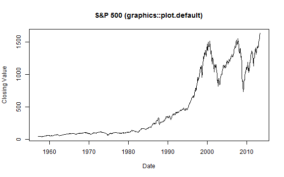
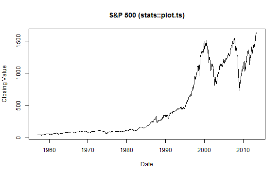
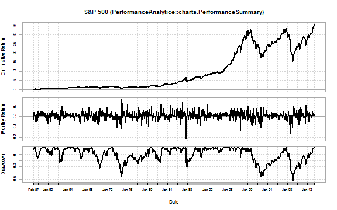
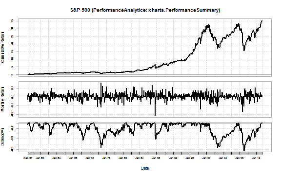
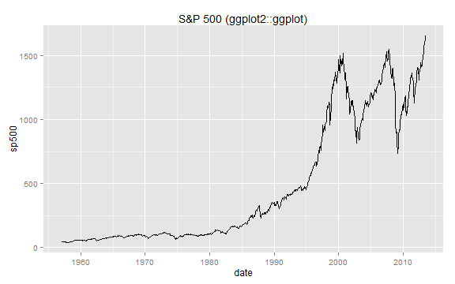
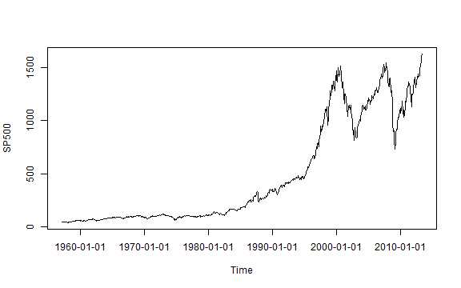
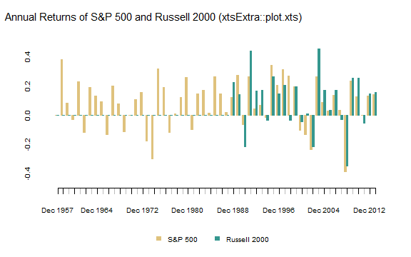

<style>
.rChart {
  height: 400px
}
</style>

# History of R Charting of Time Series

As with all of R, the ability to easily chart financial time series is the result of an iterative progression driven by the collaboration of an extremely dedicated group of open source volunteers.  With the release of [rCharts](http://ramnathv.github.io/rCharts), I thought it would be interesting to document the timeline of this progression.  For each step in the timeline, I will include a link to the source code (svn or github) of the package and a minimal example to demo the "out-of-the-box" capability.  Separating the financial time series piece from graphing in general can get murky, and some of the timeline will differ from the timeline of R graphics and the timeline of R time series analysis.

For a much more extensive discussion of time series analysis with R, please see:

- [Time Series Analysis with R](http://www.stats.uwo.ca/faculty/aim/tsar/tsar.pdf) by A. Ian McLeod, Hao Yu, and Esam Mahdi
- [CRAN Task View: Time Series Analysis](http://cran.r-project.org/web/views/TimeSeries.html) by Rob Hyndman
- [A Little Book of R for Time Series](http://a-little-book-of-r-for-time-series.readthedocs.org/en/latest/src/timeseries.html) by Avril Chohlan

Just in case you don't make it to the end,   
> Thanks to the contributors!  I wouldn't be using R if it weren't for you.


First, to build a plot, we need data. Let's see how easy it is to get a time series of financial data in R through `quantmod` [`getSymbols()`](https://r-forge.r-project.org/scm/viewvc.php/pkg/R/getSymbols.R?root=quantmod&view=log).  The [`getSymbols()`]((https://r-forge.r-project.org/scm/viewvc.php/pkg/R/getSymbols.R?root=quantmod&view=log)) function has been a work in progress since December 20, 2006.


```r
require(timeSeries)
require(latticeExtra)
require(ggplot2)
require(reshape2)
require(quantmod)
require(PerformanceAnalytics)
require(xtsExtra)
require(rCharts)


# get S&P 500 data from FRED (St. Louis Fed)
sp500 <- na.omit( 
  getSymbols(
    "SP500",
    src = "FRED",
    from = "1949-12-31",
    auto.assign = FALSE
  )
)

# use monthly data
sp500.monthly <- sp500[endpoints(sp500, on ="months")]
```


---
## Timeline

### plot.default (As Old as Time Itself)


```r
# base plot of time series prior to xts
# get the data in data.frame format rather than xts
sp500.df <- data.frame(
  index(sp500.monthly),
  coredata(sp500.monthly),
  stringsAsFactors=FALSE
)
# name columns
colnames( sp500.df ) <- c( "date", "sp500" )
# go back in time to plot.default from the graphics library
graphics::plot.default(
  x = sp500.df$date,
  y = sp500.df$sp500,
  type = "l",
  xlab = "Date",
  ylab = "Closing Value",
  main = "S&P 500 (graphics::plot.default)"
)
```

 


- - -

---
### [ts](https://stat.ethz.ch/pipermail/r-announce/1999/000097.html) 1999-08-27
The ts package was added in R version 0.65.0 and significantly improved with release 1.5.0 in April 2002.  There is a very good discussion of the improvements in Brian Ripley's ["Time Series in R 1.5.0" from Volume 2 of R News, June 2002](http://cran.r-project.org/doc/Rnews/Rnews_2002-2.pdf).

- - -

---
### [lattice](http://r-forge.r-project.org/scm/?group_id=638) and [grid](http://www.stat.auckland.ac.nz/~paul/grid/grid.html) released with R 1.5.0 2002-04-29
With the release of lattice and grid and also the improvements in ts mentioned above, R 1.5.0 was a very important milestone for both graphing and time series analysis.  All of these are covered in [Volume 2 of R News, June 2002](http://cran.r-project.org/doc/Rnews/Rnews_2002-2.pdf).

- - -

---
### [zoo](https://r-forge.r-project.org/scm/viewvc.php/pkg/zoo/R/plot.zoo.R?root=zoo&view=log) 2004-10-08


```r
# 2004-10-08 plot.zoo comes to the rescue with the zoo package
zoo::plot.zoo(sp500.monthly)
```

 


- - -

---
### [zoo](https://r-forge.r-project.org/scm/viewvc.php/pkg/zoo/R/xyplot.zoo.R?root=zoo&view=log) Meets [lattice](http://r-forge.r-project.org/scm/?group_id=638) 2006-07-06


```r
# 2006-07-06 zoo also made a handy lattice xyplot.zoo function
# so no more need to melt wide data to long data
# or convert to data.frame prior to plotting
# although slightly out of chronology
# I'll also use theEconomist from latticeExtra
asTheEconomist(
  xyplot(
    sp500.monthly,
    scales = list( y = list( rot = 0 ) ),
    main = "S&P 500 (lattice::xyplot.xts)"  
  )
)
```

 


- - -

---
### [PerformanceAnalytics chart.TimeSeries](https://r-forge.r-project.org/scm/viewvc.php/pkg/PerformanceAnalytics/R/chart.TimeSeries.R?root=returnanalytics&view=log) 2007-02-02


```r
# 2007-02-02 chart.TimeSeries in PerformanceAnalytics
charts.PerformanceSummary(
  ROC(sp500.monthly, n = 1, type = "discrete"),
  main = "S&P 500 (PerformanceAnalytice::charts.PerformanceSummary)"
)
```

  


- - -

---
### [ggplot2](http://cran.r-project.org/src/contrib/Archive/ggplot2/) 2007-06-10
Although ggplot2 is not designed specifically for time series plotting, I include it in the timeline for both its significant impact on R graphics and its ability to handle dates/times on the x-axis.  To use xts with ggplot2, a simple conversion to a wide or long format data.frame is necessary.

```r
#ggplot2 requires conversion of xts to data.frame
#we will use the data.frame from the plot.default example
ggplot( sp500.df, aes(date) ) + 
  geom_line( aes( y = sp500 ) ) +
  labs( title = "S&P 500 (ggplot2::ggplot)")
```

 

- - -

---
### [quantmod/ttr chartSeries](https://r-forge.r-project.org/scm/viewvc.php/pkg/R/chartSeries.R?root=quantmod&view=log) 2007-10-07

```r
# 2007-10-17 then quantmod/ttr built on zoo
# to offer much better handling of financial time series
# notice the ease of adding pertinent financial information
chartSeries(
  sp500.monthly,
#  log = TRUE,
  theme = chartTheme("white"),
  TA = c(addBBands(),addTA(RSI(sp500.monthly)))
)
```


Just look how easy it is to zoom.


```r
# also easy zooming
zoomChart("1990::")
```


- - -

---
### [xts plot.xts](https://r-forge.r-project.org/scm/viewvc.php/pkg/xts/R/plot.R?root=xts&view=log) 2008-02-17


```r
# 2008-02-17 xts improved zoo and other time series libraries
# http://cran.r-project.org/web/packages/xts/vignettes/xts.pdf
# plot.zoo got ported to plot.xts and little graphing improvement
xts::plot.xts(
  sp500.monthly,
  ylab = "Closing Value",
  main = "S&P 500 (xts::plot.xts)"  
)
```

 


- - -

---
### [timeSeries plot](https://r-forge.r-project.org/scm/viewvc.php/pkg/timeSeries/R/methods-plot.R?root=rmetrics&view=log) 2009-05-17
The timeSeries plot method is basically a port of R's plot.ts().  It does not significantly add any functionality, but I include it for completeness and since the [Rmetrics team](https://www.rmetrics.org) offers robust financial analysis through its many R packages that depend on the timeSeries object.


```r
timeSeries::plot(timeSeries(sp500.monthly))
```

 


- - -

---
### [xtsExtra plot.xts and barplot.xts](https://r-forge.r-project.org/scm/viewvc.php/pkg/xtsExtra/R/plot.R?root=xts&view=log) 2012-05-30


```r
# Summer 2012 Google Summer of Code
# xtsExtra significantly improves xts
# lots of examples in this post
# http://timelyportfolio.blogspot.com/search/label/plot.xts

#require(devtools)
#setwd("C:/Program Files/R/R-2.15.1/sandbox/svnsource/xts/pkg/xtsExtra")
#build()
#load_all()


#explore barplot.xts to do a chart of annual returns for both indexes
#merge prices
russell2000 <- getSymbols("^RUT", from = "1900-01-01", auto.assign = F)  
prices <- merge(sp500,russell2000[,4])
#use endpoints to get annual returns
returns.annual <- as.xts(
  apply(
    ROC(prices[endpoints(prices,"years")],type="discrete",n=1),
    MARGIN = 2,
    FUN = na.fill, fill = 0
  ),
  order.by = index(prices[endpoints(prices,"years")])
)
#name columns something a little more clear
colnames(returns.annual) <- c("S&P 500","Russell 2000")
#using barplot.xts create the plot
#I made some subtle changes to barplot.xts to experiment so plot will be cosmetically different
barplot.xts(returns.annual,
            stacked=FALSE,
            box="transparent",  #get rid of box surrounding the plot
            ylim=c(-0.5,0.5),
            ylab=NA,
            border=c(brewer.pal(n=11,"BrBG")[c(4,9)]),
            col=c(brewer.pal(n=11,"BrBG")[c(4,9)])) #deliberately trying some new colors                         
```

 

```r
title(main="Annual Returns of S&P 500 and Russell 2000 (xtsExtra::plot.xts)", 
      outer = TRUE,
      adj=0.05, font.main = 1, cex.main = 1.25, line = -2)
```

 


- - -

---
### rCharts


```r
# 2013 the world changes with rCharts

# define a function to convert wide to long
xtsMelt <- function(xtsData,metric){
  df <- data.frame(index(xtsData),coredata(xtsData),stringsAsFactors=FALSE)
  df.melt <- melt(df,id.vars=1)
  df.melt <- data.frame(df.melt,rep(metric,NROW(df.melt)))
  #little unnecessary housekeeping
  df.melt <- df.melt[,c(1,2,4,3)]
  colnames(df.melt) <- c("date","indexname","metric","value")
  df.melt$date <- as.Date(df.melt$date)
  #javascript works better when there are no .
  #remove troublesome . using modified method from this Stack Overflow
  #http://stackoverflow.com/questions/2851015/convert-data-frame-columns-from-factors-to-characters
  i <- sapply(df.melt, is.factor)
  df.melt[i] <- lapply(df.melt[i], gsub, pattern="\\.", replacement="")
  
  return(df.melt)
}

sp500.melt <- xtsMelt(
  sp500.monthly,
  metric = "price"
)

n1 <- nPlot(
  value~date,
  data = sp500.melt,
  group = "indexname",  # even though only one series need to specify group
  type = "lineWithFocusChart"
)

n1$xAxis(
  tickFormat="#!function(d) {return d3.time.format('%b %Y')(new Date( d * 86400000 ));}!#"
)

n1$x2Axis(
  tickFormat="#!function(d) {return d3.time.format('%Y')(new Date( d * 86400000 ));}!#"
)
n1$print("chart1")
```


<div id='chart1' class='rChart nvd3'></div>
<script type='text/javascript'>
 $(document).ready(function(){
      drawchart1()
    });
    function drawchart1(){  
      var opts = {
 "dom": "chart1",
"width":    600,
"height":    400,
"x": "date",
"y": "value",
"group": "indexname",
"type": "lineWithFocusChart",
"id": "chart1" 
},
        data = [
 {
 "date":  -4718,
"indexname": "SP500",
"metric": "price",
"value":  44.72 
},
{
 "date":  -4690,
"indexname": "SP500",
"metric": "price",
"value":  43.26 
},
{
 "date":  -4661,
"indexname": "SP500",
"metric": "price",
"value":  44.11 
},
{
 "date":  -4629,
"indexname": "SP500",
"metric": "price",
"value":  45.74 
},
{
 "date":  -4598,
"indexname": "SP500",
"metric": "price",
"value":  47.43 
},
{
 "date":  -4570,
"indexname": "SP500",
"metric": "price",
"value":  47.37 
},
{
 "date":  -4537,
"indexname": "SP500",
"metric": "price",
"value":  47.91 
},
{
 "date":  -4507,
"indexname": "SP500",
"metric": "price",
"value":  45.22 
},
{
 "date":  -4476,
"indexname": "SP500",
"metric": "price",
"value":  42.42 
},
{
 "date":  -4445,
"indexname": "SP500",
"metric": "price",
"value":  41.06 
},
{
 "date":  -4416,
"indexname": "SP500",
"metric": "price",
"value":  41.72 
},
{
 "date":  -4384,
"indexname": "SP500",
"metric": "price",
"value":  39.99 
},
{
 "date":  -4353,
"indexname": "SP500",
"metric": "price",
"value":   41.7 
},
{
 "date":  -4325,
"indexname": "SP500",
"metric": "price",
"value":  40.84 
},
{
 "date":  -4294,
"indexname": "SP500",
"metric": "price",
"value":   42.1 
},
{
 "date":  -4264,
"indexname": "SP500",
"metric": "price",
"value":  43.44 
},
{
 "date":  -4235,
"indexname": "SP500",
"metric": "price",
"value":  44.09 
},
{
 "date":  -4203,
"indexname": "SP500",
"metric": "price",
"value":  45.24 
},
{
 "date":  -4172,
"indexname": "SP500",
"metric": "price",
"value":  47.19 
},
{
 "date":  -4143,
"indexname": "SP500",
"metric": "price",
"value":  47.75 
},
{
 "date":  -4111,
"indexname": "SP500",
"metric": "price",
"value":  50.06 
},
{
 "date":  -4080,
"indexname": "SP500",
"metric": "price",
"value":  51.33 
},
{
 "date":  -4052,
"indexname": "SP500",
"metric": "price",
"value":  52.48 
},
{
 "date":  -4019,
"indexname": "SP500",
"metric": "price",
"value":  55.21 
},
{
 "date":  -3989,
"indexname": "SP500",
"metric": "price",
"value":  55.42 
},
{
 "date":  -3961,
"indexname": "SP500",
"metric": "price",
"value":  55.41 
},
{
 "date":  -3929,
"indexname": "SP500",
"metric": "price",
"value":  55.44 
},
{
 "date":  -3899,
"indexname": "SP500",
"metric": "price",
"value":  57.59 
},
{
 "date":  -3870,
"indexname": "SP500",
"metric": "price",
"value":  58.68 
},
{
 "date":  -3838,
"indexname": "SP500",
"metric": "price",
"value":  58.47 
},
{
 "date":  -3807,
"indexname": "SP500",
"metric": "price",
"value":  60.51 
},
{
 "date":  -3776,
"indexname": "SP500",
"metric": "price",
"value":   59.6 
},
{
 "date":  -3746,
"indexname": "SP500",
"metric": "price",
"value":  56.88 
},
{
 "date":  -3716,
"indexname": "SP500",
"metric": "price",
"value":  57.52 
},
{
 "date":  -3685,
"indexname": "SP500",
"metric": "price",
"value":  58.28 
},
{
 "date":  -3654,
"indexname": "SP500",
"metric": "price",
"value":  59.89 
},
{
 "date":  -3625,
"indexname": "SP500",
"metric": "price",
"value":  55.61 
},
{
 "date":  -3594,
"indexname": "SP500",
"metric": "price",
"value":  56.12 
},
{
 "date":  -3563,
"indexname": "SP500",
"metric": "price",
"value":  55.34 
},
{
 "date":  -3534,
"indexname": "SP500",
"metric": "price",
"value":  54.37 
},
{
 "date":  -3502,
"indexname": "SP500",
"metric": "price",
"value":  55.83 
},
{
 "date":  -3472,
"indexname": "SP500",
"metric": "price",
"value":  56.92 
},
{
 "date":  -3443,
"indexname": "SP500",
"metric": "price",
"value":  55.51 
},
{
 "date":  -3410,
"indexname": "SP500",
"metric": "price",
"value":  56.96 
},
{
 "date":  -3380,
"indexname": "SP500",
"metric": "price",
"value":  53.52 
},
{
 "date":  -3349,
"indexname": "SP500",
"metric": "price",
"value":  53.39 
},
{
 "date":  -3319,
"indexname": "SP500",
"metric": "price",
"value":  55.54 
},
{
 "date":  -3289,
"indexname": "SP500",
"metric": "price",
"value":  58.11 
},
{
 "date":  -3257,
"indexname": "SP500",
"metric": "price",
"value":  61.78 
},
{
 "date":  -3229,
"indexname": "SP500",
"metric": "price",
"value":  63.44 
},
{
 "date":  -3199,
"indexname": "SP500",
"metric": "price",
"value":  65.06 
},
{
 "date":  -3170,
"indexname": "SP500",
"metric": "price",
"value":  65.31 
},
{
 "date":  -3137,
"indexname": "SP500",
"metric": "price",
"value":  66.56 
},
{
 "date":  -3107,
"indexname": "SP500",
"metric": "price",
"value":  64.64 
},
{
 "date":  -3076,
"indexname": "SP500",
"metric": "price",
"value":  66.76 
},
{
 "date":  -3045,
"indexname": "SP500",
"metric": "price",
"value":  68.07 
},
{
 "date":  -3016,
"indexname": "SP500",
"metric": "price",
"value":  66.73 
},
{
 "date":  -2984,
"indexname": "SP500",
"metric": "price",
"value":  68.62 
},
{
 "date":  -2954,
"indexname": "SP500",
"metric": "price",
"value":  71.32 
},
{
 "date":  -2925,
"indexname": "SP500",
"metric": "price",
"value":  71.55 
},
{
 "date":  -2892,
"indexname": "SP500",
"metric": "price",
"value":  68.84 
},
{
 "date":  -2864,
"indexname": "SP500",
"metric": "price",
"value":  69.96 
},
{
 "date":  -2834,
"indexname": "SP500",
"metric": "price",
"value":  69.55 
},
{
 "date":  -2803,
"indexname": "SP500",
"metric": "price",
"value":  65.24 
},
{
 "date":  -2772,
"indexname": "SP500",
"metric": "price",
"value":  59.63 
},
{
 "date":  -2743,
"indexname": "SP500",
"metric": "price",
"value":  54.75 
},
{
 "date":  -2711,
"indexname": "SP500",
"metric": "price",
"value":  58.23 
},
{
 "date":  -2680,
"indexname": "SP500",
"metric": "price",
"value":  59.12 
},
{
 "date":  -2652,
"indexname": "SP500",
"metric": "price",
"value":  56.27 
},
{
 "date":  -2619,
"indexname": "SP500",
"metric": "price",
"value":  56.52 
},
{
 "date":  -2589,
"indexname": "SP500",
"metric": "price",
"value":  62.26 
},
{
 "date":  -2558,
"indexname": "SP500",
"metric": "price",
"value":   63.1 
},
{
 "date":  -2527,
"indexname": "SP500",
"metric": "price",
"value":   66.2 
},
{
 "date":  -2499,
"indexname": "SP500",
"metric": "price",
"value":  64.29 
},
{
 "date":  -2470,
"indexname": "SP500",
"metric": "price",
"value":  66.57 
},
{
 "date":  -2438,
"indexname": "SP500",
"metric": "price",
"value":   69.8 
},
{
 "date":  -2407,
"indexname": "SP500",
"metric": "price",
"value":   70.8 
},
{
 "date":  -2379,
"indexname": "SP500",
"metric": "price",
"value":  69.37 
},
{
 "date":  -2346,
"indexname": "SP500",
"metric": "price",
"value":  69.13 
},
{
 "date":  -2316,
"indexname": "SP500",
"metric": "price",
"value":   72.5 
},
{
 "date":  -2285,
"indexname": "SP500",
"metric": "price",
"value":   71.7 
},
{
 "date":  -2254,
"indexname": "SP500",
"metric": "price",
"value":  74.01 
},
{
 "date":  -2225,
"indexname": "SP500",
"metric": "price",
"value":  73.23 
},
{
 "date":  -2193,
"indexname": "SP500",
"metric": "price",
"value":  75.02 
},
{
 "date":  -2162,
"indexname": "SP500",
"metric": "price",
"value":  77.04 
},
{
 "date":  -2134,
"indexname": "SP500",
"metric": "price",
"value":   77.8 
},
{
 "date":  -2102,
"indexname": "SP500",
"metric": "price",
"value":  78.98 
},
{
 "date":  -2072,
"indexname": "SP500",
"metric": "price",
"value":  79.46 
},
{
 "date":  -2044,
"indexname": "SP500",
"metric": "price",
"value":  80.37 
},
{
 "date":  -2011,
"indexname": "SP500",
"metric": "price",
"value":  81.69 
},
{
 "date":  -1980,
"indexname": "SP500",
"metric": "price",
"value":  83.18 
},
{
 "date":  -1949,
"indexname": "SP500",
"metric": "price",
"value":  81.83 
},
{
 "date":  -1919,
"indexname": "SP500",
"metric": "price",
"value":  84.18 
},
{
 "date":  -1889,
"indexname": "SP500",
"metric": "price",
"value":  84.86 
},
{
 "date":  -1858,
"indexname": "SP500",
"metric": "price",
"value":  84.42 
},
{
 "date":  -1827,
"indexname": "SP500",
"metric": "price",
"value":  84.75 
},
{
 "date":  -1798,
"indexname": "SP500",
"metric": "price",
"value":  87.56 
},
{
 "date":  -1770,
"indexname": "SP500",
"metric": "price",
"value":  87.43 
},
{
 "date":  -1737,
"indexname": "SP500",
"metric": "price",
"value":  86.16 
},
{
 "date":  -1707,
"indexname": "SP500",
"metric": "price",
"value":  89.11 
},
{
 "date":  -1679,
"indexname": "SP500",
"metric": "price",
"value":  88.42 
},
{
 "date":  -1646,
"indexname": "SP500",
"metric": "price",
"value":  84.12 
},
{
 "date":  -1616,
"indexname": "SP500",
"metric": "price",
"value":  85.25 
},
{
 "date":  -1584,
"indexname": "SP500",
"metric": "price",
"value":  87.17 
},
{
 "date":  -1554,
"indexname": "SP500",
"metric": "price",
"value":  89.96 
},
{
 "date":  -1525,
"indexname": "SP500",
"metric": "price",
"value":  92.42 
},
{
 "date":  -1493,
"indexname": "SP500",
"metric": "price",
"value":  91.61 
},
{
 "date":  -1462,
"indexname": "SP500",
"metric": "price",
"value":  92.43 
},
{
 "date":  -1431,
"indexname": "SP500",
"metric": "price",
"value":  92.88 
},
{
 "date":  -1403,
"indexname": "SP500",
"metric": "price",
"value":  91.22 
},
{
 "date":  -1372,
"indexname": "SP500",
"metric": "price",
"value":  89.23 
},
{
 "date":  -1343,
"indexname": "SP500",
"metric": "price",
"value":  91.06 
},
{
 "date":  -1311,
"indexname": "SP500",
"metric": "price",
"value":  86.13 
},
{
 "date":  -1281,
"indexname": "SP500",
"metric": "price",
"value":  84.74 
},
{
 "date":  -1252,
"indexname": "SP500",
"metric": "price",
"value":   83.6 
},
{
 "date":  -1219,
"indexname": "SP500",
"metric": "price",
"value":   77.1 
},
{
 "date":  -1189,
"indexname": "SP500",
"metric": "price",
"value":  76.56 
},
{
 "date":  -1158,
"indexname": "SP500",
"metric": "price",
"value":   80.2 
},
{
 "date":  -1128,
"indexname": "SP500",
"metric": "price",
"value":  80.45 
},
{
 "date":  -1098,
"indexname": "SP500",
"metric": "price",
"value":  80.33 
},
{
 "date":  -1066,
"indexname": "SP500",
"metric": "price",
"value":  86.61 
},
{
 "date":  -1038,
"indexname": "SP500",
"metric": "price",
"value":  86.78 
},
{
 "date":  -1007,
"indexname": "SP500",
"metric": "price",
"value":   90.2 
},
{
 "date":   -979,
"indexname": "SP500",
"metric": "price",
"value":  94.01 
},
{
 "date":   -946,
"indexname": "SP500",
"metric": "price",
"value":  89.08 
},
{
 "date":   -916,
"indexname": "SP500",
"metric": "price",
"value":  90.64 
},
{
 "date":   -885,
"indexname": "SP500",
"metric": "price",
"value":  94.75 
},
{
 "date":   -854,
"indexname": "SP500",
"metric": "price",
"value":  93.64 
},
{
 "date":   -825,
"indexname": "SP500",
"metric": "price",
"value":  96.71 
},
{
 "date":   -793,
"indexname": "SP500",
"metric": "price",
"value":   93.9 
},
{
 "date":   -763,
"indexname": "SP500",
"metric": "price",
"value":     94 
},
{
 "date":   -734,
"indexname": "SP500",
"metric": "price",
"value":  96.47 
},
{
 "date":   -701,
"indexname": "SP500",
"metric": "price",
"value":  92.24 
},
{
 "date":   -672,
"indexname": "SP500",
"metric": "price",
"value":  89.36 
},
{
 "date":   -643,
"indexname": "SP500",
"metric": "price",
"value":   90.2 
},
{
 "date":   -611,
"indexname": "SP500",
"metric": "price",
"value":  97.59 
},
{
 "date":   -580,
"indexname": "SP500",
"metric": "price",
"value":  98.68 
},
{
 "date":   -552,
"indexname": "SP500",
"metric": "price",
"value":  99.58 
},
{
 "date":   -520,
"indexname": "SP500",
"metric": "price",
"value":  97.74 
},
{
 "date":   -489,
"indexname": "SP500",
"metric": "price",
"value":  98.86 
},
{
 "date":   -458,
"indexname": "SP500",
"metric": "price",
"value": 102.67 
},
{
 "date":   -427,
"indexname": "SP500",
"metric": "price",
"value": 103.41 
},
{
 "date":   -398,
"indexname": "SP500",
"metric": "price",
"value": 108.37 
},
{
 "date":   -366,
"indexname": "SP500",
"metric": "price",
"value": 103.86 
},
{
 "date":   -335,
"indexname": "SP500",
"metric": "price",
"value": 103.01 
},
{
 "date":   -307,
"indexname": "SP500",
"metric": "price",
"value":  98.13 
},
{
 "date":   -279,
"indexname": "SP500",
"metric": "price",
"value": 101.51 
},
{
 "date":   -246,
"indexname": "SP500",
"metric": "price",
"value": 103.69 
},
{
 "date":   -217,
"indexname": "SP500",
"metric": "price",
"value": 103.46 
},
{
 "date":   -185,
"indexname": "SP500",
"metric": "price",
"value":  97.71 
},
{
 "date":   -154,
"indexname": "SP500",
"metric": "price",
"value":  91.83 
},
{
 "date":   -125,
"indexname": "SP500",
"metric": "price",
"value":  95.51 
},
{
 "date":    -93,
"indexname": "SP500",
"metric": "price",
"value":  93.12 
},
{
 "date":    -62,
"indexname": "SP500",
"metric": "price",
"value":  97.24 
},
{
 "date":    -34,
"indexname": "SP500",
"metric": "price",
"value":  93.81 
},
{
 "date":     -1,
"indexname": "SP500",
"metric": "price",
"value":  92.06 
},
{
 "date":     29,
"indexname": "SP500",
"metric": "price",
"value":  85.02 
},
{
 "date":     57,
"indexname": "SP500",
"metric": "price",
"value":   89.5 
},
{
 "date":     89,
"indexname": "SP500",
"metric": "price",
"value":  89.63 
},
{
 "date":    119,
"indexname": "SP500",
"metric": "price",
"value":  81.52 
},
{
 "date":    148,
"indexname": "SP500",
"metric": "price",
"value":  76.55 
},
{
 "date":    180,
"indexname": "SP500",
"metric": "price",
"value":  72.72 
},
{
 "date":    211,
"indexname": "SP500",
"metric": "price",
"value":  78.05 
},
{
 "date":    242,
"indexname": "SP500",
"metric": "price",
"value":  81.52 
},
{
 "date":    272,
"indexname": "SP500",
"metric": "price",
"value":  84.21 
},
{
 "date":    302,
"indexname": "SP500",
"metric": "price",
"value":  83.25 
},
{
 "date":    333,
"indexname": "SP500",
"metric": "price",
"value":   87.2 
},
{
 "date":    364,
"indexname": "SP500",
"metric": "price",
"value":  92.15 
},
{
 "date":    393,
"indexname": "SP500",
"metric": "price",
"value":  95.88 
},
{
 "date":    421,
"indexname": "SP500",
"metric": "price",
"value":  96.75 
},
{
 "date":    454,
"indexname": "SP500",
"metric": "price",
"value": 100.31 
},
{
 "date":    484,
"indexname": "SP500",
"metric": "price",
"value": 103.95 
},
{
 "date":    512,
"indexname": "SP500",
"metric": "price",
"value":  99.63 
},
{
 "date":    545,
"indexname": "SP500",
"metric": "price",
"value":   99.7 
},
{
 "date":    575,
"indexname": "SP500",
"metric": "price",
"value":  95.58 
},
{
 "date":    607,
"indexname": "SP500",
"metric": "price",
"value":  99.03 
},
{
 "date":    637,
"indexname": "SP500",
"metric": "price",
"value":  98.34 
},
{
 "date":    666,
"indexname": "SP500",
"metric": "price",
"value":  94.23 
},
{
 "date":    698,
"indexname": "SP500",
"metric": "price",
"value":  93.99 
},
{
 "date":    729,
"indexname": "SP500",
"metric": "price",
"value": 102.09 
},
{
 "date":    760,
"indexname": "SP500",
"metric": "price",
"value": 103.94 
},
{
 "date":    789,
"indexname": "SP500",
"metric": "price",
"value": 106.57 
},
{
 "date":    819,
"indexname": "SP500",
"metric": "price",
"value":  107.2 
},
{
 "date":    848,
"indexname": "SP500",
"metric": "price",
"value": 107.67 
},
{
 "date":    881,
"indexname": "SP500",
"metric": "price",
"value": 109.53 
},
{
 "date":    911,
"indexname": "SP500",
"metric": "price",
"value": 107.14 
},
{
 "date":    942,
"indexname": "SP500",
"metric": "price",
"value": 107.39 
},
{
 "date":    973,
"indexname": "SP500",
"metric": "price",
"value": 111.09 
},
{
 "date":   1002,
"indexname": "SP500",
"metric": "price",
"value": 110.55 
},
{
 "date":   1034,
"indexname": "SP500",
"metric": "price",
"value": 111.58 
},
{
 "date":   1064,
"indexname": "SP500",
"metric": "price",
"value": 116.67 
},
{
 "date":   1093,
"indexname": "SP500",
"metric": "price",
"value": 118.05 
},
{
 "date":   1126,
"indexname": "SP500",
"metric": "price",
"value": 116.03 
},
{
 "date":   1154,
"indexname": "SP500",
"metric": "price",
"value": 111.68 
},
{
 "date":   1184,
"indexname": "SP500",
"metric": "price",
"value": 111.52 
},
{
 "date":   1215,
"indexname": "SP500",
"metric": "price",
"value": 106.97 
},
{
 "date":   1246,
"indexname": "SP500",
"metric": "price",
"value": 104.95 
},
{
 "date":   1275,
"indexname": "SP500",
"metric": "price",
"value": 104.26 
},
{
 "date":   1307,
"indexname": "SP500",
"metric": "price",
"value": 108.22 
},
{
 "date":   1338,
"indexname": "SP500",
"metric": "price",
"value": 104.25 
},
{
 "date":   1366,
"indexname": "SP500",
"metric": "price",
"value": 108.43 
},
{
 "date":   1399,
"indexname": "SP500",
"metric": "price",
"value": 108.29 
},
{
 "date":   1429,
"indexname": "SP500",
"metric": "price",
"value":  95.96 
},
{
 "date":   1460,
"indexname": "SP500",
"metric": "price",
"value":  97.55 
},
{
 "date":   1491,
"indexname": "SP500",
"metric": "price",
"value":  96.57 
},
{
 "date":   1519,
"indexname": "SP500",
"metric": "price",
"value":  96.22 
},
{
 "date":   1548,
"indexname": "SP500",
"metric": "price",
"value":  93.98 
},
{
 "date":   1580,
"indexname": "SP500",
"metric": "price",
"value":  90.31 
},
{
 "date":   1611,
"indexname": "SP500",
"metric": "price",
"value":  87.28 
},
{
 "date":   1639,
"indexname": "SP500",
"metric": "price",
"value":     86 
},
{
 "date":   1672,
"indexname": "SP500",
"metric": "price",
"value":  79.31 
},
{
 "date":   1702,
"indexname": "SP500",
"metric": "price",
"value":  72.15 
},
{
 "date":   1733,
"indexname": "SP500",
"metric": "price",
"value":  63.54 
},
{
 "date":   1764,
"indexname": "SP500",
"metric": "price",
"value":   73.9 
},
{
 "date":   1793,
"indexname": "SP500",
"metric": "price",
"value":  69.97 
},
{
 "date":   1825,
"indexname": "SP500",
"metric": "price",
"value":  68.56 
},
{
 "date":   1856,
"indexname": "SP500",
"metric": "price",
"value":  76.98 
},
{
 "date":   1884,
"indexname": "SP500",
"metric": "price",
"value":  81.59 
},
{
 "date":   1915,
"indexname": "SP500",
"metric": "price",
"value":  83.36 
},
{
 "date":   1945,
"indexname": "SP500",
"metric": "price",
"value":   87.3 
},
{
 "date":   1975,
"indexname": "SP500",
"metric": "price",
"value":  91.15 
},
{
 "date":   2006,
"indexname": "SP500",
"metric": "price",
"value":  95.19 
},
{
 "date":   2037,
"indexname": "SP500",
"metric": "price",
"value":  88.75 
},
{
 "date":   2066,
"indexname": "SP500",
"metric": "price",
"value":  86.88 
},
{
 "date":   2098,
"indexname": "SP500",
"metric": "price",
"value":  83.87 
},
{
 "date":   2129,
"indexname": "SP500",
"metric": "price",
"value":  89.04 
},
{
 "date":   2157,
"indexname": "SP500",
"metric": "price",
"value":  91.24 
},
{
 "date":   2190,
"indexname": "SP500",
"metric": "price",
"value":  90.19 
},
{
 "date":   2220,
"indexname": "SP500",
"metric": "price",
"value": 100.86 
},
{
 "date":   2248,
"indexname": "SP500",
"metric": "price",
"value":  99.71 
},
{
 "date":   2281,
"indexname": "SP500",
"metric": "price",
"value": 102.77 
},
{
 "date":   2311,
"indexname": "SP500",
"metric": "price",
"value": 101.64 
},
{
 "date":   2339,
"indexname": "SP500",
"metric": "price",
"value": 100.18 
},
{
 "date":   2372,
"indexname": "SP500",
"metric": "price",
"value": 104.28 
},
{
 "date":   2402,
"indexname": "SP500",
"metric": "price",
"value": 103.44 
},
{
 "date":   2434,
"indexname": "SP500",
"metric": "price",
"value": 102.91 
},
{
 "date":   2464,
"indexname": "SP500",
"metric": "price",
"value": 105.24 
},
{
 "date":   2493,
"indexname": "SP500",
"metric": "price",
"value":  102.9 
},
{
 "date":   2525,
"indexname": "SP500",
"metric": "price",
"value":  102.1 
},
{
 "date":   2556,
"indexname": "SP500",
"metric": "price",
"value": 107.46 
},
{
 "date":   2587,
"indexname": "SP500",
"metric": "price",
"value": 102.03 
},
{
 "date":   2615,
"indexname": "SP500",
"metric": "price",
"value":  99.82 
},
{
 "date":   2646,
"indexname": "SP500",
"metric": "price",
"value":  98.42 
},
{
 "date":   2675,
"indexname": "SP500",
"metric": "price",
"value":  98.44 
},
{
 "date":   2707,
"indexname": "SP500",
"metric": "price",
"value":  96.12 
},
{
 "date":   2737,
"indexname": "SP500",
"metric": "price",
"value": 100.48 
},
{
 "date":   2766,
"indexname": "SP500",
"metric": "price",
"value":  98.85 
},
{
 "date":   2799,
"indexname": "SP500",
"metric": "price",
"value":  96.77 
},
{
 "date":   2829,
"indexname": "SP500",
"metric": "price",
"value":  96.53 
},
{
 "date":   2860,
"indexname": "SP500",
"metric": "price",
"value":  92.34 
},
{
 "date":   2890,
"indexname": "SP500",
"metric": "price",
"value":  94.83 
},
{
 "date":   2920,
"indexname": "SP500",
"metric": "price",
"value":   95.1 
},
{
 "date":   2952,
"indexname": "SP500",
"metric": "price",
"value":  89.25 
},
{
 "date":   2980,
"indexname": "SP500",
"metric": "price",
"value":  87.04 
},
{
 "date":   3011,
"indexname": "SP500",
"metric": "price",
"value":  89.21 
},
{
 "date":   3039,
"indexname": "SP500",
"metric": "price",
"value":  96.83 
},
{
 "date":   3072,
"indexname": "SP500",
"metric": "price",
"value":  97.29 
},
{
 "date":   3102,
"indexname": "SP500",
"metric": "price",
"value":  95.53 
},
{
 "date":   3133,
"indexname": "SP500",
"metric": "price",
"value": 100.68 
},
{
 "date":   3164,
"indexname": "SP500",
"metric": "price",
"value": 103.29 
},
{
 "date":   3193,
"indexname": "SP500",
"metric": "price",
"value": 102.54 
},
{
 "date":   3225,
"indexname": "SP500",
"metric": "price",
"value":  93.15 
},
{
 "date":   3255,
"indexname": "SP500",
"metric": "price",
"value":   94.7 
},
{
 "date":   3284,
"indexname": "SP500",
"metric": "price",
"value":  96.11 
},
{
 "date":   3317,
"indexname": "SP500",
"metric": "price",
"value":  99.93 
},
{
 "date":   3345,
"indexname": "SP500",
"metric": "price",
"value":  96.28 
},
{
 "date":   3375,
"indexname": "SP500",
"metric": "price",
"value": 101.59 
},
{
 "date":   3406,
"indexname": "SP500",
"metric": "price",
"value": 101.76 
},
{
 "date":   3437,
"indexname": "SP500",
"metric": "price",
"value":  99.08 
},
{
 "date":   3466,
"indexname": "SP500",
"metric": "price",
"value": 102.91 
},
{
 "date":   3498,
"indexname": "SP500",
"metric": "price",
"value": 103.81 
},
{
 "date":   3529,
"indexname": "SP500",
"metric": "price",
"value": 109.32 
},
{
 "date":   3557,
"indexname": "SP500",
"metric": "price",
"value": 109.32 
},
{
 "date":   3590,
"indexname": "SP500",
"metric": "price",
"value": 101.82 
},
{
 "date":   3620,
"indexname": "SP500",
"metric": "price",
"value": 106.16 
},
{
 "date":   3651,
"indexname": "SP500",
"metric": "price",
"value": 107.94 
},
{
 "date":   3682,
"indexname": "SP500",
"metric": "price",
"value": 114.16 
},
{
 "date":   3711,
"indexname": "SP500",
"metric": "price",
"value": 113.66 
},
{
 "date":   3742,
"indexname": "SP500",
"metric": "price",
"value": 102.09 
},
{
 "date":   3772,
"indexname": "SP500",
"metric": "price",
"value": 106.29 
},
{
 "date":   3802,
"indexname": "SP500",
"metric": "price",
"value": 111.24 
},
{
 "date":   3833,
"indexname": "SP500",
"metric": "price",
"value": 114.24 
},
{
 "date":   3864,
"indexname": "SP500",
"metric": "price",
"value": 121.67 
},
{
 "date":   3893,
"indexname": "SP500",
"metric": "price",
"value": 122.38 
},
{
 "date":   3925,
"indexname": "SP500",
"metric": "price",
"value": 125.46 
},
{
 "date":   3956,
"indexname": "SP500",
"metric": "price",
"value": 127.47 
},
{
 "date":   3984,
"indexname": "SP500",
"metric": "price",
"value": 140.52 
},
{
 "date":   4017,
"indexname": "SP500",
"metric": "price",
"value": 135.76 
},
{
 "date":   4047,
"indexname": "SP500",
"metric": "price",
"value": 129.55 
},
{
 "date":   4075,
"indexname": "SP500",
"metric": "price",
"value": 131.27 
},
{
 "date":   4107,
"indexname": "SP500",
"metric": "price",
"value":    136 
},
{
 "date":   4137,
"indexname": "SP500",
"metric": "price",
"value": 132.81 
},
{
 "date":   4166,
"indexname": "SP500",
"metric": "price",
"value": 132.59 
},
{
 "date":   4198,
"indexname": "SP500",
"metric": "price",
"value": 131.21 
},
{
 "date":   4229,
"indexname": "SP500",
"metric": "price",
"value": 130.92 
},
{
 "date":   4260,
"indexname": "SP500",
"metric": "price",
"value": 122.79 
},
{
 "date":   4290,
"indexname": "SP500",
"metric": "price",
"value": 116.18 
},
{
 "date":   4320,
"indexname": "SP500",
"metric": "price",
"value": 121.89 
},
{
 "date":   4351,
"indexname": "SP500",
"metric": "price",
"value": 126.35 
},
{
 "date":   4382,
"indexname": "SP500",
"metric": "price",
"value": 122.55 
},
{
 "date":   4411,
"indexname": "SP500",
"metric": "price",
"value":  120.4 
},
{
 "date":   4439,
"indexname": "SP500",
"metric": "price",
"value": 113.11 
},
{
 "date":   4472,
"indexname": "SP500",
"metric": "price",
"value": 111.96 
},
{
 "date":   4502,
"indexname": "SP500",
"metric": "price",
"value": 116.44 
},
{
 "date":   4530,
"indexname": "SP500",
"metric": "price",
"value": 111.88 
},
{
 "date":   4563,
"indexname": "SP500",
"metric": "price",
"value": 109.61 
},
{
 "date":   4593,
"indexname": "SP500",
"metric": "price",
"value": 107.09 
},
{
 "date":   4625,
"indexname": "SP500",
"metric": "price",
"value": 119.51 
},
{
 "date":   4655,
"indexname": "SP500",
"metric": "price",
"value": 120.42 
},
{
 "date":   4684,
"indexname": "SP500",
"metric": "price",
"value": 133.71 
},
{
 "date":   4716,
"indexname": "SP500",
"metric": "price",
"value": 138.54 
},
{
 "date":   4747,
"indexname": "SP500",
"metric": "price",
"value": 140.64 
},
{
 "date":   4778,
"indexname": "SP500",
"metric": "price",
"value":  145.3 
},
{
 "date":   4806,
"indexname": "SP500",
"metric": "price",
"value": 148.06 
},
{
 "date":   4837,
"indexname": "SP500",
"metric": "price",
"value": 152.96 
},
{
 "date":   4866,
"indexname": "SP500",
"metric": "price",
"value": 164.42 
},
{
 "date":   4898,
"indexname": "SP500",
"metric": "price",
"value": 162.39 
},
{
 "date":   4928,
"indexname": "SP500",
"metric": "price",
"value": 168.11 
},
{
 "date":   4957,
"indexname": "SP500",
"metric": "price",
"value": 162.56 
},
{
 "date":   4990,
"indexname": "SP500",
"metric": "price",
"value":  164.4 
},
{
 "date":   5020,
"indexname": "SP500",
"metric": "price",
"value": 166.07 
},
{
 "date":   5051,
"indexname": "SP500",
"metric": "price",
"value": 163.55 
},
{
 "date":   5081,
"indexname": "SP500",
"metric": "price",
"value":  166.4 
},
{
 "date":   5111,
"indexname": "SP500",
"metric": "price",
"value": 164.93 
},
{
 "date":   5143,
"indexname": "SP500",
"metric": "price",
"value": 163.41 
},
{
 "date":   5172,
"indexname": "SP500",
"metric": "price",
"value": 157.06 
},
{
 "date":   5202,
"indexname": "SP500",
"metric": "price",
"value": 159.18 
},
{
 "date":   5233,
"indexname": "SP500",
"metric": "price",
"value": 160.05 
},
{
 "date":   5264,
"indexname": "SP500",
"metric": "price",
"value": 150.55 
},
{
 "date":   5293,
"indexname": "SP500",
"metric": "price",
"value": 153.18 
},
{
 "date":   5325,
"indexname": "SP500",
"metric": "price",
"value": 150.66 
},
{
 "date":   5356,
"indexname": "SP500",
"metric": "price",
"value": 166.68 
},
{
 "date":   5384,
"indexname": "SP500",
"metric": "price",
"value":  166.1 
},
{
 "date":   5417,
"indexname": "SP500",
"metric": "price",
"value": 166.09 
},
{
 "date":   5447,
"indexname": "SP500",
"metric": "price",
"value": 163.58 
},
{
 "date":   5478,
"indexname": "SP500",
"metric": "price",
"value": 167.24 
},
{
 "date":   5509,
"indexname": "SP500",
"metric": "price",
"value": 179.63 
},
{
 "date":   5537,
"indexname": "SP500",
"metric": "price",
"value": 181.18 
},
{
 "date":   5566,
"indexname": "SP500",
"metric": "price",
"value": 180.66 
},
{
 "date":   5598,
"indexname": "SP500",
"metric": "price",
"value": 179.83 
},
{
 "date":   5629,
"indexname": "SP500",
"metric": "price",
"value": 189.55 
},
{
 "date":   5657,
"indexname": "SP500",
"metric": "price",
"value": 191.85 
},
{
 "date":   5690,
"indexname": "SP500",
"metric": "price",
"value": 190.92 
},
{
 "date":   5720,
"indexname": "SP500",
"metric": "price",
"value": 188.63 
},
{
 "date":   5751,
"indexname": "SP500",
"metric": "price",
"value": 182.08 
},
{
 "date":   5782,
"indexname": "SP500",
"metric": "price",
"value": 189.82 
},
{
 "date":   5811,
"indexname": "SP500",
"metric": "price",
"value": 202.17 
},
{
 "date":   5843,
"indexname": "SP500",
"metric": "price",
"value": 211.28 
},
{
 "date":   5874,
"indexname": "SP500",
"metric": "price",
"value": 211.78 
},
{
 "date":   5902,
"indexname": "SP500",
"metric": "price",
"value": 226.92 
},
{
 "date":   5933,
"indexname": "SP500",
"metric": "price",
"value":  238.9 
},
{
 "date":   5963,
"indexname": "SP500",
"metric": "price",
"value": 235.52 
},
{
 "date":   5993,
"indexname": "SP500",
"metric": "price",
"value": 247.35 
},
{
 "date":   6024,
"indexname": "SP500",
"metric": "price",
"value": 250.84 
},
{
 "date":   6055,
"indexname": "SP500",
"metric": "price",
"value": 236.12 
},
{
 "date":   6084,
"indexname": "SP500",
"metric": "price",
"value": 252.93 
},
{
 "date":   6116,
"indexname": "SP500",
"metric": "price",
"value": 231.32 
},
{
 "date":   6147,
"indexname": "SP500",
"metric": "price",
"value": 243.98 
},
{
 "date":   6175,
"indexname": "SP500",
"metric": "price",
"value": 249.22 
},
{
 "date":   6208,
"indexname": "SP500",
"metric": "price",
"value": 242.17 
},
{
 "date":   6238,
"indexname": "SP500",
"metric": "price",
"value": 274.08 
},
{
 "date":   6266,
"indexname": "SP500",
"metric": "price",
"value":  284.2 
},
{
 "date":   6298,
"indexname": "SP500",
"metric": "price",
"value":  291.7 
},
{
 "date":   6328,
"indexname": "SP500",
"metric": "price",
"value": 288.36 
},
{
 "date":   6357,
"indexname": "SP500",
"metric": "price",
"value":  290.1 
},
{
 "date":   6389,
"indexname": "SP500",
"metric": "price",
"value":    304 
},
{
 "date":   6420,
"indexname": "SP500",
"metric": "price",
"value": 318.66 
},
{
 "date":   6451,
"indexname": "SP500",
"metric": "price",
"value":  329.8 
},
{
 "date":   6481,
"indexname": "SP500",
"metric": "price",
"value": 321.83 
},
{
 "date":   6511,
"indexname": "SP500",
"metric": "price",
"value": 251.79 
},
{
 "date":   6542,
"indexname": "SP500",
"metric": "price",
"value":  230.3 
},
{
 "date":   6573,
"indexname": "SP500",
"metric": "price",
"value": 247.08 
},
{
 "date":   6602,
"indexname": "SP500",
"metric": "price",
"value": 257.07 
},
{
 "date":   6633,
"indexname": "SP500",
"metric": "price",
"value": 267.82 
},
{
 "date":   6664,
"indexname": "SP500",
"metric": "price",
"value": 258.89 
},
{
 "date":   6693,
"indexname": "SP500",
"metric": "price",
"value": 261.33 
},
{
 "date":   6725,
"indexname": "SP500",
"metric": "price",
"value": 262.16 
},
{
 "date":   6755,
"indexname": "SP500",
"metric": "price",
"value":  273.5 
},
{
 "date":   6784,
"indexname": "SP500",
"metric": "price",
"value": 272.02 
},
{
 "date":   6817,
"indexname": "SP500",
"metric": "price",
"value": 261.52 
},
{
 "date":   6847,
"indexname": "SP500",
"metric": "price",
"value": 271.91 
},
{
 "date":   6878,
"indexname": "SP500",
"metric": "price",
"value": 278.97 
},
{
 "date":   6908,
"indexname": "SP500",
"metric": "price",
"value":  273.7 
},
{
 "date":   6938,
"indexname": "SP500",
"metric": "price",
"value": 277.72 
},
{
 "date":   6970,
"indexname": "SP500",
"metric": "price",
"value": 297.47 
},
{
 "date":   6998,
"indexname": "SP500",
"metric": "price",
"value": 288.86 
},
{
 "date":   7029,
"indexname": "SP500",
"metric": "price",
"value": 294.87 
},
{
 "date":   7057,
"indexname": "SP500",
"metric": "price",
"value": 309.64 
},
{
 "date":   7090,
"indexname": "SP500",
"metric": "price",
"value": 320.52 
},
{
 "date":   7120,
"indexname": "SP500",
"metric": "price",
"value": 317.98 
},
{
 "date":   7151,
"indexname": "SP500",
"metric": "price",
"value": 346.08 
},
{
 "date":   7182,
"indexname": "SP500",
"metric": "price",
"value": 351.45 
},
{
 "date":   7211,
"indexname": "SP500",
"metric": "price",
"value": 349.15 
},
{
 "date":   7243,
"indexname": "SP500",
"metric": "price",
"value": 340.36 
},
{
 "date":   7273,
"indexname": "SP500",
"metric": "price",
"value": 345.99 
},
{
 "date":   7302,
"indexname": "SP500",
"metric": "price",
"value":  353.4 
},
{
 "date":   7335,
"indexname": "SP500",
"metric": "price",
"value": 329.08 
},
{
 "date":   7363,
"indexname": "SP500",
"metric": "price",
"value": 331.89 
},
{
 "date":   7393,
"indexname": "SP500",
"metric": "price",
"value": 339.94 
},
{
 "date":   7424,
"indexname": "SP500",
"metric": "price",
"value":  330.8 
},
{
 "date":   7455,
"indexname": "SP500",
"metric": "price",
"value": 361.23 
},
{
 "date":   7484,
"indexname": "SP500",
"metric": "price",
"value": 358.02 
},
{
 "date":   7516,
"indexname": "SP500",
"metric": "price",
"value": 356.15 
},
{
 "date":   7547,
"indexname": "SP500",
"metric": "price",
"value": 322.56 
},
{
 "date":   7575,
"indexname": "SP500",
"metric": "price",
"value": 306.05 
},
{
 "date":   7608,
"indexname": "SP500",
"metric": "price",
"value":    304 
},
{
 "date":   7638,
"indexname": "SP500",
"metric": "price",
"value": 322.22 
},
{
 "date":   7669,
"indexname": "SP500",
"metric": "price",
"value": 330.22 
},
{
 "date":   7700,
"indexname": "SP500",
"metric": "price",
"value": 343.93 
},
{
 "date":   7728,
"indexname": "SP500",
"metric": "price",
"value": 367.07 
},
{
 "date":   7756,
"indexname": "SP500",
"metric": "price",
"value": 375.22 
},
{
 "date":   7789,
"indexname": "SP500",
"metric": "price",
"value": 375.35 
},
{
 "date":   7820,
"indexname": "SP500",
"metric": "price",
"value": 389.83 
},
{
 "date":   7848,
"indexname": "SP500",
"metric": "price",
"value": 371.16 
},
{
 "date":   7881,
"indexname": "SP500",
"metric": "price",
"value": 387.81 
},
{
 "date":   7911,
"indexname": "SP500",
"metric": "price",
"value": 395.43 
},
{
 "date":   7942,
"indexname": "SP500",
"metric": "price",
"value": 387.86 
},
{
 "date":   7973,
"indexname": "SP500",
"metric": "price",
"value": 392.46 
},
{
 "date":   8002,
"indexname": "SP500",
"metric": "price",
"value": 375.22 
},
{
 "date":   8034,
"indexname": "SP500",
"metric": "price",
"value": 417.09 
},
{
 "date":   8065,
"indexname": "SP500",
"metric": "price",
"value": 408.79 
},
{
 "date":   8093,
"indexname": "SP500",
"metric": "price",
"value":  412.7 
},
{
 "date":   8125,
"indexname": "SP500",
"metric": "price",
"value": 403.69 
},
{
 "date":   8155,
"indexname": "SP500",
"metric": "price",
"value": 414.95 
},
{
 "date":   8184,
"indexname": "SP500",
"metric": "price",
"value": 415.35 
},
{
 "date":   8216,
"indexname": "SP500",
"metric": "price",
"value": 408.14 
},
{
 "date":   8247,
"indexname": "SP500",
"metric": "price",
"value": 424.21 
},
{
 "date":   8278,
"indexname": "SP500",
"metric": "price",
"value": 414.03 
},
{
 "date":   8308,
"indexname": "SP500",
"metric": "price",
"value":  417.8 
},
{
 "date":   8338,
"indexname": "SP500",
"metric": "price",
"value": 418.68 
},
{
 "date":   8369,
"indexname": "SP500",
"metric": "price",
"value": 431.35 
},
{
 "date":   8400,
"indexname": "SP500",
"metric": "price",
"value": 435.71 
},
{
 "date":   8429,
"indexname": "SP500",
"metric": "price",
"value": 438.78 
},
{
 "date":   8457,
"indexname": "SP500",
"metric": "price",
"value": 443.38 
},
{
 "date":   8490,
"indexname": "SP500",
"metric": "price",
"value": 451.67 
},
{
 "date":   8520,
"indexname": "SP500",
"metric": "price",
"value": 440.19 
},
{
 "date":   8548,
"indexname": "SP500",
"metric": "price",
"value": 450.19 
},
{
 "date":   8581,
"indexname": "SP500",
"metric": "price",
"value": 450.53 
},
{
 "date":   8611,
"indexname": "SP500",
"metric": "price",
"value": 448.13 
},
{
 "date":   8643,
"indexname": "SP500",
"metric": "price",
"value": 463.56 
},
{
 "date":   8673,
"indexname": "SP500",
"metric": "price",
"value": 458.93 
},
{
 "date":   8702,
"indexname": "SP500",
"metric": "price",
"value": 467.83 
},
{
 "date":   8734,
"indexname": "SP500",
"metric": "price",
"value": 461.79 
},
{
 "date":   8765,
"indexname": "SP500",
"metric": "price",
"value": 466.45 
},
{
 "date":   8796,
"indexname": "SP500",
"metric": "price",
"value": 481.61 
},
{
 "date":   8824,
"indexname": "SP500",
"metric": "price",
"value": 467.14 
},
{
 "date":   8855,
"indexname": "SP500",
"metric": "price",
"value": 445.77 
},
{
 "date":   8884,
"indexname": "SP500",
"metric": "price",
"value": 450.91 
},
{
 "date":   8916,
"indexname": "SP500",
"metric": "price",
"value":  456.5 
},
{
 "date":   8946,
"indexname": "SP500",
"metric": "price",
"value": 444.27 
},
{
 "date":   8975,
"indexname": "SP500",
"metric": "price",
"value": 458.26 
},
{
 "date":   9008,
"indexname": "SP500",
"metric": "price",
"value": 475.49 
},
{
 "date":   9038,
"indexname": "SP500",
"metric": "price",
"value": 462.69 
},
{
 "date":   9069,
"indexname": "SP500",
"metric": "price",
"value": 472.35 
},
{
 "date":   9099,
"indexname": "SP500",
"metric": "price",
"value": 453.69 
},
{
 "date":   9129,
"indexname": "SP500",
"metric": "price",
"value": 459.27 
},
{
 "date":   9161,
"indexname": "SP500",
"metric": "price",
"value": 470.42 
},
{
 "date":   9189,
"indexname": "SP500",
"metric": "price",
"value": 487.39 
},
{
 "date":   9220,
"indexname": "SP500",
"metric": "price",
"value": 500.71 
},
{
 "date":   9248,
"indexname": "SP500",
"metric": "price",
"value": 514.71 
},
{
 "date":   9281,
"indexname": "SP500",
"metric": "price",
"value":  533.4 
},
{
 "date":   9311,
"indexname": "SP500",
"metric": "price",
"value": 544.75 
},
{
 "date":   9342,
"indexname": "SP500",
"metric": "price",
"value": 562.06 
},
{
 "date":   9373,
"indexname": "SP500",
"metric": "price",
"value": 561.88 
},
{
 "date":   9402,
"indexname": "SP500",
"metric": "price",
"value": 584.41 
},
{
 "date":   9434,
"indexname": "SP500",
"metric": "price",
"value":  581.5 
},
{
 "date":   9464,
"indexname": "SP500",
"metric": "price",
"value": 605.37 
},
{
 "date":   9493,
"indexname": "SP500",
"metric": "price",
"value": 615.93 
},
{
 "date":   9526,
"indexname": "SP500",
"metric": "price",
"value": 636.02 
},
{
 "date":   9555,
"indexname": "SP500",
"metric": "price",
"value": 640.43 
},
{
 "date":   9584,
"indexname": "SP500",
"metric": "price",
"value":  645.5 
},
{
 "date":   9616,
"indexname": "SP500",
"metric": "price",
"value": 654.17 
},
{
 "date":   9647,
"indexname": "SP500",
"metric": "price",
"value": 669.12 
},
{
 "date":   9675,
"indexname": "SP500",
"metric": "price",
"value": 670.63 
},
{
 "date":   9708,
"indexname": "SP500",
"metric": "price",
"value": 639.95 
},
{
 "date":   9738,
"indexname": "SP500",
"metric": "price",
"value": 651.99 
},
{
 "date":   9769,
"indexname": "SP500",
"metric": "price",
"value": 687.31 
},
{
 "date":   9800,
"indexname": "SP500",
"metric": "price",
"value": 705.27 
},
{
 "date":   9829,
"indexname": "SP500",
"metric": "price",
"value": 757.02 
},
{
 "date":   9861,
"indexname": "SP500",
"metric": "price",
"value": 740.74 
},
{
 "date":   9892,
"indexname": "SP500",
"metric": "price",
"value": 786.16 
},
{
 "date":   9920,
"indexname": "SP500",
"metric": "price",
"value": 790.82 
},
{
 "date":   9951,
"indexname": "SP500",
"metric": "price",
"value": 757.12 
},
{
 "date":   9981,
"indexname": "SP500",
"metric": "price",
"value": 801.34 
},
{
 "date":  10011,
"indexname": "SP500",
"metric": "price",
"value": 848.28 
},
{
 "date":  10042,
"indexname": "SP500",
"metric": "price",
"value": 885.14 
},
{
 "date":  10073,
"indexname": "SP500",
"metric": "price",
"value": 954.29 
},
{
 "date":  10102,
"indexname": "SP500",
"metric": "price",
"value": 899.47 
},
{
 "date":  10134,
"indexname": "SP500",
"metric": "price",
"value": 947.28 
},
{
 "date":  10165,
"indexname": "SP500",
"metric": "price",
"value": 914.62 
},
{
 "date":  10193,
"indexname": "SP500",
"metric": "price",
"value":  955.4 
},
{
 "date":  10226,
"indexname": "SP500",
"metric": "price",
"value": 970.43 
},
{
 "date":  10256,
"indexname": "SP500",
"metric": "price",
"value": 980.28 
},
{
 "date":  10284,
"indexname": "SP500",
"metric": "price",
"value": 1049.3 
},
{
 "date":  10316,
"indexname": "SP500",
"metric": "price",
"value": 1101.8 
},
{
 "date":  10346,
"indexname": "SP500",
"metric": "price",
"value": 1111.8 
},
{
 "date":  10375,
"indexname": "SP500",
"metric": "price",
"value": 1090.8 
},
{
 "date":  10407,
"indexname": "SP500",
"metric": "price",
"value": 1133.8 
},
{
 "date":  10438,
"indexname": "SP500",
"metric": "price",
"value": 1120.7 
},
{
 "date":  10469,
"indexname": "SP500",
"metric": "price",
"value": 957.28 
},
{
 "date":  10499,
"indexname": "SP500",
"metric": "price",
"value":   1017 
},
{
 "date":  10529,
"indexname": "SP500",
"metric": "price",
"value": 1098.7 
},
{
 "date":  10560,
"indexname": "SP500",
"metric": "price",
"value": 1163.6 
},
{
 "date":  10591,
"indexname": "SP500",
"metric": "price",
"value": 1229.2 
},
{
 "date":  10620,
"indexname": "SP500",
"metric": "price",
"value": 1279.6 
},
{
 "date":  10648,
"indexname": "SP500",
"metric": "price",
"value": 1238.3 
},
{
 "date":  10681,
"indexname": "SP500",
"metric": "price",
"value": 1286.4 
},
{
 "date":  10711,
"indexname": "SP500",
"metric": "price",
"value": 1335.2 
},
{
 "date":  10739,
"indexname": "SP500",
"metric": "price",
"value": 1301.8 
},
{
 "date":  10772,
"indexname": "SP500",
"metric": "price",
"value": 1372.7 
},
{
 "date":  10802,
"indexname": "SP500",
"metric": "price",
"value": 1328.7 
},
{
 "date":  10834,
"indexname": "SP500",
"metric": "price",
"value": 1320.4 
},
{
 "date":  10864,
"indexname": "SP500",
"metric": "price",
"value": 1282.7 
},
{
 "date":  10893,
"indexname": "SP500",
"metric": "price",
"value": 1362.9 
},
{
 "date":  10925,
"indexname": "SP500",
"metric": "price",
"value": 1388.9 
},
{
 "date":  10956,
"indexname": "SP500",
"metric": "price",
"value": 1469.2 
},
{
 "date":  10987,
"indexname": "SP500",
"metric": "price",
"value": 1394.5 
},
{
 "date":  11016,
"indexname": "SP500",
"metric": "price",
"value": 1366.4 
},
{
 "date":  11047,
"indexname": "SP500",
"metric": "price",
"value": 1498.6 
},
{
 "date":  11075,
"indexname": "SP500",
"metric": "price",
"value": 1452.4 
},
{
 "date":  11108,
"indexname": "SP500",
"metric": "price",
"value": 1420.6 
},
{
 "date":  11138,
"indexname": "SP500",
"metric": "price",
"value": 1454.6 
},
{
 "date":  11169,
"indexname": "SP500",
"metric": "price",
"value": 1430.8 
},
{
 "date":  11200,
"indexname": "SP500",
"metric": "price",
"value": 1517.7 
},
{
 "date":  11229,
"indexname": "SP500",
"metric": "price",
"value": 1436.5 
},
{
 "date":  11261,
"indexname": "SP500",
"metric": "price",
"value": 1429.4 
},
{
 "date":  11291,
"indexname": "SP500",
"metric": "price",
"value":   1315 
},
{
 "date":  11320,
"indexname": "SP500",
"metric": "price",
"value": 1320.3 
},
{
 "date":  11353,
"indexname": "SP500",
"metric": "price",
"value":   1366 
},
{
 "date":  11381,
"indexname": "SP500",
"metric": "price",
"value": 1239.9 
},
{
 "date":  11411,
"indexname": "SP500",
"metric": "price",
"value": 1160.3 
},
{
 "date":  11442,
"indexname": "SP500",
"metric": "price",
"value": 1249.5 
},
{
 "date":  11473,
"indexname": "SP500",
"metric": "price",
"value": 1255.8 
},
{
 "date":  11502,
"indexname": "SP500",
"metric": "price",
"value": 1224.4 
},
{
 "date":  11534,
"indexname": "SP500",
"metric": "price",
"value": 1211.2 
},
{
 "date":  11565,
"indexname": "SP500",
"metric": "price",
"value": 1133.6 
},
{
 "date":  11593,
"indexname": "SP500",
"metric": "price",
"value": 1040.9 
},
{
 "date":  11626,
"indexname": "SP500",
"metric": "price",
"value": 1059.8 
},
{
 "date":  11656,
"indexname": "SP500",
"metric": "price",
"value": 1139.5 
},
{
 "date":  11687,
"indexname": "SP500",
"metric": "price",
"value": 1148.1 
},
{
 "date":  11718,
"indexname": "SP500",
"metric": "price",
"value": 1130.2 
},
{
 "date":  11746,
"indexname": "SP500",
"metric": "price",
"value": 1106.7 
},
{
 "date":  11774,
"indexname": "SP500",
"metric": "price",
"value": 1147.4 
},
{
 "date":  11807,
"indexname": "SP500",
"metric": "price",
"value": 1076.9 
},
{
 "date":  11838,
"indexname": "SP500",
"metric": "price",
"value": 1067.1 
},
{
 "date":  11866,
"indexname": "SP500",
"metric": "price",
"value": 989.81 
},
{
 "date":  11899,
"indexname": "SP500",
"metric": "price",
"value": 911.62 
},
{
 "date":  11929,
"indexname": "SP500",
"metric": "price",
"value": 916.07 
},
{
 "date":  11960,
"indexname": "SP500",
"metric": "price",
"value": 815.28 
},
{
 "date":  11991,
"indexname": "SP500",
"metric": "price",
"value": 885.76 
},
{
 "date":  12020,
"indexname": "SP500",
"metric": "price",
"value": 936.31 
},
{
 "date":  12052,
"indexname": "SP500",
"metric": "price",
"value": 879.82 
},
{
 "date":  12083,
"indexname": "SP500",
"metric": "price",
"value":  855.7 
},
{
 "date":  12111,
"indexname": "SP500",
"metric": "price",
"value": 841.15 
},
{
 "date":  12142,
"indexname": "SP500",
"metric": "price",
"value": 848.18 
},
{
 "date":  12172,
"indexname": "SP500",
"metric": "price",
"value": 916.92 
},
{
 "date":  12202,
"indexname": "SP500",
"metric": "price",
"value": 963.59 
},
{
 "date":  12233,
"indexname": "SP500",
"metric": "price",
"value":  974.5 
},
{
 "date":  12264,
"indexname": "SP500",
"metric": "price",
"value": 990.31 
},
{
 "date":  12293,
"indexname": "SP500",
"metric": "price",
"value":   1008 
},
{
 "date":  12325,
"indexname": "SP500",
"metric": "price",
"value": 995.97 
},
{
 "date":  12356,
"indexname": "SP500",
"metric": "price",
"value": 1050.7 
},
{
 "date":  12384,
"indexname": "SP500",
"metric": "price",
"value": 1058.2 
},
{
 "date":  12417,
"indexname": "SP500",
"metric": "price",
"value": 1111.9 
},
{
 "date":  12447,
"indexname": "SP500",
"metric": "price",
"value": 1131.1 
},
{
 "date":  12475,
"indexname": "SP500",
"metric": "price",
"value": 1144.9 
},
{
 "date":  12508,
"indexname": "SP500",
"metric": "price",
"value": 1126.2 
},
{
 "date":  12538,
"indexname": "SP500",
"metric": "price",
"value": 1107.3 
},
{
 "date":  12566,
"indexname": "SP500",
"metric": "price",
"value": 1120.7 
},
{
 "date":  12599,
"indexname": "SP500",
"metric": "price",
"value": 1140.8 
},
{
 "date":  12629,
"indexname": "SP500",
"metric": "price",
"value": 1101.7 
},
{
 "date":  12661,
"indexname": "SP500",
"metric": "price",
"value": 1104.2 
},
{
 "date":  12691,
"indexname": "SP500",
"metric": "price",
"value": 1114.6 
},
{
 "date":  12720,
"indexname": "SP500",
"metric": "price",
"value": 1130.2 
},
{
 "date":  12752,
"indexname": "SP500",
"metric": "price",
"value": 1173.8 
},
{
 "date":  12783,
"indexname": "SP500",
"metric": "price",
"value": 1211.9 
},
{
 "date":  12814,
"indexname": "SP500",
"metric": "price",
"value": 1181.3 
},
{
 "date":  12842,
"indexname": "SP500",
"metric": "price",
"value": 1203.6 
},
{
 "date":  12873,
"indexname": "SP500",
"metric": "price",
"value": 1180.6 
},
{
 "date":  12902,
"indexname": "SP500",
"metric": "price",
"value": 1156.8 
},
{
 "date":  12934,
"indexname": "SP500",
"metric": "price",
"value": 1191.5 
},
{
 "date":  12964,
"indexname": "SP500",
"metric": "price",
"value": 1191.3 
},
{
 "date":  12993,
"indexname": "SP500",
"metric": "price",
"value": 1234.2 
},
{
 "date":  13026,
"indexname": "SP500",
"metric": "price",
"value": 1220.3 
},
{
 "date":  13056,
"indexname": "SP500",
"metric": "price",
"value": 1228.8 
},
{
 "date":  13087,
"indexname": "SP500",
"metric": "price",
"value":   1207 
},
{
 "date":  13117,
"indexname": "SP500",
"metric": "price",
"value": 1249.5 
},
{
 "date":  13147,
"indexname": "SP500",
"metric": "price",
"value": 1248.3 
},
{
 "date":  13179,
"indexname": "SP500",
"metric": "price",
"value": 1280.1 
},
{
 "date":  13207,
"indexname": "SP500",
"metric": "price",
"value": 1280.7 
},
{
 "date":  13238,
"indexname": "SP500",
"metric": "price",
"value": 1294.8 
},
{
 "date":  13266,
"indexname": "SP500",
"metric": "price",
"value": 1310.6 
},
{
 "date":  13299,
"indexname": "SP500",
"metric": "price",
"value": 1270.1 
},
{
 "date":  13329,
"indexname": "SP500",
"metric": "price",
"value": 1270.2 
},
{
 "date":  13360,
"indexname": "SP500",
"metric": "price",
"value": 1276.7 
},
{
 "date":  13391,
"indexname": "SP500",
"metric": "price",
"value": 1303.8 
},
{
 "date":  13420,
"indexname": "SP500",
"metric": "price",
"value": 1335.8 
},
{
 "date":  13452,
"indexname": "SP500",
"metric": "price",
"value": 1377.9 
},
{
 "date":  13482,
"indexname": "SP500",
"metric": "price",
"value": 1400.6 
},
{
 "date":  13511,
"indexname": "SP500",
"metric": "price",
"value": 1418.3 
},
{
 "date":  13544,
"indexname": "SP500",
"metric": "price",
"value": 1438.2 
},
{
 "date":  13572,
"indexname": "SP500",
"metric": "price",
"value": 1406.8 
},
{
 "date":  13602,
"indexname": "SP500",
"metric": "price",
"value": 1420.9 
},
{
 "date":  13633,
"indexname": "SP500",
"metric": "price",
"value": 1482.4 
},
{
 "date":  13664,
"indexname": "SP500",
"metric": "price",
"value": 1530.6 
},
{
 "date":  13693,
"indexname": "SP500",
"metric": "price",
"value": 1503.3 
},
{
 "date":  13725,
"indexname": "SP500",
"metric": "price",
"value": 1455.3 
},
{
 "date":  13756,
"indexname": "SP500",
"metric": "price",
"value":   1474 
},
{
 "date":  13784,
"indexname": "SP500",
"metric": "price",
"value": 1526.8 
},
{
 "date":  13817,
"indexname": "SP500",
"metric": "price",
"value": 1549.4 
},
{
 "date":  13847,
"indexname": "SP500",
"metric": "price",
"value": 1481.1 
},
{
 "date":  13878,
"indexname": "SP500",
"metric": "price",
"value": 1468.4 
},
{
 "date":  13909,
"indexname": "SP500",
"metric": "price",
"value": 1378.5 
},
{
 "date":  13938,
"indexname": "SP500",
"metric": "price",
"value": 1330.6 
},
{
 "date":  13969,
"indexname": "SP500",
"metric": "price",
"value": 1322.7 
},
{
 "date":  13999,
"indexname": "SP500",
"metric": "price",
"value": 1385.6 
},
{
 "date":  14029,
"indexname": "SP500",
"metric": "price",
"value": 1400.4 
},
{
 "date":  14060,
"indexname": "SP500",
"metric": "price",
"value":   1280 
},
{
 "date":  14091,
"indexname": "SP500",
"metric": "price",
"value": 1267.4 
},
{
 "date":  14120,
"indexname": "SP500",
"metric": "price",
"value": 1282.8 
},
{
 "date":  14152,
"indexname": "SP500",
"metric": "price",
"value": 1166.4 
},
{
 "date":  14183,
"indexname": "SP500",
"metric": "price",
"value": 968.75 
},
{
 "date":  14211,
"indexname": "SP500",
"metric": "price",
"value": 896.24 
},
{
 "date":  14244,
"indexname": "SP500",
"metric": "price",
"value": 903.25 
},
{
 "date":  14274,
"indexname": "SP500",
"metric": "price",
"value": 825.88 
},
{
 "date":  14302,
"indexname": "SP500",
"metric": "price",
"value": 735.09 
},
{
 "date":  14334,
"indexname": "SP500",
"metric": "price",
"value": 797.87 
},
{
 "date":  14364,
"indexname": "SP500",
"metric": "price",
"value": 872.81 
},
{
 "date":  14393,
"indexname": "SP500",
"metric": "price",
"value": 919.14 
},
{
 "date":  14425,
"indexname": "SP500",
"metric": "price",
"value": 919.32 
},
{
 "date":  14456,
"indexname": "SP500",
"metric": "price",
"value": 987.48 
},
{
 "date":  14487,
"indexname": "SP500",
"metric": "price",
"value": 1020.6 
},
{
 "date":  14517,
"indexname": "SP500",
"metric": "price",
"value": 1057.1 
},
{
 "date":  14547,
"indexname": "SP500",
"metric": "price",
"value": 1036.2 
},
{
 "date":  14578,
"indexname": "SP500",
"metric": "price",
"value": 1095.6 
},
{
 "date":  14609,
"indexname": "SP500",
"metric": "price",
"value": 1115.1 
},
{
 "date":  14638,
"indexname": "SP500",
"metric": "price",
"value": 1073.9 
},
{
 "date":  14666,
"indexname": "SP500",
"metric": "price",
"value": 1104.5 
},
{
 "date":  14699,
"indexname": "SP500",
"metric": "price",
"value": 1169.4 
},
{
 "date":  14729,
"indexname": "SP500",
"metric": "price",
"value": 1186.7 
},
{
 "date":  14757,
"indexname": "SP500",
"metric": "price",
"value": 1089.4 
},
{
 "date":  14790,
"indexname": "SP500",
"metric": "price",
"value": 1030.7 
},
{
 "date":  14820,
"indexname": "SP500",
"metric": "price",
"value": 1101.6 
},
{
 "date":  14852,
"indexname": "SP500",
"metric": "price",
"value": 1049.3 
},
{
 "date":  14882,
"indexname": "SP500",
"metric": "price",
"value": 1141.2 
},
{
 "date":  14911,
"indexname": "SP500",
"metric": "price",
"value": 1183.3 
},
{
 "date":  14943,
"indexname": "SP500",
"metric": "price",
"value": 1180.5 
},
{
 "date":  14974,
"indexname": "SP500",
"metric": "price",
"value": 1257.6 
},
{
 "date":  15005,
"indexname": "SP500",
"metric": "price",
"value": 1286.1 
},
{
 "date":  15033,
"indexname": "SP500",
"metric": "price",
"value": 1327.2 
},
{
 "date":  15064,
"indexname": "SP500",
"metric": "price",
"value": 1325.8 
},
{
 "date":  15093,
"indexname": "SP500",
"metric": "price",
"value": 1363.6 
},
{
 "date":  15125,
"indexname": "SP500",
"metric": "price",
"value": 1345.2 
},
{
 "date":  15155,
"indexname": "SP500",
"metric": "price",
"value": 1320.6 
},
{
 "date":  15184,
"indexname": "SP500",
"metric": "price",
"value": 1292.3 
},
{
 "date":  15217,
"indexname": "SP500",
"metric": "price",
"value": 1218.9 
},
{
 "date":  15247,
"indexname": "SP500",
"metric": "price",
"value": 1131.4 
},
{
 "date":  15278,
"indexname": "SP500",
"metric": "price",
"value": 1253.3 
},
{
 "date":  15308,
"indexname": "SP500",
"metric": "price",
"value":   1247 
},
{
 "date":  15338,
"indexname": "SP500",
"metric": "price",
"value": 1257.6 
},
{
 "date":  15370,
"indexname": "SP500",
"metric": "price",
"value": 1312.4 
},
{
 "date":  15399,
"indexname": "SP500",
"metric": "price",
"value": 1365.7 
},
{
 "date":  15429,
"indexname": "SP500",
"metric": "price",
"value": 1408.5 
},
{
 "date":  15460,
"indexname": "SP500",
"metric": "price",
"value": 1397.9 
},
{
 "date":  15491,
"indexname": "SP500",
"metric": "price",
"value": 1310.3 
},
{
 "date":  15520,
"indexname": "SP500",
"metric": "price",
"value": 1362.2 
},
{
 "date":  15552,
"indexname": "SP500",
"metric": "price",
"value": 1379.3 
},
{
 "date":  15583,
"indexname": "SP500",
"metric": "price",
"value": 1406.6 
},
{
 "date":  15611,
"indexname": "SP500",
"metric": "price",
"value": 1440.7 
},
{
 "date":  15644,
"indexname": "SP500",
"metric": "price",
"value": 1412.2 
},
{
 "date":  15674,
"indexname": "SP500",
"metric": "price",
"value": 1416.2 
},
{
 "date":  15705,
"indexname": "SP500",
"metric": "price",
"value": 1426.2 
},
{
 "date":  15736,
"indexname": "SP500",
"metric": "price",
"value": 1498.1 
},
{
 "date":  15764,
"indexname": "SP500",
"metric": "price",
"value": 1514.7 
},
{
 "date":  15792,
"indexname": "SP500",
"metric": "price",
"value": 1569.2 
},
{
 "date":  15825,
"indexname": "SP500",
"metric": "price",
"value": 1597.6 
},
{
 "date":  15856,
"indexname": "SP500",
"metric": "price",
"value": 1630.7 
},
{
 "date":  15870,
"indexname": "SP500",
"metric": "price",
"value": 1626.7 
} 
]
  
      var data = d3.nest()
        .key(function(d){
          return opts.group === undefined ? 'main' : d[opts.group]
        })
        .entries(data)
      
      nv.addGraph(function() {
        var chart = nv.models[opts.type]()
          .x(function(d) { return d[opts.x] })
          .y(function(d) { return d[opts.y] })
          .width(opts.width)
          .height(opts.height)
         
        
          
        chart.xAxis
  .tickFormat(function(d) {return d3.time.format('%b %Y')(new Date( d * 86400000 ));})

        chart.x2Axis
  .tickFormat(function(d) {return d3.time.format('%Y')(new Date( d * 86400000 ));})
        
        
      
       d3.select("#" + opts.id)
        .append('svg')
        .datum(data)
        .transition().duration(500)
        .call(chart);

       nv.utils.windowResize(chart.update);
       return chart;
      });
    };
</script>


<h4>morris.js example</h4>

<h4>rickshaw example</h4>

<h4>highcharts example</h4>


- - -

---
## Thanks
Thanks to all the wonderful and diligent contributors who have made R great.


## References
http://www.stats.uwo.ca/faculty/aim/tsar/tsar.pdf

http://cran.r-project.org/web/views/TimeSeries.html

http://cran.r-project.org/web/packages/zoo/vignettes/zoo.pdf

http://cran.r-project.org/web/packages/timeSeries/timeSeries.pdf

http://cran.r-project.org/web/packages/xts/vignettes/xts.pdf


http://fishyoperations.com/r/timeline-graph-with-ggplot2/
